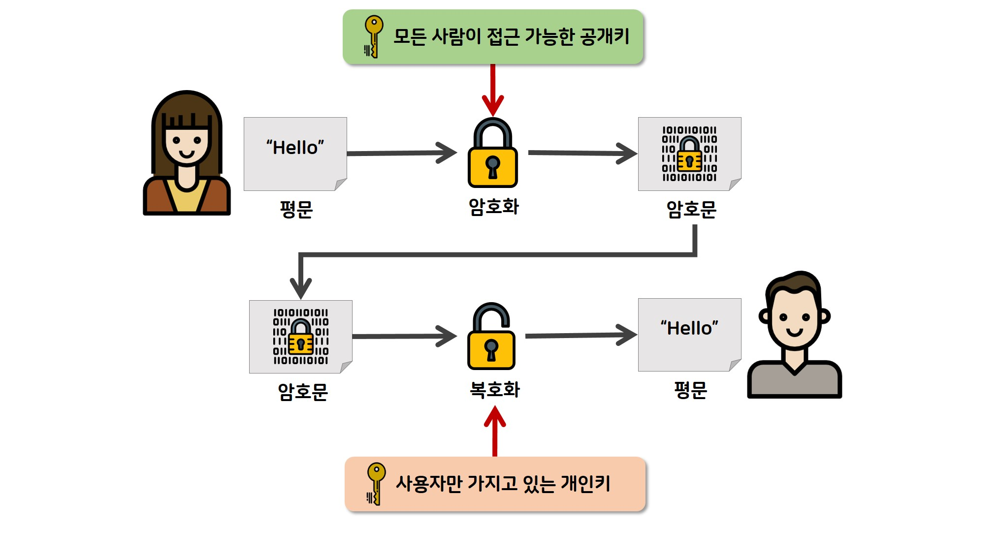

# Crypto

- [암호화 개념](#암호화-개념)
- [암호화 방식 비교](#암호화-방식-비교)
- [단방향 알고리즘(해시 알고리즘)](#단방향-알고리즘해시-알고리즘)
- [양방향 알고리즘(대칭키)](#양방향-알고리즘대칭키)
- [양방향 알고리즘(비대칭키)](#양방향-알고리즘비대칭키)
- [실무에서의 선택 기준](#실무에서의-선택-기준)

## 암호화 개념

암호화는 0과 1로 이루어진 이진수 데이터를 수학적 계산을 통해 변환하는 기술이다. 원본 데이터를 암호화 과정을 통해 변경하고, 복호화 과정을 통해 원래 상태로 복원한다.

## 암호화 방식 비교

| 구분      | 단방향 (해시) | 양방향 (대칭키)      | 양방향 (비대칭키)    |
| --------- | ------------- | -------------------- | -------------------- |
| 복호화    | 불가능        | 가능                 | 가능                 |
| 키 관리   | 키 불필요     | 동일한 키 공유       | 공개키/개인키 쌍     |
| 속도      | 빠름          | 빠름                 | 느림                 |
| 용도      | 무결성 검증   | 대용량 데이터 암호화 | 키 교환, 디지털 서명 |
| 주요 예시 | SHA-256, MD5  | AES, DES             | RSA, ECC             |

## 단방향 알고리즘(해시 알고리즘)

해시 알고리즘은 임의의 크기 데이터를 고정된 크기의 해시값으로 변환하는 단방향 암호화다. 복호화가 불가능하다는 특성을 이용해 데이터 무결성 검증에 사용된다.

▾ 특징:

- 일방향성: 암호화만 가능, 복호화 불가능
- 결정성: 동일한 입력은 항상 동일한 해시값 생성
- 고정 길이: 입력 크기와 관계없이 항상 고정된 길이의 출력
- 눈사태 효과: 입력의 작은 변화로도 출력이 크게 달라짐

▾ 해시 알고리즘 종류:

| 알고리즘 | 해시 길이 | 보안 수준 | 사용 현황        |
| -------- | --------- | --------- | ---------------- |
| MD5      | 128bit    | 취약      | 사용 권장 안함   |
| SHA-1    | 160bit    | 취약      | 사용 권장 안함   |
| SHA-256  | 256bit    | 안전      | 현재 표준        |
| SHA-512  | 512bit    | 안전      | 높은 보안 필요시 |
| bcrypt   | 가변      | 안전      | 패스워드 해싱    |

## 양방향 알고리즘(대칭키)

대칭키 암호화는 암호화와 복호화에 동일한 키를 사용하는 양방향 암호화 방식이다. 암호화와 복호화 속도가 빠르고 시스템 구현이 용이하다.

▾ 장점:

- 빠른 암호화/복호화 속도
- 상대적으로 작은 키 크기
- 단순한 구조로 구현 용이
- 대용량 데이터 처리에 적합

▾ 단점:

- 키 배송 문제 (안전한 키 전달 어려움)
- 사용자 증가 시 키 관리 복잡성 급증
- 디지털 서명 기능 제공 불가
- 키 분실 시 모든 데이터 접근 불가

▾ 대칭키 알고리즘 종류:

| 알고리즘 | 키 크기    | 블록 크기 | 보안 수준 | 현재 상태 |
| -------- | ---------- | --------- | --------- | --------- |
| DES      | 56bit      | 64bit     | 취약      | 폐기      |
| 3DES     | 112/168bit | 64bit     | 보통      | 레거시    |
| AES-128  | 128bit     | 128bit    | 안전      | 표준      |
| AES-256  | 256bit     | 128bit    | 매우 안전 | 표준      |
| ChaCha20 | 256bit     | 스트림    | 안전      | 신규 표준 |

## 양방향 알고리즘(비대칭키)

비대칭키 암호화는 서로 다른 두 개의 키(공개키와 개인키)를 사용하는 양방향 암호화 방식이다. 대칭키의 키 전달 문제를 해결하기 위해 개발되었다.

▾ 동작 원리:

- 공개키로 암호화 → 개인키로 복호화: 기밀성 보장
- 개인키로 암호화 → 공개키로 복호화: 인증 및 디지털 서명

▾ 장점:

- 키 배송 문제 해결
- 디지털 서명 가능
- 키 관리가 상대적으로 간단
- 부인 방지 기능 제공

▾ 단점:

- 대칭키 대비 현저히 느린 속도
- 큰 키 크기 필요
- 복잡한 수학적 연산
- 대용량 데이터 처리 부적합

▾ 비대칭키 알고리즘 종류:

| 알고리즘 | 키 크기      | 기반 수학  | 보안 수준 | 특징                |
| -------- | ------------ | ---------- | --------- | ------------------- |
| RSA      | 2048~4096bit | 소인수분해 | 안전      | 가장 널리 사용      |
| ECC      | 256~521bit   | 타원곡선   | 매우 안전 | 작은 키로 높은 보안 |
| DSA      | 2048~3072bit | 이산로그   | 안전      | 서명 전용           |
| EdDSA    | 256bit       | 타원곡선   | 매우 안전 | 빠른 서명 검증      |

## 실무에서의 선택 기준

▾ 성능 우선 (대용량 데이터):

- 대칭키 암호화 사용 (AES-256)
- 키 교환은 비대칭키로 수행

▾ 보안 우선 (민감한 데이터):

- 하이브리드 방식: 비대칭키로 대칭키 암호화
- 디지털 서명으로 무결성 보장

▾ 무결성 검증:

- 해시 함수 사용 (SHA-256)
- 디지털 서명과 조합

▾ 일반적인 웹 서비스:

- HTTPS (TLS): RSA/ECC + AES 조합
- 패스워드: bcrypt/scrypt 해싱
