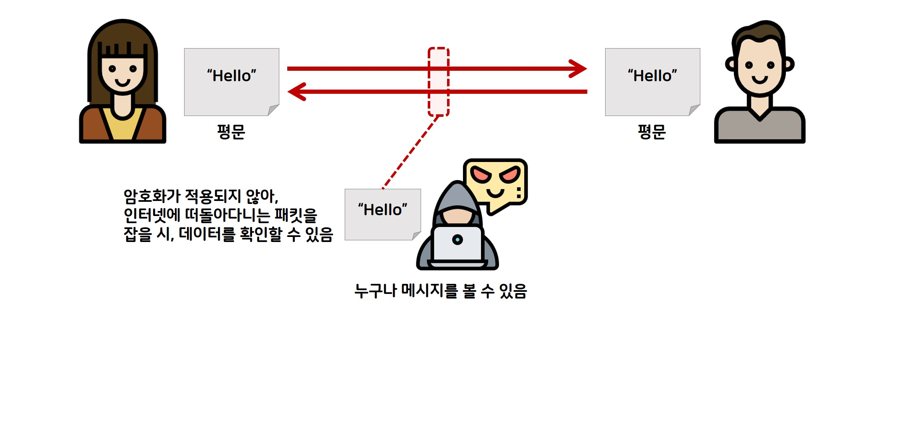
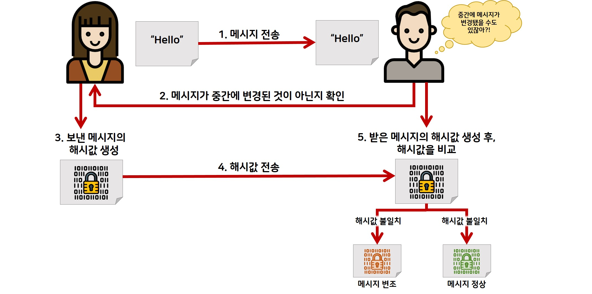
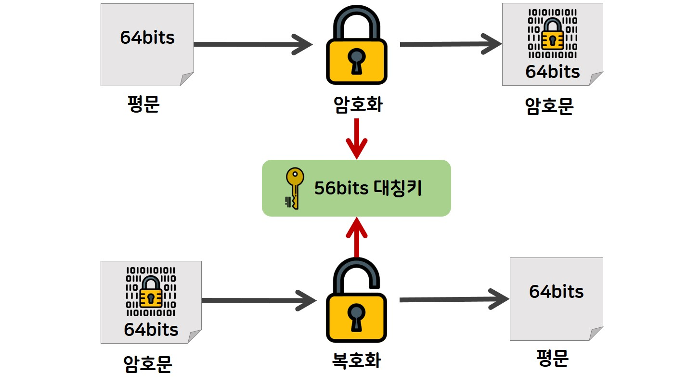
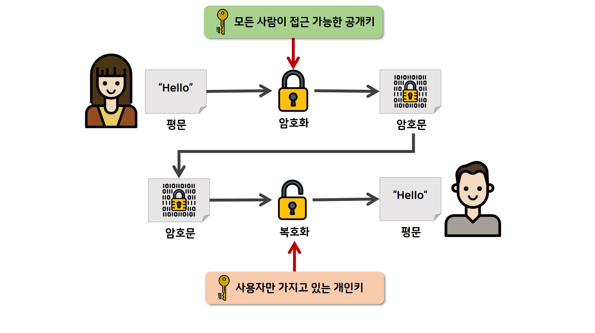

# 암호화 기술(Cryptography)

- [암호화(Encryption) 개요](#암호화encryption-개요)
- [암호화 방식 비교](#암호화-방식-비교)
- [단방향 알고리즘: 해시 함수(Hash Function)](#단방향-알고리즘-해시-함수hash-function)
- [양방향 알고리즘: 대칭키 암호화(Symmetric-Key Encryption)](#양방향-알고리즘-대칭키-암호화symmetric-key-encryption)
  - [AES(Advanced Encryption Standard)의 특성](#aesadvanced-encryption-standard의-특성)
- [양방향 알고리즘: 비대칭키 암호화(Asymmetric-Key Encryption)](#양방향-알고리즘-비대칭키-암호화asymmetric-key-encryption)
  - [RSA(Rivest-Shamir-Adleman)의 특성](#rsarivest-shamir-adleman의-특성)
- [실무 활용 사례: 하이브리드 암호화](#실무-활용-사례-하이브리드-암호화)

## 암호화(Encryption) 개요

암호화는 평문(Plaintext) 데이터를 수학적 알고리즘을 사용하여 권한이 없는 사용자가 읽을 수 없는 암호문(Ciphertext)으로 변환하는 기술임. 복호화(Decryption)는 암호문을 다시 원래의 평문으로 복원하는 과정을 의미함.

## 암호화 방식 비교

| 구분 | 단방향(해시) | 양방향(대칭키) | 양방향(비대칭키) |
| --- | --- | --- | --- |
| 복호화 | 불가능 | 가능 | 가능 |
| 키 관리 | 키 불필요 | 동일한 키 공유 | 공개키/개인키 쌍 |
| 속도 | 매우 빠름 | 빠름 | 느림 |
| 주요 용도 | 무결성 검증, 비밀번호 저장 | 대용량 데이터 암호화 | 키 교환, 디지털 서명 |
| 주요 알고리즘 | SHA-256, bcrypt | AES, ChaCha20 | RSA, ECC |

## 단방향 알고리즘: 해시 함수(Hash Function)

해시 함수는 임의의 길이를 가진 데이터를 고정된 길이의 해시값으로 변환함. 한 번 암호화하면 원래 데이터를 찾아낼 수 없는 단방향성을 가짐.

- 일방향성: 암호문에서 평문을 추론할 수 없음.
- 충돌 저항성: 서로 다른 두 입력값이 동일한 출력값을 가질 확률이 극히 낮아야 함.
- 눈사태 효과(Avalanche Effect): 입력값의 아주 작은 변화가 결과값의 거대한 차이를 만들어냄.

## 양방향 알고리즘: 대칭키 암호화(Symmetric-Key Encryption)

암호화와 복호화에 동일한 비밀키(Secret Key)를 사용하는 방식임. 속도가 빠르지만 키를 안전하게 전달하는 과정이 복잡하다는 단점이 있음.

### AES(Advanced Encryption Standard)의 특성

- 블록 암호(Block Cipher): 데이터를 고정된 크기(128비트)의 블록 단위로 나누어 처리함.
- 키 길이: 128, 192, 256비트 세 가지 길이를 지원하며, 길수록 보안 강도가 높음.
- 운용 모드(Mode of Operation):
  - CBC(Cipher Block Chaining): 이전 블록의 암호문과 XOR 연산을 수행하여 보안성을 높임 (IV 필요).
  - GCM(Galois/Counter Mode): 암호화와 동시에 데이터 인증(MAC)을 제공하여 현재 가장 널리 사용됨.
- 하드웨어 가속: 대부분의 현대 CPU(AES-NI)에서 하드웨어 수준의 최적화를 지원하여 성능이 매우 뛰어남.

## 양방향 알고리즘: 비대칭키 암호화(Asymmetric-Key Encryption)

서로 수학적으로 연결된 공개키(Public Key)와 개인키(Private Key) 쌍을 사용하는 방식임. 공개키는 누구나 알 수 있지만, 개인키는 소유자만 안전하게 보관함.

### RSA(Rivest-Shamir-Adleman)의 특성

- 수학적 원리: 매우 큰 두 소수의 곱을 소인수분해하는 것이 어렵다는 점에 기반함.
- 주요 용도:
  - 기밀성: 수신자의 공개키로 암호화하여 수신자의 개인키로만 복호화할 수 있게 함.
  - 인증(디지털 서명): 송신자의 개인키로 서명하고 송신자의 공개키로 검증하여 데이터의 출처를 증명함.
- 제약 사항: 대칭키 암호화에 비해 연산량이 많아 속도가 현저히 느림. 주로 작은 크기의 데이터(대칭키 전달용 등)를 처리하는 데 사용함.

## 실무 활용 사례: 하이브리드 암호화

현대 보안 시스템(TLS/SSL 등)은 대칭키와 비대칭키의 장점을 결합하여 사용함.

1. 비대칭키(RSA/ECC)를 사용하여 안전하게 대칭키(AES)를 교환함.
2. 이후 실제 데이터 통신은 교환된 대칭키를 사용하여 고속으로 수행함.
3. 데이터의 무결성 보장을 위해 해시 함수(HMAC)를 병행하여 사용함.
