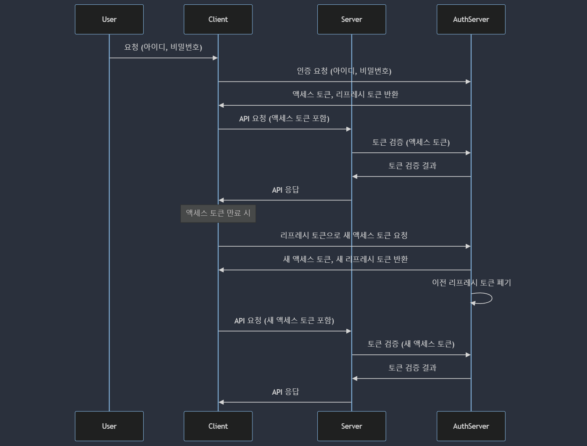

# JWT 인증

- [JWT 인증을 사용하는 이유](#jwt-인증을-사용하는-이유)
- [JWT 구조](#jwt-구조)
- [공통키(대칭키) 방식의 JWT 생성 및 검증](#공통키대칭키-방식의-jwt-생성-및-검증)
- [공개키 • 개인키(비대칭키) 방식의 JWT 생성 및 검증](#공개키--개인키비대칭키-방식의-jwt-생성-및-검증)
- [Access Token • Refresh Token](#access-token--refresh-token)
- [JWT 인증 흐름](#jwt-인증-흐름)

## JWT 인증을 사용하는 이유

- 상태 비저장: 서버에서 세션 정보를 저장할 필요가 없으므로, 확장성과 성능이 개선된다.
- 보안성: JWT는 서명된 토큰으로, 데이터 위변조를 방지할 수 있다. 또한, 비밀키를 통해 암호화할 수 있다.
- 자체 포함형(Token-based): 필요한 정보를 포함하고 있어, 별도의 데이터베이스 조회 없이 빠르게 인증 상태를 확인할 수 있다.
- 다양한 플랫폼 지원: 다양한 프로그래밍 언어와 플랫폼에서 쉽게 사용이 가능하여, 유연한 시스템 통합이 가능하다.
- 클라이언트-서버 간의 데이터 전송: 클라이언트가 서버와 통신할 때, 인증 정보를 안전하게 전송할 수 있다.

## JWT 구조

1. header:

   ```json
   {
     "alg": "HS256",
     "typ": "JWT"
   }
   ```

   - 토큰 유형과 해싱 알고리즘 정보를 포함한다.

2. payload:

   ```json
   {
     "sub": "1234567890",
     "name": "John Doe",
     "iat": 1516239022
   }
   ```

   - 토큰에 담길 실제 데이터를 포함한다. 일반적으로 사용자의 정보나 만료 시간 등이 들어간다.

3. signature:

   ```ts
   HMACSHA256(base64UrlEncode(header) + '.' + base64UrlEncode(payload), secret);
   ```

   - 토큰의 무결성을 검증하기 위해 사용된다. 헤더와 페이로드를 합친 후 비밀 키로 서명한다.

## 공통키(대칭키) 방식의 JWT 생성 및 검증

```ts
const crypto = require('crypto');

// Base64 URL 인코딩 함수
function base64urlEncode(str) {
  return Buffer.from(str).toString('base64').replace(/=/g, '').replace(/\+/g, '-').replace(/\//g, '_');
}

// Base64 URL 디코딩 함수
function base64urlDecode(str) {
  str = str.replace(/-/g, '+').replace(/_/g, '/');
  return Buffer.from(str, 'base64').toString('utf8');
}

// HMAC-SHA256 해싱 함수
function hmacSHA256(data, secret) {
  return crypto.createHmac('sha256', secret).update(data).digest('base64url');
}

// JWT 생성 함수
function generateToken(payload, secret, expiresIn = '1h') {
  const header = {
    alg: 'HS256',
    typ: 'JWT',
  };

  const iat = Math.floor(Date.now() / 1000);
  let exp = iat;

  // 만료 시간 계산
  if (expiresIn.endsWith('h')) {
    exp += parseInt(expiresIn) * 60 * 60;
  } else if (expiresIn.endsWith('m')) {
    exp += parseInt(expiresIn) * 60;
  } else if (expiresIn.endsWith('s')) {
    exp += parseInt(expiresIn);
  }

  const extendedPayload = {
    ...payload,
    iat,
    exp,
  };

  const encodedHeader = base64urlEncode(JSON.stringify(header));
  const encodedPayload = base64urlEncode(JSON.stringify(extendedPayload));
  const signature = hmacSHA256(`${encodedHeader}.${encodedPayload}`, secret);

  return `${encodedHeader}.${encodedPayload}.${signature}`;
}

// JWT 검증 함수
function verifyToken(token, secret) {
  const [encodedHeader, encodedPayload, signature] = token.split('.');

  const data = `${encodedHeader}.${encodedPayload}`;
  const validSignature = hmacSHA256(data, secret);

  if (signature !== validSignature) {
    return null;
  }

  const payload = JSON.parse(base64urlDecode(encodedPayload));
  const currentTime = Math.floor(Date.now() / 1000);

  if (currentTime > payload.exp) {
    return null;
  }

  return payload;
}

// 예제 데이터
const secretKey = 'your-256-bit-secret';
const payload = {
  userId: 123,
  username: 'exampleUser',
};

// 토큰 생성
const token = generateToken(payload, secretKey);
console.log('Generated Token:', token);

// 토큰 검증
const decoded = verifyToken(token, secretKey);
if (decoded) {
  console.log('Decoded Payload:', decoded);
} else {
  console.log('Invalid or expired token');
}
```

## 공개키 • 개인키(비대칭키) 방식의 JWT 생성 및 검증

```ts
const crypto = require('crypto');

// Base64 URL 인코딩 함수
function base64urlEncode(str) {
  return Buffer.from(str).toString('base64').replace(/=/g, '').replace(/\+/g, '-').replace(/\//g, '_');
}

// Base64 URL 디코딩 함수
function base64urlDecode(str) {
  str = str.replace(/-/g, '+').replace(/_/g, '/');
  return Buffer.from(str, 'base64').toString('utf8');
}

// RSA-SHA256 서명 생성 함수
function sign(data, privateKey) {
  const sign = crypto.createSign('RSA-SHA256');
  sign.update(data);
  sign.end();
  return sign.sign(privateKey, 'base64').replace(/=/g, '').replace(/\+/g, '-').replace(/\//g, '_');
}

// RSA-SHA256 서명 검증 함수
function verify(data, signature, publicKey) {
  const verify = crypto.createVerify('RSA-SHA256');
  verify.update(data);
  verify.end();
  return verify.verify(publicKey, signature.replace(/-/g, '+').replace(/_/g, '/'), 'base64');
}

// JWT 생성 함수
function generateToken(payload, privateKey, expiresIn = '1h') {
  const header = {
    alg: 'RS256',
    typ: 'JWT',
  };

  const iat = Math.floor(Date.now() / 1000);
  let exp = iat;

  // 만료 시간 계산
  if (expiresIn.endsWith('h')) {
    exp += parseInt(expiresIn) * 60 * 60;
  } else if (expiresIn.endsWith('m')) {
    exp += parseInt(expiresIn) * 60;
  } else if (expiresIn.endsWith('s')) {
    exp += parseInt(expiresIn);
  }

  const extendedPayload = {
    ...payload,
    iat,
    exp,
  };

  const encodedHeader = base64urlEncode(JSON.stringify(header));
  const encodedPayload = base64urlEncode(JSON.stringify(extendedPayload));
  const signature = sign(`${encodedHeader}.${encodedPayload}`, privateKey);

  return `${encodedHeader}.${encodedPayload}.${signature}`;
}

// JWT 검증 함수
function verifyToken(token, publicKey) {
  const [encodedHeader, encodedPayload, signature] = token.split('.');

  const data = `${encodedHeader}.${encodedPayload}`;

  if (!verify(data, signature, publicKey)) {
    return null;
  }

  const payload = JSON.parse(base64urlDecode(encodedPayload));
  const currentTime = Math.floor(Date.now() / 1000);

  if (currentTime > payload.exp) {
    return null;
  }

  return payload;
}

// RSA 키 생성
const { publicKey, privateKey } = crypto.generateKeyPairSync('rsa', {
  modulusLength: 2048,
});

// 예제 데이터
const payload = {
  userId: 123,
  username: 'exampleUser',
};

// 토큰 생성
const token = generateToken(payload, privateKey);
console.log('Generated Token:', token);

// 토큰 검증
const decoded = verifyToken(token, publicKey);
if (decoded) {
  console.log('Decoded Payload:', decoded);
} else {
  console.log('Invalid or expired token');
}
```

## Access Token • Refresh Token

| 항목        | 액세스 토큰                                               | 리프레시 토큰                                        |
| ----------- | --------------------------------------------------------- | ---------------------------------------------------- |
| 목적        | 리소스 서버에 접근하여 보호된 리소스에 대한 권한을 증명   | 새로운 액세스 토큰을 발급받기 위한 권한을 증명       |
| 용도        | API 호출 시 인증을 위해 사용                              | 액세스 토큰이 만료되었을 때 갱신을 위해 사용         |
| 유효 기간   | 짧음 (몇 분에서 몇 시간)                                  | 길음 (몇 일에서 몇 주)                               |
| 보안 위험성 | 만료 시간이 짧아 상대적으로 적음                          | 만료 시간이 길어 유출 시 위험성 큼                   |
| 만료될 경우 | 새로운 액세스 토큰 발급 필요                              | 재로그인 필요                                        |
| 저장 위치   | 주로 클라이언트 측                                        | 주로 클라이언트 측                                   |
| 페이로드    | 사용자 ID, 권한, 만료 시간, 발급자 정보                   | 사용자 ID, 토큰 ID, 만료 시간                        |
| 발급 주체   | 인증 서버                                                 | 인증 서버                                            |
| 전송 방식   | HTTP 헤더에 포함 (`Authorization: Bearer <access_token>`) | HTTP 요청의 바디에 포함 (토큰 갱신을 위한 POST 요청) |

## JWT 인증 흐름

- 일반적인 방식


- Refresh Token Rotation을 이용한 보안이 강화된 방식


