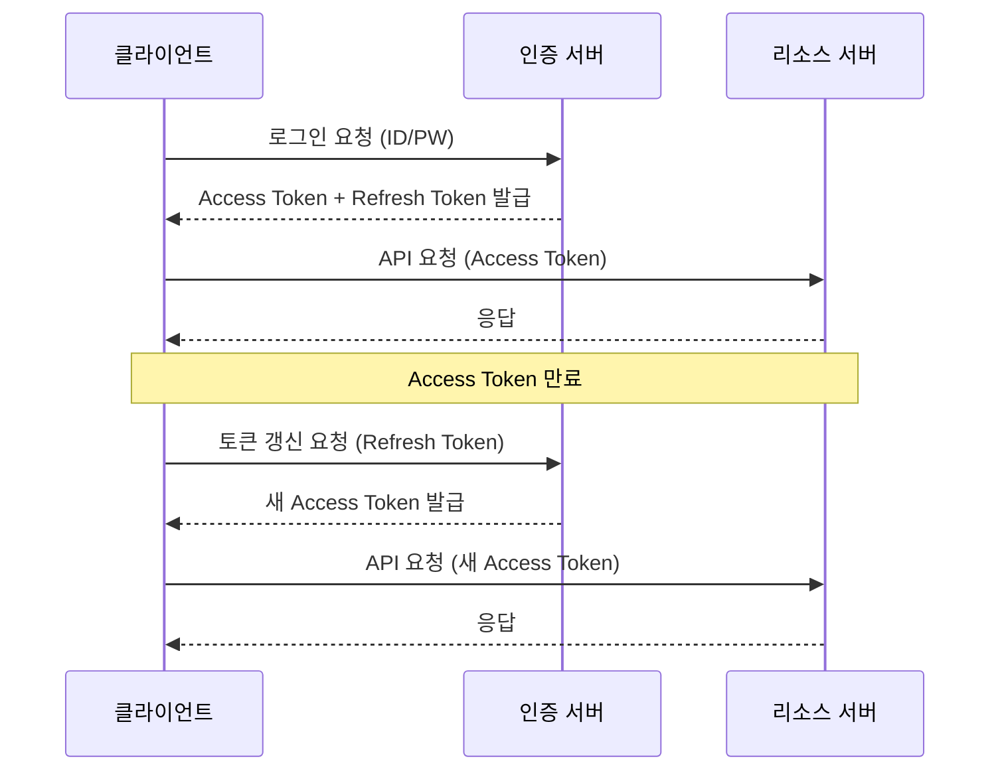
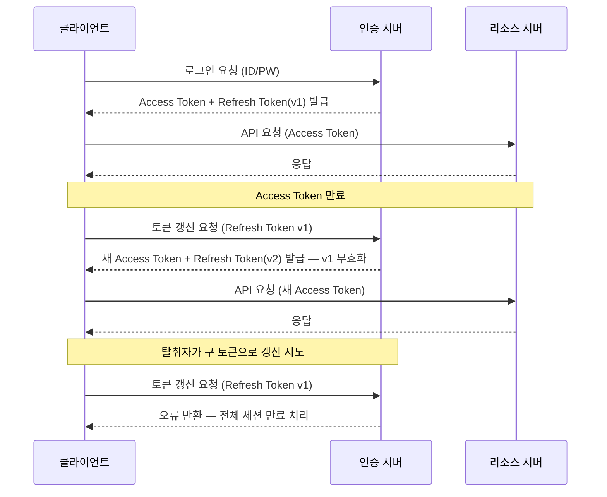

# JWT(JSON Web Token) 인증

- [JWT(JSON Web Token)란?](#jwtjson-web-token란)
- [JWT 구조](#jwt-구조)
- [JWT 인증의 특징](#jwt-인증의-특징)
- [토큰 저장 위치와 보안](#토큰-저장-위치와-보안)
- [Access Token • Refresh Token](#access-token--refresh-token)
- [구현 예제(Node.js)](#구현-예제nodejs)
  - [대칭키(HMAC) 방식](#대칭키hmac-방식)
  - [비대칭키(RSA) 방식](#비대칭키rsa-방식)

## JWT(JSON Web Token)란?

JWT는 당사자 간에 정보를 JSON 객체로 안전하게 전송하기 위한 개방형 표준(RFC 7519)이다. 주로 인증(Authentication)과 정보 교환(Information Exchange)을 위해 사용된다.

- 특징:
  - 자가 수용적(Self-contained): 토큰 자체에 필요한 모든 정보(사용자 권한, 만료 시간 등)를 담고 있음.
  - 무상태성(Stateless): 서버가 클라이언트의 상태를 저장하지 않아 서버 확장에 유리함.
  - 무결성 보장: 서명(Signature)을 통해 데이터의 변조 여부를 확인할 수 있음.

## JWT 구조

JWT는 점(`.`)으로 구분된 세 부분으로 구성된다.

1. Header(헤더): 토큰의 유형(typ)과 사용 중인 해싱 알고리즘(alg) 정보를 담고 있음.
2. Payload(페이로드): 토큰에 담긴 실제 클레임(Claim) 정보임. Base64로 인코딩되어 누구나 읽을 수 있으므로 민감한 정보는 담지 않아야 함.
3. Signature(서명): 헤더와 페이로드를 비밀키로 해싱하여 생성함. 토큰의 위변조를 방지하는 역할을 함.

## JWT 인증의 특징

| 특징      | 내용                                                                         |
| :-------- | :--------------------------------------------------------------------------- |
| 상태 관리 | 클라이언트 측에서 상태를 유지함 (Stateless)                                  |
| 확장성    | 세션 저장소가 필요 없어 수평적 확장이 용이함                                 |
| 보안      | 토큰 탈취 시 만료 전까지 무효화가 어려움 (Blacklist 등 추가 로직 필요)       |
| 크기      | 페이로드에 정보가 많아질수록 토큰 크기가 커져 네트워크 부하가 발생할 수 있음 |

## 토큰 저장 위치와 보안

| 저장 위치         | 주요 공격 위험                   | 방어 전략                                       |
| :---------------- | :------------------------------- | :---------------------------------------------- |
| `LocalStorage`    | XSS(Cross-Site Scripting)        | 스크립트를 통한 탈취가 매우 쉬움. 권장되지 않음 |
| `HttpOnly` Cookie | CSRF(Cross-Site Request Forgery) | `SameSite` 속성과 CSRF 토큰을 사용하여 방어함   |

## Access Token • Refresh Token

- Access Token: 실제 리소스 접근 권한을 증명함. 보안을 위해 유효 기간을 짧게(예: 15분) 설정함.
- Refresh Token: 새로운 Access Token을 발급받기 위해 사용함. 보안이 강화된 저장소에 보관하며 유효 기간을 길게(예: 2주) 설정함.


```mermaid
sequenceDiagram
    participant C as 클라이언트
    participant A as 인증 서버
    participant R as 리소스 서버

    C->>A: 로그인 요청 (ID/PW)
    A-->>C: Access Token + Refresh Token 발급

    C->>R: API 요청 (Access Token)
    R-->>C: 응답

    Note over C,R: Access Token 만료

    C->>A: 토큰 갱신 요청 (Refresh Token)
    A-->>C: 새 Access Token 발급

    C->>R: API 요청 (새 Access Token)
    R-->>C: 응답
```

- Refresh Token Rotation: Refresh Token 사용 시마다 새로운 토큰을 재발급하여 탈취된 토큰의 재사용을 방지하는 기법임.


```mermaid
sequenceDiagram
    participant C as 클라이언트
    participant A as 인증 서버
    participant R as 리소스 서버

    C->>A: 로그인 요청 (ID/PW)
    A-->>C: Access Token + Refresh Token(v1) 발급

    C->>R: API 요청 (Access Token)
    R-->>C: 응답

    Note over C,R: Access Token 만료

    C->>A: 토큰 갱신 요청 (Refresh Token v1)
    A-->>C: 새 Access Token + Refresh Token(v2) 발급 — v1 무효화

    C->>R: API 요청 (새 Access Token)
    R-->>C: 응답

    Note over C,A: 탈취자가 구 토큰으로 갱신 시도

    C->>A: 토큰 갱신 요청 (Refresh Token v1)
    A-->>C: 오류 반환 — 전체 세션 만료 처리
```

## 구현 예제(Node.js)

### 대칭키(HMAC) 방식

동일한 비밀키를 사용하여 생성과 검증을 모두 수행한다.

```ts
const crypto = require('crypto');

function generateToken(payload, secret) {
  const header = Buffer.from(JSON.stringify({ alg: 'HS256', typ: 'JWT' })).toString('base64url');
  const encodedPayload = Buffer.from(JSON.stringify(payload)).toString('base64url');
  const signature = crypto.createHmac('sha256', secret).update(`${header}.${encodedPayload}`).digest('base64url');

  return `${header}.${encodedPayload}.${signature}`;
}

function verifyToken(token, secret) {
  const [header, payload, signature] = token.split('.');
  const expected = crypto.createHmac('sha256', secret).update(`${header}.${payload}`).digest('base64url');

  if (signature !== expected) throw new Error('Invalid signature');
  return JSON.parse(Buffer.from(payload, 'base64url').toString());
}
```

### 비대칭키(RSA) 방식

개인키로 서명하고 공개키로 검증한다. 인증 서버와 리소스 서버가 분리된 환경에서 안전하다.

```ts
const { publicKey, privateKey } = crypto.generateKeyPairSync('rsa', { modulusLength: 2048 });

function signToken(data, privateKey) {
  const sign = crypto.createSign('RSA-SHA256');
  sign.update(data);
  return sign.sign(privateKey, 'base64url');
}

function verifyToken(data, signature, publicKey) {
  const verify = crypto.createVerify('RSA-SHA256');
  verify.update(data);
  return verify.verify(publicKey, signature, 'base64url');
}
```
