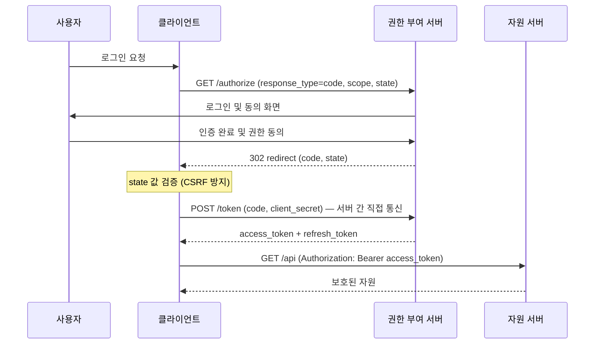
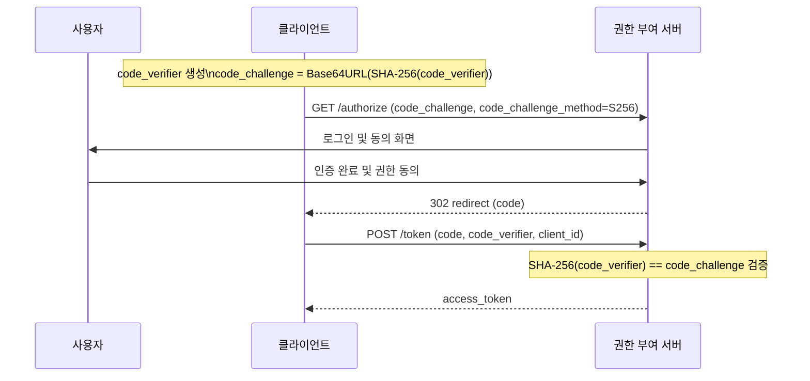
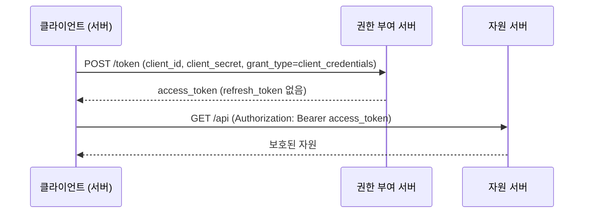
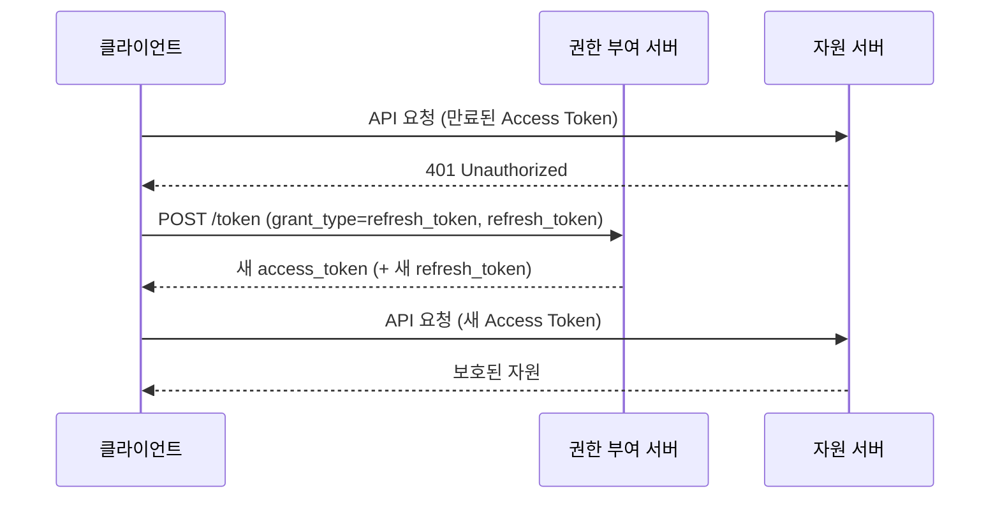

# OAuth 2.0

- [OAuth 2.0 개요](#oauth-20-개요)
  - [등장 배경](#등장-배경)
  - [OAuth 1.0과의 차이](#oauth-10과의-차이)
- [주요 역할(Roles)](#주요-역할roles)
- [주요 용어](#주요-용어)
- [권한 부여 승인 방식(Grant Types)](#권한-부여-승인-방식grant-types)
  - [Authorization Code Grant](#authorization-code-grant)
  - [Authorization Code Grant with PKCE](#authorization-code-grant-with-pkce)
  - [Client Credentials Grant](#client-credentials-grant)
  - [Refresh Token Grant](#refresh-token-grant)
  - [Deprecated Grants](#deprecated-grants)
- [OAuth 2.0과 OpenID Connect(OIDC)](#oauth-20과-openid-connectoidc)

## OAuth 2.0 개요

OAuth 2.0은 애플리케이션이 사용자 대신 보호된 자원에 접근할 수 있는 권한을 위임받기 위한 개방형 표준 프로토콜이다. 사용자의 비밀번호를 서드파티 애플리케이션에 직접 공개하지 않고도, 특정 자원에 대한 접근 범위(Scope)를 제한적으로 위임할 수 있다.

### 등장 배경

OAuth 이전에는 사용자가 서드파티 서비스에 자신의 계정을 연동할 때 아이디와 비밀번호를 직접 제공하는 방식이 일반적이었다. 이 방식에는 다음과 같은 근본적인 문제가 있었다.

- 서드파티 앱이 사용자 자격 증명 전체를 보유하게 됨
- 특정 자원에만 접근을 제한하는 것이 불가능함
- 권한을 취소하려면 비밀번호를 변경해야 하며, 다른 서비스에도 영향이 생김
- 비밀번호 유출 시 모든 연동 서비스가 동시에 위험에 처함

OAuth 2.0은 이 문제를 해결하기 위해 권한 부여(Authorization)와 인증(Authentication)을 명확히 분리하고, 접근 범위를 제한하는 토큰 기반 위임 모델을 도입했다.

### OAuth 1.0과의 차이

| 항목            | OAuth 1.0            | OAuth 2.0                    |
| --------------- | -------------------- | ---------------------------- |
| 서명 방식       | HMAC-SHA1 서명 필수  | Bearer Token으로 단순화      |
| HTTPS 의존도    | 서명으로 일부 보완   | HTTPS 필수                   |
| 토큰 종류       | Access Token만 존재  | Access Token + Refresh Token |
| 모바일/SPA 지원 | 미흡                 | Grant Type 다변화로 지원     |
| 구현 복잡도     | 서명 로직으로 복잡함 | 상대적으로 단순함            |
| 확장성          | 낮음                 | 높음 (다양한 Grant Type)     |

OAuth 2.0은 OAuth 1.0의 복잡한 서명 메커니즘을 제거하고 HTTPS에 보안을 위임한다. 대신 다양한 클라이언트 유형(웹, 모바일, 서버 간 통신 등)을 커버하는 여러 Grant Type을 정의한다.

## 주요 역할(Roles)

OAuth 2.0은 네 가지 역할을 정의한다.

- 자원 소유자(Resource Owner): 데이터의 주인이며, 주로 서비스를 이용하는 최종 사용자(User)다. 클라이언트에게 자신의 자원에 대한 접근 권한을 위임한다.
- 클라이언트(Client): 자원 소유자의 보호된 자원에 접근하고자 하는 애플리케이션(웹, 모바일, 서버 등)이다. 권한 부여 서버로부터 액세스 토큰을 발급받아 자원 서버에 요청을 보낸다.
- 권한 부여 서버(Authorization Server): 자원 소유자를 인증하고, 동의를 확인한 후 클라이언트에게 액세스 토큰을 발행하는 서버다. Google Auth, Kakao Auth 등이 이에 해당한다.
- 자원 서버(Resource Server): 보호된 자원을 호스팅하는 서버로, 액세스 토큰을 검증하여 자원을 제공한다. 권한 부여 서버와 동일한 서비스에서 운영되거나 분리될 수 있다.

## 주요 용어

| 용어               | 설명                                                                                               |
| ------------------ | -------------------------------------------------------------------------------------------------- |
| Access Token       | 자원 서버에 접근하기 위한 자격 증명 토큰. 만료 시간이 짧게 설정됨                                  |
| Refresh Token      | 만료된 Access Token을 재발급받기 위한 토큰. Access Token보다 수명이 길며 권한 부여 서버에만 전송됨 |
| Scope              | 클라이언트가 요청하는 접근 권한의 범위. 예: `read:email`, `write:profile`                          |
| Client ID          | 권한 부여 서버에 등록된 클라이언트의 공개 식별자                                                   |
| Client Secret      | 클라이언트 인증에 사용되는 비밀 키. 반드시 서버 측에서만 보관해야 함                               |
| Authorization Code | Authorization Code Grant에서 중간 단계로 발급되는 단기 코드. Access Token과 교환됨                 |
| Redirect URI       | 사용자 동의 후 권한 부여 서버가 클라이언트에게 응답을 전달하는 콜백 URL                            |
| State              | CSRF 공격 방지를 위해 클라이언트가 생성하는 무작위 값                                              |

## 권한 부여 승인 방식(Grant Types)

Grant Type은 클라이언트가 액세스 토큰을 획득하는 구체적인 절차를 정의한다. 클라이언트의 유형과 보안 요구사항에 따라 적합한 방식을 선택해야 한다.

| Grant Type                | 적합한 상황                                         |
| ------------------------- | --------------------------------------------------- |
| Authorization Code        | 서버 사이드 웹 앱, 백엔드가 있는 서비스             |
| Authorization Code + PKCE | SPA, 모바일 앱 (Client Secret 보관 불가 환경)       |
| Client Credentials        | 서버 간 통신(M2M), 사용자 개입 없는 백그라운드 작업 |
| Refresh Token             | 만료된 Access Token 갱신                            |

### Authorization Code Grant

가장 보안성이 높고 널리 사용되는 방식이다. 액세스 토큰이 브라우저를 거치지 않고 서버 간 통신으로만 전달되므로 토큰 노출 위험이 낮다.



### Authorization Code Grant with PKCE

PKCE(Proof Key for Code Exchange, 피키)는 SPA나 모바일 앱처럼 Client Secret을 안전하게 보관할 수 없는 환경을 위해 Authorization Code Grant에 추가하는 보안 확장이다.

Authorization Code를 탈취당하더라도 토큰 교환을 차단할 수 있다. RFC 7636에 정의되어 있으며, 현재는 Client Secret이 있는 환경에서도 적용이 권장된다.

PKCE 핵심 개념:

- `code_verifier`: 클라이언트가 생성하는 43~128자의 무작위 문자열
- `code_challenge`: `code_verifier`를 SHA-256으로 해시한 후 Base64URL 인코딩한 값
- `code_challenge_method`: 해시 방식 (`S256`)

Step 1: `code_verifier`와 `code_challenge` 생성 (클라이언트)

```ts
// code_verifier 생성
const codeVerifier = crypto.randomUUID().replace(/-/g, '') + crypto.randomUUID().replace(/-/g, '');

// code_challenge 생성
const encoder = new TextEncoder();
const data = encoder.encode(codeVerifier);
const digest = await crypto.subtle.digest('SHA-256', data);
const codeChallenge = btoa(String.fromCharCode(...new Uint8Array(digest)))
  .replace(/\+/g, '-')
  .replace(/\//g, '_')
  .replace(/=+$/, '');
```



### Client Credentials Grant

사용자 개입 없이 클라이언트(애플리케이션) 자체의 자격 증명으로 Access Token을 획득하는 방식이다. 서버 간 통신(M2M, Machine-to-Machine)이나 백그라운드 작업, 데몬 프로세스 등에서 사용된다.

사용자가 없으므로 Resource Owner의 동의 단계가 존재하지 않는다. Client ID와 Client Secret만으로 인증한다.



### Refresh Token Grant

Access Token의 만료 후 사용자가 재로그인하지 않고도 새 Access Token을 발급받기 위한 방식이다. Authorization Code Grant 등에서 최초 토큰 발급 시 함께 제공되는 Refresh Token을 사용한다.

Refresh Token은 수명이 길고 강력한 권한을 가지므로, 반드시 서버 측에 안전하게 보관해야 한다. 자원 서버가 아닌 권한 부여 서버에만 전송한다.



권한 부여 서버에 따라 Refresh Token도 갱신하여 함께 반환하기도 한다. 이를 Refresh Token Rotation이라 하며, 탈취된 Refresh Token의 재사용을 차단하는 데 효과적이다.

### Deprecated Grants

다음 두 방식은 보안 문제로 인해 OAuth 2.1 초안에서 공식적으로 제거되었다. 신규 구현에서는 사용해서는 안 된다.

암시적 승인 방식(Implicit Grant):

- 기존 SPA나 모바일 앱을 위해 설계된 방식
- Authorization Code 없이 권한 부여 서버가 Access Token을 리다이렉트 URL의 해시 파라미터(`#access_token=...`)로 직접 전달함
- Access Token이 브라우저 히스토리, 로그, Referer 헤더 등에 노출될 수 있음
- PKCE가 도입된 이후 Authorization Code + PKCE로 완전히 대체됨

리소스 소유자 비밀번호 자격 증명 방식(Resource Owner Password Credentials, ROPC):

- 사용자의 아이디와 비밀번호를 클라이언트가 직접 수집하여 권한 부여 서버에 전달함
- OAuth가 해결하고자 했던 "서드파티에 자격 증명 직접 노출" 문제를 그대로 안고 있음
- 클라이언트를 완전히 신뢰할 수 있는 퍼스트 파티 앱(레거시 마이그레이션 목적)에서만 제한적으로 허용됨

## OAuth 2.0과 OpenID Connect(OIDC)

OAuth 2.0과 OIDC(OpenID Connect)는 혼용되는 경우가 많지만 목적이 다르다.

| 항목                   | OAuth 2.0                             | OIDC                         |
| ---------------------- | ------------------------------------- | ---------------------------- |
| 목적                   | 권한 부여(Authorization)              | 인증(Authentication)         |
| 핵심 질문              | "이 앱이 이 자원에 접근할 수 있는가?" | "이 사용자가 누구인가?"      |
| 발급 토큰              | Access Token                          | Access Token + ID Token      |
| ID Token 형식          | 없음                                  | JWT (사용자 정보 포함)       |
| 사용자 정보 엔드포인트 | 없음                                  | `/userinfo` 표준 엔드포인트  |
| 표준화                 | RFC 6749                              | OAuth 2.0 위에 구축된 레이어 |

OIDC는 OAuth 2.0을 기반으로 인증 레이어를 추가한 프로토콜이다. OAuth 2.0만으로는 "사용자가 누구인지"를 표준적인 방법으로 알 수 없다. Access Token은 자원 접근 자격 증명일 뿐이며, 사용자 정보를 담는 형식이 정해져 있지 않다.

OIDC는 이 문제를 해결하기 위해 다음을 추가한다.

- `scope`에 `openid`를 포함하면 ID Token을 함께 발급함
- ID Token은 JWT 형식이며 `sub`(사용자 식별자), `email`, `name` 등의 클레임을 담음
- `/userinfo` 엔드포인트를 통해 Access Token으로 사용자 정보를 조회하는 표준 방법을 정의함

OIDC 요청 예시:

```text
GET https://auth.example.com/authorize
  ?response_type=code
  &client_id=CLIENT_ID
  &redirect_uri=https://app.example.com/callback
  &scope=openid profile email
  &state=RANDOM_STATE_VALUE
```

`scope`에 `openid`가 포함되면 토큰 응답에 `id_token`이 함께 포함된다.

```json
{
  "access_token": "eyJhbGciOiJSUzI1NiJ9...",
  "token_type": "Bearer",
  "expires_in": 3600,
  "id_token": "eyJhbGciOiJSUzI1NiJ9.eyJzdWIiOiIxMjM0NTY3ODkwIiwiZW1haWwiOiJ1c2VyQGV4YW1wbGUuY29tIn0..."
}
```

실제 서비스에서 "Google로 로그인", "카카오로 로그인" 등의 소셜 로그인 기능은 OAuth 2.0 위에 OIDC를 결합한 구현이다.
