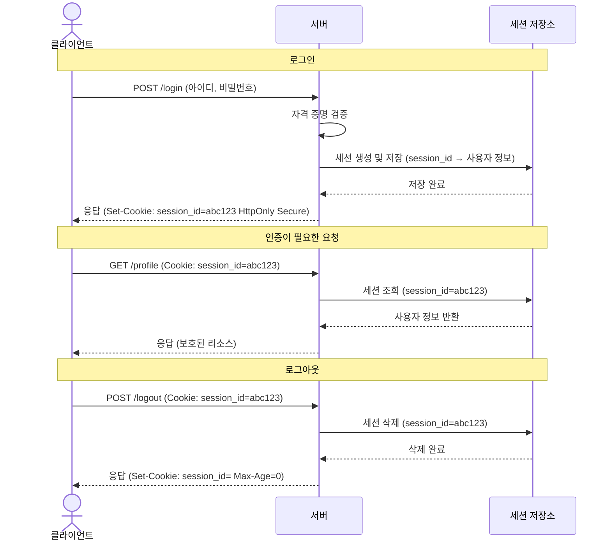

# 세션(Session) 기반 인증

- [세션(Session) 인증이란?](#세션session-인증이란)
- [세션 인증 플로우](#세션-인증-플로우)
- [세션 인증의 특징](#세션-인증의-특징)
- [쿠키(Cookie) 보안 속성](#쿠키cookie-보안-속성)
- [세션 저장소(Session Store) 비교](#세션-저장소session-store-비교)

## 세션(Session) 인증이란?

세션 인증은 서버 측에서 사용자의 상태를 유지하는 상태 유지(Stateful) 방식의 인증 메커니즘이다. 서버는 사용자의 로그인 정보를 세션 저장소에 보관하고, 클라이언트에게는 해당 정보에 접근할 수 있는 세션 ID(Session ID)를 쿠키를 통해 전달한다.

- 특징:
  - 서버가 모든 인증 상태를 직접 관리하므로 보안 제어가 용이함.
  - 사용자가 많아질수록 서버 메모리나 DB 부하가 증가함.
  - 서버 확장 시 세션 불일치 문제를 해결하기 위해 세션 클러스터링(Session Clustering)이나 공유 저장소(Redis 등)가 필요함.

## 세션 인증 플로우

## 세션 인증의 특징

| 항목      | 내용                                                               |
| :-------- | :----------------------------------------------------------------- |
| 상태 관리 | 서버 측에서 사용자의 인증 상태를 유지함 (Stateful)                 |
| 저장 위치 | 서버 메모리, 데이터베이스, 또는 Redis와 같은 인메모리 저장소       |
| 보안성    | 토큰 방식보다 탈취 시 대응이 빠름 (서버에서 즉시 세션 무효화 가능) |
| 확장성    | 서버 간 세션 정보 공유를 위한 추가 인프라 설정이 필요함            |

## 쿠키(Cookie) 보안 속성

세션 ID는 주로 쿠키를 통해 전송되므로, 쿠키의 보안 속성을 올바르게 설정하는 것이 매우 중요하다.

- `HttpOnly`: 자바스크립트(`document.cookie`)를 통한 쿠키 접근을 차단하여 XSS 공격으로부터 세션 ID를 보호함.
- `Secure`: HTTPS 프로토콜을 통해서만 쿠키가 전송되도록 제한함.
- `SameSite`: 크로스 사이트 요청 위조(CSRF) 공격을 방지하기 위해 쿠키 전송 범위를 제한함 (`Strict`, `Lax`, `None`).
- `Max-Age` / `Expires`: 쿠키의 유효 기간을 설정하여 브라우저 종료 후에도 유지할지 결정함.

## 세션 저장소(Session Store) 비교

| 저장 방식           | 특징                      | 장점                           | 단점                                         |
| :------------------ | :------------------------ | :----------------------------- | :------------------------------------------- |
| 서버 메모리         | 서버 프로세스 내부에 저장 | 가장 빠른 속도                 | 서버 재시작 시 초기화됨, 분산 환경 사용 불가 |
| 인메모리 DB (Redis) | 별도의 고속 저장소 사용   | 서버 확장 용이, 매우 빠른 성능 | 별도의 인프라 관리 비용 발생                 |
| 관계형 DB (MySQL)   | 기존 데이터베이스 활용    | 영속성 보장, 관리 편의성       | 입출력 속도가 상대적으로 느림                |
