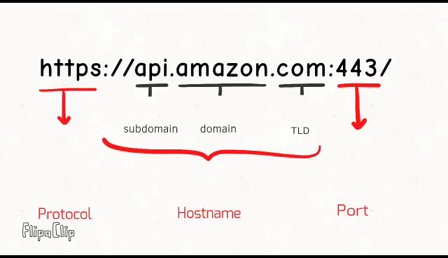

# Same Origin Policy

- [출처(Origin)의 정의](#출처origin의-정의)
- [교차 출처 네트워크 접근](#교차-출처-네트워크-접근)
- [교차 출처 스크립트 API 접근](#교차-출처-스크립트-api-접근)
- [교차 출처 데이터 저장소 접근](#교차-출처-데이터-저장소-접근)

동일 출처 정책(Same-Origin Policy, SOP)은 웹 보안 모델의 핵심 개념 중 하나로, 웹 브라우저에서 실행되는 스크립트가 서로 다른 출처(origin)에서 가져온 리소스에 접근하는 것을 제한하는 규칙이다.

## 출처(Origin)의 정의

- 출처는 프로토콜, 호스트, 포트로 구성된다. 이 세 가지가 동일한 경우에만 두 URL은 동일한 출처로 간주된다.
- `http://store.company.com/dir/page.html`과 `http://store.company.com/dir/other.html`은 동일한 출처다.

## 교차 출처 네트워크 접근

▾ 동일 출처 정책이 허용하는 네트워크 접근:

- ``를 사용하는 JavaScript. 구문 오류에 대한 오류 세부 정보는 동일 출처 스크립트에서만 사용할 수 있다.
- `<link rel="stylesheet" href="…">`로 적용된 CSS. CSS의 완화된 구문 규칙으로 인해 교차 출처 CSS에는 올바른 Content-Type 헤더가 요구된다. 브라우저는 MIME 유형이 올바르지 않고 리소스가 유효한 CSS 구성으로 시작하지 않는 교차 출처 로드인 경우 스타일시트 로드를 차단한다.
- ``로 표시하는 이미지.
- `<video>`와 `<audio>`로 재생하는 미디어.
- `<object>`와 `<embed>`로 삽입하는 외부 리소스.
- `@font-face`로 적용하는 글꼴. 일부 브라우저는 교차 출처를 허용하지만, 일부 브라우는 동일 출처를 요구할 수도 있다.
- `<iframe>`으로 삽입하는 모든 것. 사이트는 `X-Frame-Options` 헤더를 사용하여 출처 간 프레이밍을 방지할 수 있다.

▾ 동일 출처 정책이 비허용하는 접근:

## 교차 출처 스크립트 API 접근

## 교차 출처 데이터 저장소 접근
