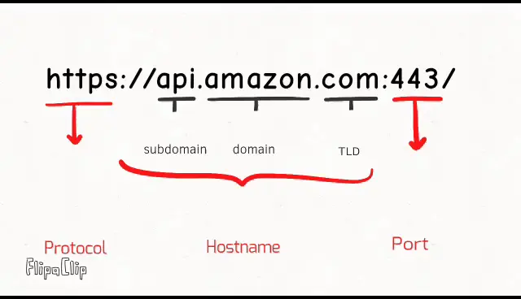

# 동일 출처 정책(Same Origin Policy)과 CORS

- [동일 출처 정책(Same Origin Policy) 개요](#동일-출처-정책same-origin-policy-개요)
- [출처(Origin)의 정의](#출처origin의-정의)
  - [동일 출처 vs 교차 출처 예시](#동일-출처-vs-교차-출처-예시)
  - [허용 및 제한 범위](#허용-및-제한-범위)
- [교차 출처 리소스 공유(CORS)](#교차-출처-리소스-공유cors)
  - [단순 요청(Simple Request)](#단순-요청simple-request)
  - [사전 요청(Preflight Request)](#사전-요청preflight-request)
  - [인증 정보를 포함한 요청(Credentialed Request)](#인증-정보를-포함한-요청credentialed-request)
- [CORS 에러 디버깅](#cors-에러-디버깅)

## 동일 출처 정책(Same Origin Policy) 개요

동일 출처 정책(SOP)은 특정 출처에서 로드된 문서나 스크립트가 다른 출처의 자원과 상호작용하는 방식을 제한하는 브라우저의 핵심 보안 메커니즘이다.

SOP가 없을 때 발생할 수 있는 공격 시나리오는 다음과 같다.

1. 사용자가 `bank.com`에 로그인하여 세션 쿠키가 저장됨.
2. 사용자가 악성 사이트 `evil.com`을 방문함.
3. `evil.com`의 스크립트가 `bank.com/api/transfer`에 요청을 전송함.
4. 브라우저가 자동으로 세션 쿠키를 첨부하여 인증된 요청이 성립됨.

SOP는 3~4 단계에서 교차 출처 읽기를 차단하여 이러한 공격을 방지한다.

- 브라우저 환경에서만 강제되며, 서버 간 통신(Server-to-Server)에는 적용되지 않음.
- `curl`, `Postman` 등 브라우저 외부 도구는 SOP의 영향을 받지 않음.

## 출처(Origin)의 정의

출처는 프로토콜(Protocol) · 호스트(Host) · 포트(Port)의 조합으로 결정된다. 세 가지 요소가 모두 일치해야 동일 출처로 간주한다.



### 동일 출처 vs 교차 출처 예시

기준 URL: `https://www.example.com:443/page`

| URL                                 | 결과      | 이유                              |
| ----------------------------------- | --------- | --------------------------------- |
| `https://www.example.com:443/other` | 동일 출처 | 프로토콜, 호스트, 포트 동일       |
| `https://www.example.com/page`      | 동일 출처 | HTTPS 기본 포트 443 생략          |
| `http://www.example.com/page`       | 교차 출처 | 프로토콜 상이 (`https` vs `http`) |
| `https://api.example.com/page`      | 교차 출처 | 서브도메인 상이                   |
| `https://www.example.com:8080/page` | 교차 출처 | 포트 상이                         |
| `https://www.other.com/page`        | 교차 출처 | 호스트 상이                       |

### 허용 및 제한 범위

| 동작                                         | 허용 여부 |
| -------------------------------------------- | --------- |
| 교차 출처 링크 연결                          | 허용      |
| 교차 출처 리다이렉트                         | 허용      |
| `<form>` 교차 출처 제출                      | 허용      |
| `<script>`, `<link>`, `` 교차 출처 로드 | 허용      |
| `<iframe>` 교차 출처 콘텐츠 접근             | 제한      |
| `fetch` / `XMLHttpRequest` 교차 출처 요청    | 제한      |
| 교차 출처 응답 본문 읽기                     | 제한      |

## 교차 출처 리소스 공유(CORS)

교차 출처 리소스 공유(Cross-Origin Resource Sharing)는 SOP의 제한을 안전하게 완화하여 다른 출처의 자원에 접근할 수 있게 하는 메커니즘이다. 브라우저와 서버가 HTTP 헤더를 통해 허용 여부를 협상한다.

### 단순 요청(Simple Request)

사전 요청(Preflight) 없이 본 요청을 바로 전송하는 방식이다. 아래 조건을 모두 만족해야 단순 요청으로 처리된다.

- HTTP 메서드: `GET`, `HEAD`, `POST` 중 하나.
- `Content-Type`: `application/x-www-form-urlencoded`, `multipart/form-data`, `text/plain` 중 하나.
- 사용자 정의 헤더(`Authorization`, `X-Custom-Header` 등)를 포함하지 않아야 함.

실제 요청/응답 헤더 흐름은 다음과 같다.

```sh
# 요청 (브라우저 → 서버)
GET /api/data HTTP/1.1
Host: api.example.com
Origin: https://www.client.com

# 응답 (서버 → 브라우저)
HTTP/1.1 200 OK
Access-Control-Allow-Origin: https://www.client.com
Content-Type: application/json
```

브라우저는 응답의 `Access-Control-Allow-Origin` 값이 요청한 `Origin`과 일치하는지 확인한다. 불일치하면 응답을 차단하고 CORS 에러를 발생시킨다.

### 사전 요청(Preflight Request)

본 요청을 보내기 전 `OPTIONS` 메서드로 서버에 허용 여부를 확인하는 방식이다. 단순 요청 조건을 벗어나는 경우에 발생한다.

사전 요청이 발생하는 주요 조건은 다음과 같다.

- `PUT`, `DELETE`, `PATCH` 메서드 사용
- `Content-Type: application/json` 사용
- `Authorization` 등 사용자 정의 헤더 포함

실제 헤더 흐름은 다음과 같다.

```sh
# 1단계: 사전 요청 (브라우저 → 서버)
OPTIONS /api/data HTTP/1.1
Host: api.example.com
Origin: https://www.client.com
Access-Control-Request-Method: DELETE
Access-Control-Request-Headers: Authorization, Content-Type

# 2단계: 사전 요청 응답 (서버 → 브라우저)
HTTP/1.1 204 No Content
Access-Control-Allow-Origin: https://www.client.com
Access-Control-Allow-Methods: GET, POST, PUT, DELETE
Access-Control-Allow-Headers: Authorization, Content-Type
Access-Control-Max-Age: 86400

# 3단계: 본 요청 (브라우저 → 서버)
DELETE /api/data/123 HTTP/1.1
Host: api.example.com
Origin: https://www.client.com
Authorization: Bearer eyJhbGci...

# 4단계: 본 요청 응답 (서버 → 브라우저)
HTTP/1.1 200 OK
Access-Control-Allow-Origin: https://www.client.com
```

주요 응답 헤더 역할은 다음과 같다.

| 헤더                            | 설명                                             |
| ------------------------------- | ------------------------------------------------ |
| `Access-Control-Allow-Origin`   | 허용할 출처. 와일드카드(`*`) 또는 특정 출처 지정 |
| `Access-Control-Allow-Methods`  | 허용할 HTTP 메서드 목록                          |
| `Access-Control-Allow-Headers`  | 허용할 요청 헤더 목록                            |
| `Access-Control-Max-Age`        | 사전 요청 결과 캐싱 시간(초). 중복 요청 방지     |
| `Access-Control-Expose-Headers` | 브라우저가 읽을 수 있도록 노출할 응답 헤더 목록  |

### 인증 정보를 포함한 요청(Credentialed Request)

쿠키(Cookie) · 인증 헤더(`Authorization`) · TLS 클라이언트 인증서를 포함하여 교차 출처 요청을 보낼 때 사용하는 방식이다.

기본적으로 `fetch`는 교차 출처 요청에 인증 정보를 포함하지 않는다. 포함하려면 클라이언트와 서버 양측에 명시적 설정이 필요하다.

클라이언트 설정은 다음과 같다.

```ts
// fetch
fetch('https://api.example.com/profile', {
  method: 'GET',
  credentials: 'include', // 인증 정보 포함
});

// XMLHttpRequest
const xhr = new XMLHttpRequest();
xhr.open('GET', 'https://api.example.com/profile');
xhr.withCredentials = true;
xhr.send();
```

서버 응답 헤더는 다음 두 가지 조건을 동시에 만족해야 한다.

```sh
Access-Control-Allow-Origin: https://www.client.com  # * 사용 불가
Access-Control-Allow-Credentials: true
```

`Access-Control-Allow-Origin`에 와일드카드(`*`)를 사용하면 인증 정보 포함 요청은 브라우저에 의해 차단된다. 구체적인 출처를 명시해야 한다.

## CORS 에러 디버깅

CORS 에러는 브라우저 콘솔에 다음과 같은 메시지로 나타난다.

```text
Access to fetch at 'https://api.example.com/data' from origin 'https://www.client.com'
has been blocked by CORS policy: No 'Access-Control-Allow-Origin' header is present
on the requested resource.
```

원인별 진단 방법은 다음과 같다.

| 에러 메시지                                                             | 원인                                                 | 해결 방법                                                          |
| ----------------------------------------------------------------------- | ---------------------------------------------------- | ------------------------------------------------------------------ |
| `No 'Access-Control-Allow-Origin' header`                               | 서버가 CORS 헤더를 응답에 포함하지 않음              | 서버에 `Access-Control-Allow-Origin` 헤더 추가                     |
| `has been blocked by CORS policy: Response to preflight...`             | 사전 요청(`OPTIONS`)에 서버가 올바르게 응답하지 않음 | `OPTIONS` 메서드 처리 및 CORS 헤더 응답 추가                       |
| `The value of the 'Access-Control-Allow-Origin' header must not be '*'` | `credentials: 'include'` 사용 시 와일드카드 지정     | 특정 출처를 명시하고 `Access-Control-Allow-Credentials: true` 추가 |
| `Request header field X-Custom-Header is not allowed`                   | 사전 요청 없이 허용되지 않은 헤더 전송               | `Access-Control-Allow-Headers`에 해당 헤더 추가                    |

CORS 에러는 서버 응답이 실제로 도달한 뒤 브라우저가 차단하는 것이다. 서버 로그에는 요청이 기록되지만 브라우저는 응답을 읽지 못한다. 따라서 네트워크 탭에서 응답 헤더를 직접 확인하는 것이 진단의 출발점이다.
