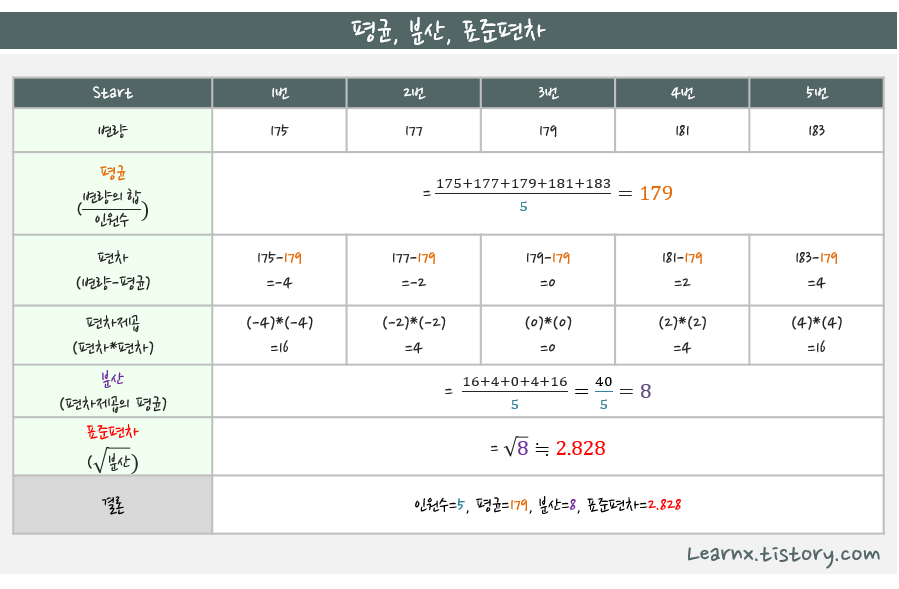
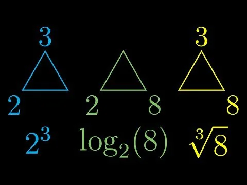

- [마크업 언어란?](#마크업-언어란)
- [표준편차란?](#표준편차란)
- [Min-Max 정규화란?](#min-max-정규화란)
- [Z-score 표준화란?](#z-score-표준화란)
- [벡터 기반 렌더링의 픽셀 기반 렌더링 차이?](#벡터-기반-렌더링의-픽셀-기반-렌더링-차이)
- [요청 • 응답](#요청--응답)
- [파싱(Parsing)이란?](#파싱parsing이란)
- [방정식이란?](#방정식이란)
- [지수 • 로그 • 루트](#지수--로그--루트)
- [정적(Static) • 동적(Dynamic)이란?](#정적static--동적dynamic이란)
- [배포(Deployment) • 배포(distribution)](#배포deployment--배포distribution)

## 마크업 언어란?

문서가 화면에 표시되는 형식을 나타내거나 데이터의 논리적인 구조를 명시하기 위한 규칙들을 정의한 언어의 일종이다. 데이터를 기술한 언어라는 점에서 프로그래밍 언어와는 분명한 차이가 있다.

## 표준편차란?

표준편차는 데이터의 평균에서 각 데이터가 떨어진 정도를 나타내는 값이다. 표준편차가 작으면 데이터가 평균에 모여있고, 표준편차가 크면 데이터가 평균에서 멀리 떨어져있다.

## Min-Max 정규화란?

최소-최대 정규화는 데이터를 특정 범위 \([a, b]\)로 변환하는 방법이다. 가장 일반적으로 \([0, 1]\) 범위로 변환된다.

$X{\text{norm}} = \frac{X - X{\text{min}}}{X{\text{max}} - X{\text{min}}} \times (b - a) + a$

- $X$ : 원본 데이터 값
- $X{\text{min}}$ : 데이터셋에서 최소값
- $X{\text{max}}$ : 데이터셋에서 최대값
- $a, b$ : 원하는 변환 범위 (기본적으로 $a=0, b=1$)

## Z-score 표준화란?

Z-score 표준화는 데이터를 평균이 0, 표준편차가 1인 분포로 변환한다.

$X{\text{norm}} = \frac{X - \mu}{\sigma}$

- $X$ : 원본 데이터 값
- $\mu$ : 데이터셋의 평균
- $\sigma$ : 데이터셋의 표준 편차

## 벡터 기반 렌더링의 픽셀 기반 렌더링 차이?

| 항목           | 벡터 기반 렌더링                                   | 픽셀 기반 렌더링                                     |
| -------------- | -------------------------------------------------- | ---------------------------------------------------- |
| 기본 개념      | 수학적 좌표와 기하학적 도형을 이용하여 그래픽 표현 | 픽셀 단위의 격자를 사용하여 이미지를 표현            |
| 확대 시 품질   | 해상도와 무관하여 무한대로 확대해도 깨지지 않음    | 확대 시 픽셀이 보이며 이미지가 깨짐 (블러 현상 발생) |
| 파일 크기      | 복잡도에 따라 크기가 변하지만 일반적으로 작음      | 해상도에 따라 크기가 증가하며 대용량이 될 수 있음    |
| 주요 사용처    | 로고, 아이콘, 폰트, 일러스트레이션, CAD 도면       | 사진, 디지털 아트, 텍스처, 웹 이미지                 |
| 렌더링 방식    | 수학적 연산을 통해 실시간으로 선과 도형을 그림     | 각 픽셀의 색상을 개별적으로 계산하여 표시            |
| 대표 파일 형식 | SVG, AI, EPS, PDF                                  | JPG, PNG, BMP, GIF                                   |
| 편집 가능성    | 개별 요소 수정이 용이하며 변형이 자유로움          | 픽셀 단위 수정이 필요하며 수정이 제한적임            |
| 연산 성능      | 실시간 연산 필요, 단순한 도형은 부담이 적음        | 고해상도 이미지 처리 시 많은 메모리와 연산 자원 사용 |

## 요청 • 응답

| 요청    | 응답     |
| ------- | -------- |
| Request | Response |
| Send    | Receive  |
| From    | To       |
| 발신    | 착신     |
| 송신    | 수신     |

## 파싱(Parsing)이란?

파싱은 입력 데이터(예: 텍스트, 코드, 문자열 등)를 읽고 이를 더 작은 구성 요소로 나누어 그 의미나 구조를 이해할 수 있도록 만드는 작업을 말한다.

1. 프로그래밍 언어 파싱

   - 소스 코드를 읽어 문법적으로 올바른지 확인하고, 추상 구문 트리(AST, Abstract Syntax Tree) 같은 자료 구조로 변환하는 과정이다. 이는 컴파일러나 인터프리터가 코드를 실행 가능하도록 만드는 첫 단계 중 하나다.
   - 예: `"3 + 5"`라는 문자열을 파싱하면 숫자 `3`, 연산자 `+`, 숫자 `5`로 분리되어 연산 구조를 이해할 수 있게 된다.

2. 데이터 파싱

   - JSON, XML, CSV 같은 형식의 데이터를 읽고, 프로그램에서 사용할 수 있는 객체, 배열, 변수 등으로 변환하는 작업이다.
   - 예: `"{"name": "John", "age": 30}"`라는 JSON 문자열을 파싱하면 `{name: "John", age: 30}`라는 데이터 구조로 변환된다.

## 방정식이란?

- 미지수의 값에 따라 참, 거짓이 결정되는 등식이다.
- 방정식을 참이 되게 하는 미지수의 값을 해 또는 근이라고 한다.

## 지수 • 로그 • 루트

- 지수: 지수 방정식의 결과값을 찾음.
- 로그: 지수 방정식의 지수를 찾음.
- 루트: 지수 방정식의 밑을 해결

## 정적(Static) • 동적(Dynamic)이란?

- 정적이란 것은 프로그램이 실행되기 전, 즉 컴파일 단계나 파싱 단계에서 결정되는 것.
- 동적이란 것은 프로그램이 실행된 후, 즉 런타임 단계에서 결정되는 것.

## 배포(Deployment) • 배포(distribution)
