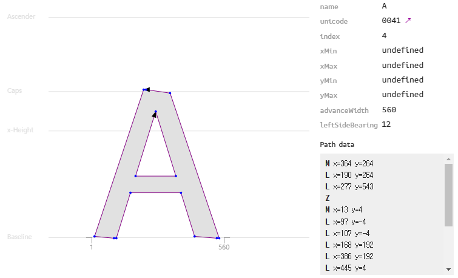

# Font

- [`font-family`](#font-family)
- [`font-face`](#font-face)
- [`rem`, `em`](#rem-em)
- [`white-space`](#white-space)
- [`word-break`](#word-break)
- [`text-overflow`](#text-overflow)
- [문자 수평 맞추기](#문자-수평-맞추기)
- [폰트 형식의 아이콘은 어떻게 동작하지?](#폰트-형식의-아이콘은-어떻게-동작하지)

## `font-family`

- `font-family` 설정이 따로 없다면, 기본적으로 각 운영체제의 설치된 시스템 기본 글꼴을 사용하게 된다.
- 일반적으로 사용하려는 폰트명과 해당 글꼴이 없는 경우 대체할 폰트명을 나열한다.
- 폰트명에 띄어쓰기가 존재하면 따옴표로 감싸주어야 인식한다.

```css
body {
  font-family: Times, 'Times New Roman', Georgia, serif;
}
```

## `font-face`

- 로컬 컴퓨터에 설치된 폰트뿐 아니라 외부 리소스를 가져와서 폰트를 정의하기 위해 사용된다.
- `local()`은 로컬 컴퓨터에 설치된 폰트를 가리키기 위해 사용된다.
- `url()`은 외부 리소스(폰트)를 가리키기 위해 사용된다.
- `format()` 폰트 파일의 확장자를 명시하기 위해 사용된다.

```css
/* ... */
@font-face {
  font-family: 'Pretendard';
  font-weight: 600;
  font-display: swap;
  src:
    local('Pretendard SemiBold'),
    url('/fonts/Pretendard-SemiBold.subset.woff2') format('woff2'),
    url('/fonts/Pretendard-SemiBold.subset.woff') format('woff');
}
@font-face {
  font-family: 'Pretendard';
  font-weight: 500;
  font-display: swap;
  src:
    local('Pretendard Medium'),
    url('/fonts/Pretendard-Medium.subset.woff2') format('woff2'),
    url('/fonts/Pretendard-Medium.subset.woff') format('woff');
}
/* ... */

body {
  font-family: Pretendard, Times, 'Times New Roman', Georgia, serif;
}
```

## `rem`, `em`

`rem`과 `em`은 CSS 글꼴 크기와 요소의 크기를 정의하는 데 사용되는 상대 단위이다.

▾ `rem`:

`rem`은 문서의 루트 요소인 `<html>`의 `font-size` 속성값을 기준으로 한다.

브라우저 글꼴 크기 설정 변경 시 모든 `rem` 단위가 동일한 비율로 조정되어 일관성 있는 레이아웃을 유지할 수 있다.

▾ `em`:

`em`은 해당 단위가 사용되고 있는 요소의 `font-size` 속성값을 기준으로 한다.

`em` 단위의 특성상 형제 요소의 스타일에 영향을 받을 수 있기 때문에, 필요한 경우가 아니라면 `rem` 단위를 사용하는 것이 좋다.

▾ 예시:

```ts
h1: {
  fontFamily: ""Roboto", "Helvetica", "Arial", sans-serif"
  fontWeight: 300;
  fontSize: "6rem";
  lineHeight: 1.167;
  letterSpacing: "-0.01562em";
}
```

## `white-space`

| `white-space`     | 스페이스(`\s`)와 탭(`\t`) | 줄바꿈(\n)            | 줄바꿈(\n)에 관계없이 오버플로우 시 줄바꿈 |
| ----------------- | ------------------------- | --------------------- | ------------------------------------------ |
| `normal`(default) | 한 개의 공백으로 변경     | 한 개의 공백으로 변경 | O                                          |
| `nowrap`          | 한 개의 공백으로 변경     | 한 개의 공백으로 변경 | X                                          |
| `pre`             | 그대로 보존               | 그대로 보존           | X                                          |
| `pre-wrap`        | 그대로 보존               | 그대로 보존           | O                                          |
| `pre-line`        | 한 개의 공백으로 변경     | 그대로 보존           | O                                          |

## `word-break`

- CJK(Chinese/Japanese/Korean): 띄어쓰기 없이 이어진 중국어, 일본어, 한국어 단어
- Non-CJK: 띄어쓰기 없이 이어진 중국어, 일본어, 한국어 제외 단어(영어, 숫자 등)
- 단어 중간에 특수문자가 있으면 예상대로 동작하지 않을 수 있다. 이럴 땐 `white-space` 속성을 같이 사용한다.

| `word-break`      | 오버플로우 시 Non-CJK 자름 여부 | 오버플로우 시 CJK 자름 여부 |
| ----------------- | ------------------------------- | --------------------------- |
| `normal`(default) | X                               | O                           |
| `break-all`       | O                               | O                           |
| `keep-all`        | X                               | X                           |

## `text-overflow`

텍스트가 오버플로우되는 상황은 부모 박스의 너비를 초과하는 경우 발생한다.
`white-space`를 `nowrap` 이나 `pre`로 바꿔 자동 줄바꿈을 제거해 오버플로우를 발생시킨다.

발생한 오버플로우는 `overflow: hidden`으로 가려버리고 이후에 `text-overflow: eillipsis`를 적용해 해당 텍스트의 `...`을 적용한다.

```css
div {
  display: block;
  white-space: nowrap; /* 자동 줄바꿈 제거 */
  overflow: hidden; /* 오버플로우 가려버리기 */
  text-overflow: eillipsis; /* 오버플로우 시 말줄임표 적용 */
}
```

## 문자 수평 맞추기

▾ 수평 정렬이 안맞는 경우:

- 크기가 서로 다른 문자끼리 수평인 경우
- 문자와 아이콘 또는 이미지와 수평인 경우

▾ 해결 방법:

- `line-height: 1`로 설정해본다.

## 폰트 형식의 아이콘은 어떻게 동작하지?

우선 위 궁금증을 알아보기 전에 일반적으로 폰트가 동작하는 방식을 알아보자.

글자 폰트는 유니코드를 입력하면 그 유니코드에 해당하는 글리프 인덱스를 매핑 테이블에서 찾아서 해당 글리프를 보여주는 식으로 동작한다. 글리프는 벡터 기반으로 그려진 그래픽으로 아래 그림과 같다.



폰트 파일 내부에는 유니코드와 글리프의 인덱스 값이 매핑된 cmap(Character To Glyph Index Mapping Table)이라는 테이블이 존재한다.


