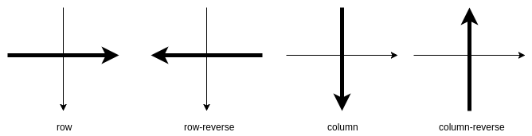
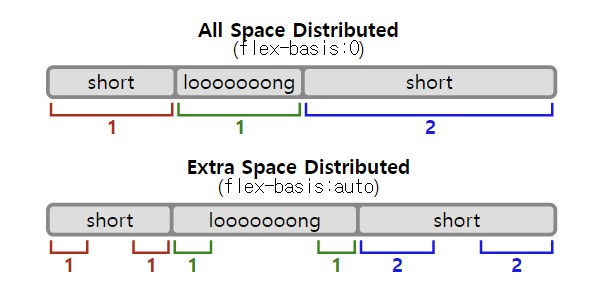
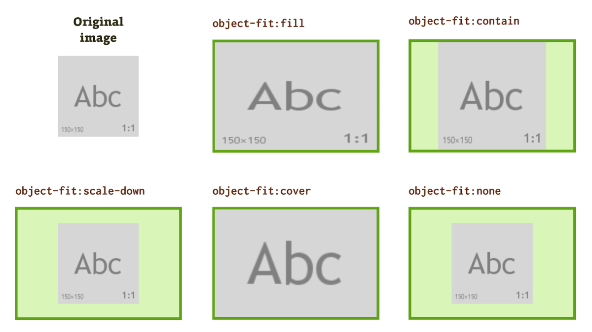

# Layout

- [`display`](#display)
  - [`display` 속성에 따라 제어 가능한 속성](#display-속성에-따라-제어-가능한-속성)
  - [`display` 속성에 따른 `width: auto`](#display-속성에-따른-width-auto)
  - [`display` 속성에 따른 `width: 100%`](#display-속성에-따른-width-100)
  - [`display` 속성에 따른 `height: auto`](#display-속성에-따른-height-auto)
  - [`display` 속성에 따른 `height: 100%`](#display-속성에-따른-height-100)
- [`flex`](#flex)
  - [`flex-direction`](#flex-direction)
  - [`flex-basis`](#flex-basis)
- [`grid`](#grid)
  - [`grid-template-columns`](#grid-template-columns)
  - [`grid-auto-rows`](#grid-auto-rows)
- [`position`](#position)
- [`box-sizing`](#box-sizing)
- [`object-fit` • `object-position`](#object-fit--object-position)
- [`@media`](#media)
- [Layout Tip](#layout-tip)

## `display`

### `display` 속성에 따라 제어 가능한 속성

| `display`               | `width` | `height` | `paddingX` | `paddingY` | `borderX` | `borderY` | `marginY` | `marginX` | 줄바꿈 |
| ----------------------- | :-----: | :------: | :--------: | :--------: | :-------: | :-------: | :-------: | :-------: | :----: |
| `inline`                |    X    |    X     |     O      |     △      |     O     |     △     |     X     |     O     |   X    |
| `inline-*`              |    O    |    O     |     O      |     O      |     O     |     O     |     O     |     O     |   X    |
| `block`, `flex`, `grid` |    O    |    O     |     O      |     O      |     O     |     O     |     O     |     O     |   O    |

- `inline` 요소는 `paddingY`와 `borderY`는 동작은 되지만 위아래로 영역을 침범한다.
- `inline` 요소끼리 배치되면 제어가 어려운 여백이 생긴다.

### `display` 속성에 따른 `width: auto`

- 가로 길이는 `width`, `paddingX`, `borderX`, `marginX` 값을 합친 값이다.
- 일반적으로 `inline` 요소는 자식으로 `inline` 요소를 제외한 요소를 넣지 않는다.
- 텍스트 길이 or 자식 요소 가로 길이를 따르는 경우 해당 값이 유동적으로 변해도 값을 따라간다.

|                | `width: auto`                          |
| -------------- | -------------------------------------- |
| `inline`       | 텍스트 길이 or `inline` 요소 가로 길이 |
| `inline-block` | 텍스트 길이 or 자식 요소 가로 길이     |
| `inline-flex`  | 텍스트 길이 or 자식 요소 가로 길이     |
| `inline-grid`  | 텍스트 길이 or 자식 요소 가로 길이     |
| `block`        | 부모 요소의 `width` - 자신의 `marginX` |
| `flex`         | 부모 요소의 `width` - 자신의 `marginX` |
| `grid`         | 부모 요소의 `width` - 자신의 `marginX` |

### `display` 속성에 따른 `width: 100%`

- `width: 100%`는 부모의 `width`를 100% 채우는 것이 일반적이지만, 부모 요소의 `min-width`, `max-width`에도 영향을 받을 수 있다. `min-width`는 직접적으로 부모 크기를 100%로 확장하는 것을 막을 수 있다.

|                | `width: 100%`                                   |
| -------------- | ----------------------------------------------- |
| `inline`       | `width` 작동하지 않음                           |
| `inline-block` | 부모 요소 `width`의 100%(부모가 `block`일 때만) |
| `inline-flex`  | 부모 요소 `width`의 100%(부모가 `block`일 때만) |
| `inline-grid`  | 부모 요소 `width`의 100%(부모가 `block`일 때만) |
| `block`        | 부모 요소 `width`의 100%                        |
| `flex`         | 부모 요소 `width`의 100%                        |
| `grid`         | 부모 요소 `width`의 100%                        |

### `display` 속성에 따른 `height: auto`

- 세로 길이는 `height`, `paddingY`, `borderY`, `marginY` 값을 합친 값이다.
- `inline-block` 요소의 경우 내부에 `inline-*` 요소를 가질 경우 이상한 높이값을 가진다.

|                | height: auto                         |
| -------------- | ------------------------------------ |
| `inline`       | 자동 계산된 텍스트 세로 길이         |
| `inline-block` | `line-height` or 자식 요소 세로 길이 |
| `inline-flex`  | `line-height` or 자식 요소 세로 길이 |
| `inline-grid`  | `line-height` or 자식 요소 세로 길이 |
| `block`        | `line-height` or 자식 요소 세로 길이 |
| `flex`         | `line-height` or 자식 요소 세로 길이 |
| `grid`         | `line-height` or 자식 요소 세로 길이 |

### `display` 속성에 따른 `height: 100%`

|                | height: 100%                          |
| -------------- | ------------------------------------- |
| `inline`       | `height` 작동하지 않음                |
| `inline-block` | 부모 요소 `height`가 설정된 경우 100% |
| `inline-flex`  | 부모 요소 `height`가 설정된 경우 100% |
| `inline-grid`  | 부모 요소 `height`가 설정된 경우 100% |
| `block`        | 부모 요소 `height`가 설정된 경우 100% |
| `flex`         | 부모 요소 `height`가 설정된 경우 100% |
| `grid`         | 부모 요소 `height`가 설정된 경우 100% |

## `flex`

`display: flex`는 해당 속성이 적힌 요소를 flex container로 만들고, 자식 요소들을 flex item으로 만들어 `flex` 관련 속성을 사용할 수 있게해서 유연한 레이아웃을 구현할 수 있도록 해준다.

### `flex-direction`

`flex`의 모든 속성은 메인 축을 기준으로 작동하며, `flex-direction`으로 메인 축을 변경할 수 있다.



|               | `flex-direction: row`    | `flex-direction: column` |
| ------------- | ------------------------ | ------------------------ |
| 메인 축       | 가로                     | 세로                     |
| `justify-*`   | 가로 정렬                | 세로 정렬                |
| `align-*`     | 세로 정렬                | 가로 정렬                |
| `flex-basis`  | 기본 가로 여백 차지 공간 | 기본 세로 여백 차지 공간 |
| `flex-grow`   | 가로 증가                | 세로 증가                |
| `flex-shrink` | 가로 감소                | 세로 감소                |

### `flex-basis`

`flex-basis`는 요소의 기본 여백 차지 공간을 결정한다.



위 사진처럼 여백을 정확한 비율로 나누기 위해서는 `flex-basis: 0`을 사용한다. `flex-basis: auto`일 경우엔 flex item의 너비만큼 차지하므로 정확한 비율로 나누지 못한다.

`width`가 지정되어 있을 경우, `flex-basis`가 우선적으로 적용되며 이 이후에 `width` 속성이 이 요소의 크기 조정에 개입하게 된다.

응용 예제:

```css
div {
  display: flex;
  flex-flow: row wrap;
}

/* 두 아이템의 여백 비율 100:1 */
/* min-width 값을 지정하여 wrap 분기점 설정*/
/* wrap될 경우 2번째 아이템은 자연스럽게 나눠진 행의 너비를 100% 차지 */
div.flex-item-1 {
  flex: 100 0;
  min-width: 200px;
}

div.flex-item-2 {
  flex: 1 0;
}
```

## `grid`

`grid`는 해당 속성이 적힌 요소를 grid container로 만들고, 자식 요소들을 grid item으로 만들어 `grid` 관련 속성을 사용할 수 있게해서 유연한 레이아웃을 구현할 수 있도록 해준다.

### `grid-template-columns`

`grid-template-columns` 속성의 값을 `repeat(auto-fit, minmax(100px ,1fr))` 또는 `repeat(auto-fill, minmax(100px ,1fr))`을 사용하여 반응형으로 구성 가능하다.

- `auto-fill`: 행에 들어갈 수 있는 만큼의 열로 행을 채운다. 따라서 가능한 한 많은 열로 행을 채우려고 하기 때문에 새 열이 들어갈 수 있을 때마다 암시적 열을 생성한다. 새로 추가된 열은 비어 있을 수도 있고 비어 있지 않을 수도 있지만 여전히 행의 지정된 공간을 차지한다.
- `auto-fit`: 현재 사용 가능한 열을 확장하여 사용 가능한 공간을 차지하도록 열을 공간에 끼워 넣는다.

`grid-template-columns` 속성의 값을 미디어쿼리로 제어하여 반응형으로 구성한다.

```css
.container {
  display: grid;
  grid-template-columns: 1fr 1fr;
}

@media (max-width: 600px) {
  .container {
    grid-template-columns: 1fr;
  }
}
```

### `grid-auto-rows`

`grid-auto-rows` 속성은 암시적으로 생성될 행의 높이를 설정한다.

```css
.container {
  display: grid;
  grid-template-columns: 1fr 1fr;
  grid-auto-rows: 100px; /* 암시적으로 생성될 행의 높이 */
}
```

## `position`

| `position` | 컨테이닝 블록                                                                                                                   |
| ---------- | ------------------------------------------------------------------------------------------------------------------------------- |
| `static`   | 가장 가까운 블록 컨테이너의 콘텐츠 영역                                                                                         |
| `relative` | 가장 가까운 블록 컨테이너의 콘텐츠 영역                                                                                         |
| `absolute` | 가장 가까운 `position` 값이 `static`이 아닌 부모 요소의 패딩 영역, 부모가 없으면 초기 컨테이닝 블록(보통 뷰포트 또는 HTML 요소) |
| `fixed`    | 뷰포트                                                                                                                          |
| `sticky`   | 가장 가까운 블록 컨테이너의 콘텐츠 영역                                                                                         |

| `position` | 일반적인 문서 흐름 유지 | `top`, `bottom`, `left`, `right`, `z-index` |
| ---------- | :---------------------: | :-----------------------------------------: |
| `static`   |            O            |                      X                      |
| `relative` |            O            |                      O                      |
| `absolute` |            X            |                      O                      |
| `fixed`    |            X            |                      O                      |
| `sticky`   |            O            |                      O                      |

| `position` | `top`, `bottom`, `left`, `right` 쓰임새      |
| ---------- | -------------------------------------------- |
| `static`   | X                                            |
| `relative` | 현재 위치 기준 요소 이동                     |
| `absolute` | 컨테이닝 블록 기준 요소 이동                 |
| `fixed`    | 컨테이닝 블록 기준 요소 이동                 |
| `sticky`   | 가장 가까운 스크롤 가능한 부모 영역의 임계값 |

`sticky`는 초기에 `relative`처럼 동작하다가 스크롤 시 요소의 컨테이닝 블록이 임계값에 도달하면 `fixed`처럼 동작하고 컨테이닝 블록의 반대편 가장자리를 만나면 `relative`처럼 다시 동작한다.

`sticky` 속성이 적용되지 않는 경우:

- 임계점 위치를 지정하는 `top`, `bottom`, `left`, `right` 속성 값 중 적어도 하나는 `auto`가 아닌 값으로 지정되어 있어야 한다.
- 가장 가까운 스크롤이 가능한 부모 요소의 영역 내에 `sticky`가 설정된 요소가 있어야 한다.
- 가장 가까운 스크롤이 가능한 부모 요소(scrollport)의 자손이면서 `sticky`가 설정된 요소의 부모 사이의 요소에는 `overflow` 속성의 값이 `auto`, `scroll` 및 `hidden`으로 설정되어 있지 않아야 한다.

## `box-sizing`

- 실무에서는 대부분 모든 요소에 `box-sizing: border-box`를 사용하여 작업을 한다.

| `box-sizing`  | 설명                                                                        |
| ------------- | --------------------------------------------------------------------------- |
| `content-box` | `width`와 `height` 값과 `padding`, `border` 값이 따로 계산되며, 기본값이다. |
| `border-box`  | `padding`, `border` 값이 `width`와 `height` 값에 포함되어 계산된다.         |

## `object-fit` • `object-position`

`object-fit`:

``나 `<video>`, `<iframe>` 요소와 같은 대체 요소의 콘텐츠 크기를 어떤 방식으로 조절해 요소에 맞출 것인지 지정한다.



| `object-fit` | 설명                                                                   |
| ------------ | ---------------------------------------------------------------------- |
| `fill`       | 종횡비 무시, 콘텐츠 박스를 가득 채움                                   |
| `contain`    | 종횡비 유지, 콘텐츠와 콘텐츠 박스의 종횡비가 다르면 레터박스 모양      |
| `cover`      | 종횡비 유지, 콘텐츠와 콘텐츠 박스의 종횡비가 다르면 콘텐츠 일부가 잘림 |
| `none`       | 아무것도 하지 않음                                                     |
| `scale-down` | `none`과 `contain` 중 콘텐츠의 크기가 더 작은 값을 선택                |

`object-position`:

대체 요소의 콘텐츠 정렬 방식을 지정한다. 대체 요소의 객체가 덮지 않은 부분은 요소의 배경이 보이게 된다.

```css
object-position: center top;
object-position: 100px 50px;
```

대체 요소:

대체 요소는 CSS 서식 모델과는 분리된 외부 객체인 요소이다. 즉, 대체 요소는 자신의 콘텐츠가 현재 문서 스타일의 영향을 받지 않는 요소라고 할 수 있다. CSS는 대체 요소의 위치에 영향을 줄 수 있지만 콘텐츠에는 미치지 못한다.

## `@media`

```css
/*
xs: 0,
sm: 600,
md: 900,
lg: 1200,
xl: 1536,
*/

@media (max-width: 600px) {
  /* 600px 이하의 스크린에서 적용 */
}

@media (min-width: 1200px) {
  /* 1200px 이상의 스크린에서 적용 */
}
```

## Layout Tip

- `vw`는 뷰포트 너비로, `width: 100vw` 사용 시 스크롤 크기를 고려하지 않기 때문에 수직 스크롤이 생기면 수평 스크롤이 생기기 때문에 사용을 지양한다.
- `vh`는 뷰포트 높이로, `height: 100vh`보다는 `min-height: 100vh`를 더 사용한다. 이유는 브라우저는 항상 충분히 길어질 수 있기 때문에 레이아웃에서 고정 높이를 사용하는 것은 지양한다.
- 레이아웃의 최대 너비를 고정하고 가운데 정렬하고 싶은 경우에는 `max-width` 값을 지정하고 `margin: auto`를 통해 가운데 정렬한다.
- 반응형으로 작성 시 브라우저 너비가 매우 좁아졌을 때 컨텐츠들이 오버플로우로 인해 튀어나가는 현상을 방지하려면 컨텐츠를 감싸는 부모 요소의 `min-width` 값을 주고 `overflow-x: auto`를 통해 튀어나가는 현상을 방지한다.
