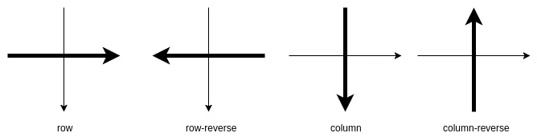
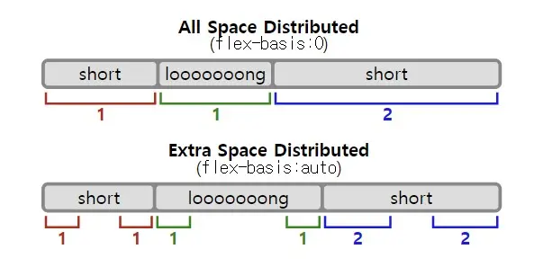
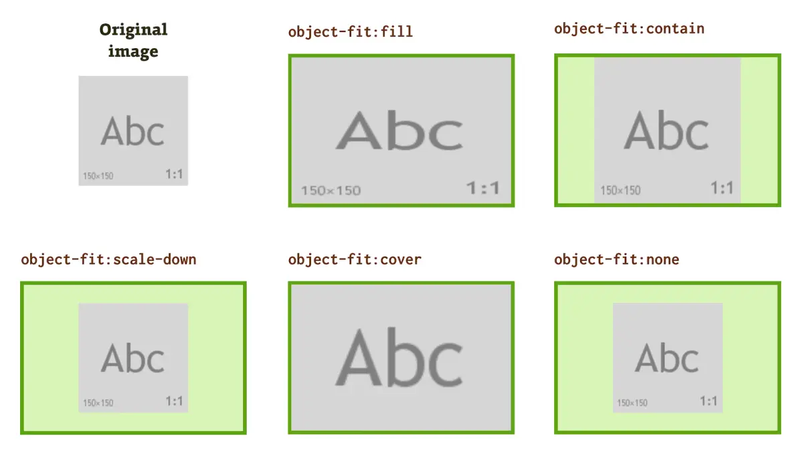

# Layout

- [상대 단위(rem • em)](#상대-단위rem--em)
- [`display`](#display)
  - [`display` 속성에 따라 제어 가능한 속성](#display-속성에-따라-제어-가능한-속성)
  - [`display` 속성에 따른 `width: auto`](#display-속성에-따른-width-auto)
  - [`display` 속성에 따른 `width: 100%`](#display-속성에-따른-width-100)
  - [`display` 속성에 따른 `height: auto`](#display-속성에-따른-height-auto)
  - [`display` 속성에 따른 `height: 100%`](#display-속성에-따른-height-100)
- [`flex`](#flex)
  - [`flex-direction`](#flex-direction)
  - [`flex-basis`](#flex-basis)
  - [`flex: 1`이 `height`를 덮어쓰는 경우](#flex-1이-height를-덮어쓰는-경우)
  - [`gap`](#gap)
  - [`min-width: auto`](#min-width-auto)
  - [정렬 속성](#정렬-속성)
- [`grid`](#grid)
  - [`grid-template-columns`](#grid-template-columns)
  - [`auto-fit` • `auto-fill` 주의사항](#auto-fit--auto-fill-주의사항)
    - [`minmax()` 최솟값에 `fr` 단위 사용 불가](#minmax-최솟값에-fr-단위-사용-불가)
    - [아이템 수가 적을 때 `auto-fit` 주의](#아이템-수가-적을-때-auto-fit-주의)
    - [컨테이너 너비가 최솟값보다 좁을 때 오버플로우](#컨테이너-너비가-최솟값보다-좁을-때-오버플로우)
  - [`grid-auto-rows`](#grid-auto-rows)
  - [`gap`](#gap-1)
  - [`grid-column` • `grid-row`](#grid-column--grid-row)
  - [`grid-template-areas`](#grid-template-areas)
  - [`grid-auto-flow`](#grid-auto-flow)
  - [`min-width: auto`](#min-width-auto-1)
  - [정렬 속성](#정렬-속성-1)
- [`position`](#position)
  - [`sticky`](#sticky)
  - [`fixed`의 컨테이닝 블록 예외](#fixed의-컨테이닝-블록-예외)
- [`box-sizing`](#box-sizing)
- [`object-fit` • `object-position`](#object-fit--object-position)
- [`@media`](#media)
- [레이아웃에 영향을 주지 않는 스타일링](#레이아웃에-영향을-주지-않는-스타일링)
- [Layout Tip](#layout-tip)
- [의도하지 않은 스크롤이 발생하는 원인](#의도하지-않은-스크롤이-발생하는-원인)

## 상대 단위(rem • em)

CSS 글꼴 크기와 요소 크기를 정의하는 상대 단위다.

`rem` (Root EM):

- 문서의 루트 요소인 `<html>`의 `font-size`를 기준으로 함.
- 브라우저 글꼴 크기 설정 변경 시 모든 `rem` 단위가 동일한 비율로 조정되어 일관성 있는 레이아웃을 유지할 수 있음.

`em`:

- 해당 단위가 사용되고 있는 요소의 `font-size`를 기준으로 함.
- 중첩 구조에서 상위 요소의 스타일에 영향을 받으므로, 필요한 경우가 아니라면 `rem`을 사용하는 것이 좋음.

```css
html {
  font-size: 16px; /* 1rem = 16px */
}

h1 {
  font-size: 2rem; /* 32px */
  letter-spacing: -0.01562em; /* 32px × -0.01562 ≈ -0.5px */
}
```

## `display`

### `display` 속성에 따라 제어 가능한 속성

| `display`               | `width` | `height` | `paddingX` | `paddingY` | `borderX` | `borderY` | `marginX` | `marginY` | 줄바꿈 |
| ----------------------- | :-----: | :------: | :--------: | :--------: | :-------: | :-------: | :-------: | :-------: | :----: |
| `inline`                |    X    |    X     |     O      |     △      |     O     |     △     |     O     |     X     |   X    |
| `inline-*`              |    O    |    O     |     O      |     O      |     O     |     O     |     O     |     O     |   X    |
| `block`, `flex`, `grid` |    O    |    O     |     O      |     O      |     O     |     O     |     O     |     O     |   O    |

- `inline` 요소는 `paddingY`와 `borderY`는 동작은 되지만 위아래로 영역을 침범한다.
- `inline` 요소 중 대체 요소(Replaced Element)인 ``, `<input>`, `<select>`, `<button>`, `<video>` 등은 `width`, `height`, `margin` 속성이 모두 적용됨.
- `inline` 요소끼리 배치되면 제어가 어려운 여백이 생긴다.

### `display` 속성에 따른 `width: auto`

- 가로 길이는 `width`, `paddingX`, `borderX`, `marginX` 값을 합친 값이다.
- 일반적으로 `inline` 요소는 자식으로 `inline` 요소를 제외한 요소를 넣지 않는다.
- 텍스트 길이 or 자식 요소 가로 길이를 따르는 경우 해당 값이 유동적으로 변해도 값을 따라간다.

|                | `width: auto`                          |
| -------------- | -------------------------------------- |
| `inline`       | 텍스트 길이 or `inline` 요소 가로 길이 |
| `inline-block` | 텍스트 길이 or 자식 요소 가로 길이     |
| `inline-flex`  | 텍스트 길이 or 자식 요소 가로 길이     |
| `inline-grid`  | 텍스트 길이 or 자식 요소 가로 길이     |
| `block`        | 부모 요소의 `width` - 자신의 `marginX` |
| `flex`         | 부모 요소의 `width` - 자신의 `marginX` |
| `grid`         | 부모 요소의 `width` - 자신의 `marginX` |

### `display` 속성에 따른 `width: 100%`

- `width: 100%`는 부모의 `width`를 100% 채우는 것이 일반적이지만, 부모 요소의 `min-width`, `max-width`에도 영향을 받을 수 있다. `min-width`는 직접적으로 부모 크기를 100%로 확장하는 것을 막을 수 있다.

|                | `width: 100%`                                   |
| -------------- | ----------------------------------------------- |
| `inline`       | `width` 작동하지 않음                           |
| `inline-block` | 부모 요소 `width`의 100%(부모가 `block`일 때만) |
| `inline-flex`  | 부모 요소 `width`의 100%(부모가 `block`일 때만) |
| `inline-grid`  | 부모 요소 `width`의 100%(부모가 `block`일 때만) |
| `block`        | 부모 요소 `width`의 100%                        |
| `flex`         | 부모 요소 `width`의 100%                        |
| `grid`         | 부모 요소 `width`의 100%                        |

### `display` 속성에 따른 `height: auto`

- 세로 길이는 `height`, `paddingY`, `borderY`, `marginY` 값을 합친 값이다.
- `inline-block` 요소의 경우 내부에 `inline-*` 요소를 가질 경우 이상한 높이값을 가진다.

|                | height: auto                         |
| -------------- | ------------------------------------ |
| `inline`       | 자동 계산된 텍스트 세로 길이         |
| `inline-block` | `line-height` or 자식 요소 세로 길이 |
| `inline-flex`  | `line-height` or 자식 요소 세로 길이 |
| `inline-grid`  | `line-height` or 자식 요소 세로 길이 |
| `block`        | `line-height` or 자식 요소 세로 길이 |
| `flex`         | `line-height` or 자식 요소 세로 길이 |
| `grid`         | `line-height` or 자식 요소 세로 길이 |

### `display` 속성에 따른 `height: 100%`

|                | height: 100%                          |
| -------------- | ------------------------------------- |
| `inline`       | `height` 작동하지 않음                |
| `inline-block` | 부모 요소 `height`가 설정된 경우 100% |
| `inline-flex`  | 부모 요소 `height`가 설정된 경우 100% |
| `inline-grid`  | 부모 요소 `height`가 설정된 경우 100% |
| `block`        | 부모 요소 `height`가 설정된 경우 100% |
| `flex`         | 부모 요소 `height`가 설정된 경우 100% |
| `grid`         | 부모 요소 `height`가 설정된 경우 100% |

## `flex`

`display: flex`는 해당 속성이 적힌 요소를 `flex-container`로 만들고, 자식 요소들을 `flex-item`으로 만들어 `flex` 관련 속성을 사용할 수 있게해서 유연한 레이아웃을 구현할 수 있도록 해준다.

### `flex-direction`

`flex`의 모든 속성은 메인 축을 기준으로 작동하며, `flex-direction`으로 메인 축을 변경할 수 있다.



|               | `flex-direction: row`        | `flex-direction: column`     |
| ------------- | ---------------------------- | ---------------------------- |
| 메인 축       | 가로                         | 세로                         |
| `justify-*`   | 가로 정렬                    | 세로 정렬                    |
| `align-*`     | 세로 정렬                    | 가로 정렬                    |
| `flex-basis`  | 기본 크기(Initial Main Size) | 기본 크기(Initial Main Size) |
| `flex-grow`   | 가로 증가                    | 세로 증가                    |
| `flex-shrink` | 가로 감소                    | 세로 감소                    |

### `flex-basis`

`flex-basis`는 아이템이 남은 공간(Free space)을 나누기 전의 기본 크기를 결정한다.



위 사진처럼 여백을 정확한 비율로 나누기 위해서는 `flex-basis: 0`을 사용한다. `flex-basis: auto`일 경우 아이템의 내용물(Content) 너비만큼 미리 차지하므로 정확한 비율로 나누지 못한다.

`width` 또는 `height`가 지정되어 있을 경우, `flex-basis`가 우선적으로 적용되며 `width` 속성은 `flex-basis: auto`일 때만 유효함. (단, `min-width`, `max-width` 제약은 여전히 적용됨.)

응용 예제:

```css
div {
  display: flex;
  flex-flow: row wrap;
}

/* 두 아이템의 여백 비율 100:1 */
/* min-width 값을 지정하여 wrap 분기점 설정*/
/* wrap될 경우 2번째 아이템은 자연스럽게 나눠진 행의 너비를 100% 차지 */
div.flex-item-1 {
  flex: 100 0;
  min-width: 200px;
}

div.flex-item-2 {
  flex: 1 0;
}
```

`align-items: baseline` 옵션은 글자 밑을 기준으로 정렬한다.

### `flex: 1`이 `height`를 덮어쓰는 경우

`flex: 1`은 `flex: 1 1 0%`의 단축이며, 여기 포함된 `flex-basis: 0%`가 메인 축 크기에서 `width`/`height`를 덮어쓴다. 따라서 `flex-direction: column` 컨테이너의 자식에 `flex: 1`과 명시적 `height`(예: Tailwind `h-120`)를 동시에 지정하면 `flex: 1`이 우선되어 `height`가 무시된다.

```html
<!-- ❌ h-120이 동작하지 않음. flex-basis: 0%가 height를 덮어씀 -->
<div class="flex flex-col">
  <div class="flex-1 h-120">콘텐츠</div>
</div>

<!-- ✅ flex-1 제거 시 h-120 적용 -->
<div class="flex flex-col">
  <div class="h-120">콘텐츠</div>
</div>

<!-- ✅ 고정 높이를 유지하면서 가로 정렬만 필요한 경우 -->
<div class="flex flex-col">
  <div class="shrink-0 basis-auto h-120">콘텐츠</div>
</div>
```

라이브러리 컴포넌트에 `flex-1`이 기본으로 포함된 경우 주의가 필요하다. shadcn UI의 `Empty` 컴포넌트(`data-slot="empty"`)는 카드 내부에서 "남은 공간 채우기" 용도로 설계되어 `flex-1`이 박혀 있다. 카드 안에서는 의도대로 동작하지만, 카드 밖 독립 블록으로 쓰면서 명시적 높이를 적용하려면 `flex-1`을 무력화하는 override가 필요하다.

```tsx
<Empty className='!flex-none h-120'>데이터가 없습니다.</Empty>
```

### `gap`

`gap`은 flex 아이템 사이의 간격을 설정한다. `row-gap`과 `column-gap`의 단축 속성이다.

```css
.container {
  display: flex;
  gap: 16px; /* row-gap: 16px, column-gap: 16px */
  gap: 16px 8px; /* row-gap: 16px, column-gap: 8px */
}
```

`margin`으로 간격을 설정할 경우 첫 번째 또는 마지막 아이템에도 여백이 생겨 별도 처리가 필요하지만, `gap`은 아이템 사이에만 적용된다.

### `min-width: auto`

`flex-item`의 `min-width`, `min-height` 기본값은 `auto`이며, 콘텐츠 크기가 최소 크기로 적용된다. 이로 인해 `flex-shrink`가 설정되어도 아이템이 콘텐츠 크기 이하로 줄어들지 않는 문제가 발생할 수 있다.

- `flex-direction: row`에서는 `min-width: 0`을 설정하여 해결한다.
- `flex-direction: column`에서는 `min-height: 0`을 설정하여 해결한다.

```css
.flex-item {
  flex: 1;
  min-width: 0; /* ✅ 콘텐츠 크기에 의한 최솟값 제거 */
  overflow: hidden;
}
```

텍스트가 긴 경우 `min-width: 0`과 함께 `overflow: hidden`, `text-overflow: ellipsis`, `white-space: nowrap`을 조합하여 사용하는 경우가 많다.

### 정렬 속성

flex 정렬 속성은 메인 축과 교차 축(Cross axis)을 기준으로 동작한다.

| 속성              | 적용 대상 | 기준 축 | 설명                                                       |
| ----------------- | --------- | ------- | ---------------------------------------------------------- |
| `justify-content` | container | 메인 축 | 아이템 전체를 메인 축 기준으로 정렬                        |
| `align-items`     | container | 교차 축 | 각 행 내에서 아이템을 교차 축 기준으로 정렬                |
| `align-content`   | container | 교차 축 | 여러 행을 교차 축 기준으로 정렬 (`flex-wrap` 사용 시 유효) |
| `align-self`      | item      | 교차 축 | 개별 아이템에 `align-items` 재정의                         |
| `justify-items`   | -         | -       | flex에서는 동작하지 않음                                   |
| `justify-self`    | -         | -       | flex에서는 동작하지 않음                                   |

`justify-content` 값:

| 값              | 설명                                                              |
| --------------- | ----------------------------------------------------------------- |
| `flex-start`    | 메인 축 시작점 정렬 (기본값)                                      |
| `flex-end`      | 메인 축 끝점 정렬                                                 |
| `center`        | 메인 축 중앙 정렬                                                 |
| `space-between` | 첫/끝 아이템을 양 끝에 배치, 나머지 간격 균등 분배                |
| `space-around`  | 각 아이템 양쪽에 균등 여백 (양 끝 여백은 아이템 사이 여백의 절반) |
| `space-evenly`  | 모든 간격(아이템 사이 및 양 끝) 동일하게 분배                     |

`align-items` / `align-self` 값:

| 값           | 설명                                      |
| ------------ | ----------------------------------------- |
| `stretch`    | 교차 축 방향으로 늘림 (기본값)            |
| `flex-start` | 교차 축 시작점 정렬                       |
| `flex-end`   | 교차 축 끝점 정렬                         |
| `center`     | 교차 축 중앙 정렬                         |
| `baseline`   | 첫 번째 텍스트 기준선(Baseline) 기준 정렬 |

`align-content` 값:

| 값              | 설명                                          |
| --------------- | --------------------------------------------- |
| `stretch`       | 교차 축 방향으로 늘림 (기본값)                |
| `flex-start`    | 교차 축 시작점 정렬                           |
| `flex-end`      | 교차 축 끝점 정렬                             |
| `center`        | 교차 축 중앙 정렬                             |
| `space-between` | 행 사이 균등 분배, 양 끝 행은 가장자리에 배치 |
| `space-around`  | 각 행 양쪽에 균등 여백                        |
| `space-evenly`  | 모든 행 간격 동일                             |

## `grid`

`grid`는 해당 속성이 적힌 요소를 grid container로 만들고, 자식 요소들을 grid item으로 만들어 `grid` 관련 속성을 사용할 수 있게해서 유연한 레이아웃을 구현할 수 있도록 해준다.

### `grid-template-columns`

`grid-template-columns` 속성의 값을 `repeat(auto-fit, minmax(100px ,1fr))` 또는 `repeat(auto-fill, minmax(100px ,1fr))`을 사용하여 반응형으로 구성 가능하다.

- `auto-fill`: 컨테이너 너비에 들어갈 수 있는 만큼의 열(Column)을 생성한다. 아이템이 없더라도 빈 트랙을 그대로 유지하여 레이아웃을 채우려 시도한다.
- `auto-fit`: 아이템을 배치한 후 남는 빈 트랙을 0px로 축소(Collapse)시킨다. 결과적으로 배정된 아이템들이 컨테이너의 남은 공간을 꽉 채우도록 확장되는 효과를 준다.

`grid-template-columns` 속성의 값을 미디어쿼리로 제어하여 반응형으로 구성한다.

```css
.container {
  display: grid;
  grid-template-columns: 1fr 1fr;
}

@media (max-width: 600px) {
  .container {
    grid-template-columns: 1fr;
  }
}
```

### `auto-fit` • `auto-fill` 주의사항

#### `minmax()` 최솟값에 `fr` 단위 사용 불가

`repeat(auto-fit, minmax(1fr, 1fr))`처럼 최솟값에 `fr`을 사용하면 브라우저가 이를 무시한다. `fr`은 사용 가능한 공간의 비율로 계산되는데, 열 크기를 결정하기 전에 비율을 먼저 계산해야 하므로 순환 참조가 발생하기 때문이다.

최솟값에는 반드시 `px`, `rem`, `%` 등의 고정 단위를 사용한다. `min-content`, `max-content`도 `minmax()` 자체에서는 유효하지만, `repeat(auto-fit/auto-fill, ...)` 내에서는 사용할 수 없다. 브라우저가 열 수를 사전에 계산하려면 트랙 크기가 확정되어야 하는데, 이 키워드들은 콘텐츠에 따라 가변적이기 때문이다.

```css
/* ❌ incorrect: 최솟값에 fr 사용 */
grid-template-columns: repeat(auto-fit, minmax(1fr, 1fr));

/* ✅ correct: 최솟값에 고정 단위 사용 */
grid-template-columns: repeat(auto-fit, minmax(200px, 1fr));
```

#### 아이템 수가 적을 때 `auto-fit` 주의

`auto-fit`은 빈 트랙을 0px로 축소하므로, 아이템이 열 수보다 적을 경우 남은 공간을 기존 아이템이 채워 의도치 않게 늘어난다. 예를 들어 아이템이 1개뿐이면 해당 아이템이 컨테이너 전체 너비를 차지한다.

```css
/* auto-fill: 빈 트랙을 유지 → 아이템 크기가 minmax의 최솟값에서 고정됨 */
grid-template-columns: repeat(auto-fill, minmax(200px, 1fr));

/* auto-fit: 빈 트랙을 축소 → 아이템이 적으면 비정상적으로 늘어날 수 있음 */
grid-template-columns: repeat(auto-fit, minmax(200px, 1fr));
```

아이템 크기를 일정하게 유지하려면 `auto-fill`을 사용하거나, `auto-fit` 사용 시 아이템에 `max-width`를 지정한다.

#### 컨테이너 너비가 최솟값보다 좁을 때 오버플로우

`minmax(200px, 1fr)` 사용 시 컨테이너 너비가 200px 미만으로 좁아지면 열이 컨테이너를 벗어나 수평 오버플로우가 발생한다. `min()` 함수와 조합하면 이를 방지할 수 있다.

```css
/* 컨테이너 너비와 200px 중 작은 값을 최솟값으로 사용 */
grid-template-columns: repeat(auto-fit, minmax(min(200px, 100%), 1fr));
```

### `grid-auto-rows`

`grid-auto-rows` 속성은 암시적으로 생성될 행의 높이를 설정한다.

```css
.container {
  display: grid;
  grid-template-columns: 1fr 1fr;
  grid-auto-rows: 100px; /* 암시적으로 생성될 행의 높이 */
}
```

### `gap`

`gap`은 grid 트랙 사이의 간격을 설정한다. `row-gap`과 `column-gap`의 단축 속성이다.

```css
.container {
  display: grid;
  gap: 16px; /* row-gap: 16px, column-gap: 16px */
  gap: 16px 8px; /* row-gap: 16px, column-gap: 8px */
}
```

### `grid-column` • `grid-row`

그리드 아이템이 차지할 열(Column)과 행(Row)의 범위를 지정한다. `grid-column-start` / `grid-column-end`, `grid-row-start` / `grid-row-end`의 단축 속성이다.

```css
.item {
  grid-column: 1 / 3; /* 1번 라인에서 3번 라인까지 (2칸 차지) */
  grid-row: 1 / 2; /* 1번 라인에서 2번 라인까지 (1칸 차지) */
}

.item {
  grid-column: span 2; /* 현재 위치에서 2칸 차지 */
}
```

- 그리드 라인 번호는 1부터 시작한다.
- 음수 값을 사용하면 반대편 끝에서 계산한다. (`-1`은 마지막 라인)

### `grid-template-areas`

ASCII 아트 방식으로 레이아웃 구조를 정의한다. 각 행은 문자열로 표현하며, 공백으로 열을 구분한다.

```css
.container {
  display: grid;
  grid-template-columns: 1fr 3fr 1fr;
  grid-template-rows: auto 1fr auto;
  grid-template-areas:
    'header  header  header'
    'sidebar content aside'
    'footer  footer  footer';
}

.header {
  grid-area: header;
}
.sidebar {
  grid-area: sidebar;
}
.content {
  grid-area: content;
}
.aside {
  grid-area: aside;
}
.footer {
  grid-area: footer;
}
```

- 같은 이름을 인접하게 나열하면 해당 영역을 차지함.
- 빈 셀은 `.`으로 표기함.
- 이름이 붙은 영역은 직사각형이어야 함 (L자형 불가).

### `grid-auto-flow`

아이템이 자동으로 배치되는 방향을 설정한다.

| 값             | 설명                                                                          |
| -------------- | ----------------------------------------------------------------------------- |
| `row`          | 행 방향으로 순차 배치 (기본값)                                                |
| `column`       | 열 방향으로 순차 배치                                                         |
| `dense`        | 이후 아이템을 앞당겨 빈 공간을 채움 (시각적 순서와 DOM 순서가 달라질 수 있음) |
| `row dense`    | 행 방향 + dense                                                               |
| `column dense` | 열 방향 + dense                                                               |

```css
.container {
  display: grid;
  grid-template-columns: repeat(3, 1fr);
  grid-auto-flow: dense;
}
```

### `min-width: auto`

`grid-item`의 `min-width`, `min-height` 기본값은 `auto`이며, 콘텐츠 크기가 최소 크기로 적용된다. 이로 인해 아이템이 콘텐츠 크기 이하로 줄어들지 않아 부모 컨테이너를 벗어나는 문제가 발생할 수 있다.

- 인라인 축(가로) 방향에서는 `min-width: 0`을 설정하여 해결한다.
- 블록 축(세로) 방향에서는 `min-height: 0`을 설정하여 해결한다.

```css
.grid-item {
  min-width: 0; /* ✅ 콘텐츠 크기에 의한 최솟값 제거 */
  overflow: hidden;
}
```

### 정렬 속성

grid 정렬 속성은 인라인 축(Inline axis, 행 방향)과 블록 축(Block axis, 열 방향)을 기준으로 동작한다.

| 속성              | 적용 대상 | 기준 축   | 설명                                                                         |
| ----------------- | --------- | --------- | ---------------------------------------------------------------------------- |
| `justify-content` | container | 인라인 축 | 그리드 트랙 전체를 컨테이너 내에서 정렬 (그리드가 컨테이너보다 작을 때 유효) |
| `justify-items`   | container | 인라인 축 | 모든 아이템을 각 셀 내에서 인라인 축 기준으로 정렬                           |
| `justify-self`    | item      | 인라인 축 | 개별 아이템에 `justify-items` 재정의                                         |
| `align-content`   | container | 블록 축   | 그리드 트랙 전체를 컨테이너 내에서 정렬                                      |
| `align-items`     | container | 블록 축   | 모든 아이템을 각 셀 내에서 블록 축 기준으로 정렬                             |
| `align-self`      | item      | 블록 축   | 개별 아이템에 `align-items` 재정의                                           |

`justify-content` / `align-content` 값:

| 값              | 설명                                             |
| --------------- | ------------------------------------------------ |
| `start`         | 축 시작점 정렬 (기본값)                          |
| `end`           | 축 끝점 정렬                                     |
| `center`        | 축 중앙 정렬                                     |
| `stretch`       | 트랙을 늘려 컨테이너를 가득 채움                 |
| `space-between` | 첫/끝 트랙을 양 끝에 배치, 나머지 간격 균등 분배 |
| `space-around`  | 각 트랙 양쪽에 균등 여백                         |
| `space-evenly`  | 모든 간격 동일                                   |

`justify-items` / `align-items` / `justify-self` / `align-self` 값:

| 값        | 설명                    |
| --------- | ----------------------- |
| `stretch` | 셀 전체를 채움 (기본값) |
| `start`   | 셀 시작점 정렬          |
| `end`     | 셀 끝점 정렬            |
| `center`  | 셀 중앙 정렬            |

`place-content`, `place-items`, `place-self`는 각각 `align-*`과 `justify-*`를 합친 단축 속성이다.

```css
place-content: center space-between; /* align-content justify-content */
place-items: center start; /* align-items justify-items */
place-self: end center; /* align-self justify-self */
```

## `position`

| `position` | 컨테이닝 블록                                                                        | 문서 흐름 유지 | offset · z-index |
| ---------- | ------------------------------------------------------------------------------------ | :------------: | :--------------: |
| `static`   | 가장 가까운 블록 컨테이너의 콘텐츠 영역                                              |       O        |        X         |
| `relative` | 가장 가까운 블록 컨테이너의 콘텐츠 영역                                              |       O        |        O         |
| `absolute` | 가장 가까운 `position`이 `static`이 아닌 조상의 패딩 경계, 없으면 초기 컨테이닝 블록 |       X        |        O         |
| `fixed`    | 뷰포트 (조상에 특정 속성이 있으면 해당 조상 — 하단 참고)                             |       X        |        O         |
| `sticky`   | 가장 가까운 블록 컨테이너의 콘텐츠 영역                                              |       O        |        O         |

`top`, `bottom`, `left`, `right` 쓰임새:

| `position` | 쓰임새                                       |
| ---------- | -------------------------------------------- |
| `static`   | 적용되지 않음                                |
| `relative` | 원래 위치 기준 요소 이동                     |
| `absolute` | 컨테이닝 블록의 패딩 경계 기준 요소 이동     |
| `fixed`    | 컨테이닝 블록(뷰포트 등) 기준 요소 이동      |
| `sticky`   | 가장 가까운 스크롤 가능한 부모 영역의 임계값 |

### `sticky`

`sticky`는 초기에 `relative`처럼 동작하다가 스크롤 시 요소의 컨테이닝 블록이 임계값에 도달하면 `fixed`처럼 동작하고, 컨테이닝 블록의 반대편 가장자리를 만나면 다시 `relative`처럼 동작한다.

`sticky`가 적용되지 않는 경우:

- `top`, `bottom`, `left`, `right` 중 적어도 하나가 `auto`가 아닌 값으로 지정되어 있어야 한다.
- `sticky` 요소가 가장 가까운 스크롤 가능한 부모 요소의 영역 내에 있어야 한다.
- `sticky` 요소와 스크롤 가능한 부모 사이의 요소에 `overflow: auto`, `scroll`, `hidden`이 설정되어 있지 않아야 한다.

### `fixed`의 컨테이닝 블록 예외

`fixed`는 기본적으로 뷰포트를 컨테이닝 블록으로 사용한다. 단, 조상 요소에 아래 속성이 적용되면 해당 조상이 컨테이닝 블록이 된다.

| 속성              | 예외 조건                        |
| ----------------- | -------------------------------- |
| `transform`       | 값이 `none`이 아닌 경우          |
| `filter`          | 값이 `none`이 아닌 경우          |
| `backdrop-filter` | 값이 `none`이 아닌 경우          |
| `perspective`     | 값이 `none`이 아닌 경우          |
| `will-change`     | 위 속성 중 하나를 값으로 가질 때 |

이 현상은 의도치 않게 발생하는 경우가 많다. 예를 들어 `backdrop-filter: blur()`가 적용된 헤더 내부에 `fixed` 모달을 렌더링하면, 모달의 `inset: 0`이 뷰포트가 아닌 헤더 영역을 기준으로 동작한다.

```css
.header {
  position: fixed;
  backdrop-filter: blur(8px); /* 새로운 컨테이닝 블록 생성 */
}

.modal-backdrop {
  position: fixed;
  inset: 0; /* 뷰포트가 아닌 .header 기준으로 동작 */
}
```

해결책은 `fixed` 요소를 해당 조상의 DOM 서브트리 밖으로 이동시키는 것이다. React에서는 `createPortal`로 `document.body`에 직접 마운트한다.

```jsx
createPortal(<div className='fixed inset-0' />, document.body);
```

## `box-sizing`

- 실무에서는 모든 요소에 `box-sizing: border-box`를 기본으로 적용하여 작업함.

| `box-sizing`  | 설명                                                                        |
| ------------- | --------------------------------------------------------------------------- |
| `content-box` | `width`와 `height` 값과 `padding`, `border` 값이 따로 계산되며, 기본값이다. |
| `border-box`  | `padding`, `border` 값이 `width`와 `height` 값에 포함되어 계산된다.         |

## `object-fit` • `object-position`

`object-fit`:

``나 `<video>`, `<iframe>` 요소와 같은 대체 요소의 콘텐츠 크기를 어떤 방식으로 조절해 요소에 맞출 것인지 지정한다.



| `object-fit` | 설명                                                                   |
| ------------ | ---------------------------------------------------------------------- |
| `fill`       | 종횡비 무시, 콘텐츠 박스를 가득 채움                                   |
| `contain`    | 종횡비 유지, 콘텐츠와 콘텐츠 박스의 종횡비가 다르면 레터박스 모양      |
| `cover`      | 종횡비 유지, 콘텐츠와 콘텐츠 박스의 종횡비가 다르면 콘텐츠 일부가 잘림 |
| `none`       | 아무것도 하지 않음                                                     |
| `scale-down` | `none`과 `contain` 중 콘텐츠의 크기가 더 작은 값을 선택                |

`object-position`:

대체 요소의 콘텐츠 정렬 방식을 지정한다. 대체 요소의 객체가 덮지 않은 부분은 요소의 배경이 보이게 된다.

```css
object-position: center top;
object-position: 100px 50px;
```

대체 요소:

대체 요소는 CSS 서식 모델과는 분리된 외부 객체인 요소이다. 즉, 대체 요소는 자신의 콘텐츠가 현재 문서 스타일의 영향을 받지 않는 요소라고 할 수 있다. CSS는 대체 요소의 위치에 영향을 줄 수 있지만 콘텐츠에는 미치지 못한다.

## `@media`

```css
/*
xs: 0,
sm: 600,
md: 900,
lg: 1200,
xl: 1536,
*/

@media (max-width: 600px) {
  /* 600px 이하의 스크린에서 적용 */
}

@media (min-width: 1200px) {
  /* 1200px 이상의 스크린에서 적용 */
}
```

## 레이아웃에 영향을 주지 않는 스타일링

요소의 크기나 위치를 변화시키지 않고 외형만 수정해야 할 때 사용한다.

- `outline`: 테두리(`border`)와 달리 공간을 차지하지 않아 레이아웃이 틀어지지 않음. 일부 픽셀이 잘리는 경우 `margin` 값으로 방지할 수 있음.
- `box-shadow`: 요소 바깥이나 안쪽에 그림자를 생성하며 레이아웃 흐름에 영향을 주지 않음. 입력 자동완성(autofill)의 배경색은 브라우저가 `!important`로 고정하므로, `box-shadow` 트릭으로 덮어쓸 수 있음.

```css
/* autofill 배경색 제거 트릭 */
input:autofill {
  box-shadow: 0 0 0px 1000px #f5f5f5 inset; /* x y blur spread color inset */
}
```

## Layout Tip

- `vw`: 뷰포트 너비임. `width: 100vw` 사용 시 스크롤바 너비를 고려하지 않아 수평 스크롤이 발생할 수 있으므로 사용을 지양함.
- `vh`: 뷰포트 높이임. 브라우저는 유동적으로 길어질 수 있으므로 `height: 100vh`보다 `min-height: 100vh` 사용을 권장함. 레이아웃에서의 고정 높이 사용은 지양함.
- 최대 너비 고정 및 가운데 정렬: `max-width` 지정 후 `margin: auto`를 통해 구현함.
- 반응형 오버플로우 방지: 브라우저 너비가 좁아질 때 콘텐츠 유실을 방지하기 위해 부모 요소에 `min-width`와 `overflow-x: auto`를 설정함.

## 의도하지 않은 스크롤이 발생하는 원인

높이와 오버플로우(Overflow) 설정이 올바름에도 부모 요소에서 스크롤이 발생하는 경우 다음 요인을 확인한다.

- 외부 라이브러리 간섭:
  - 모달(Modal)이나 팝오버(Popover) 컴포넌트 마운트 시, 라이브러리 내부 로직에 의해 `body`나 루트 요소에 강제로 스크롤 관련 스타일(`overflow: hidden`, `padding-right` 등)이 추가되어 레이아웃이 밀릴 수 있음.
- 포커스(Focus) 및 자동 스크롤:
  - 특정 컴포넌트 내부에서 `element.focus()` 또는 `scrollIntoView()` 메서드를 호출하여 브라우저가 해당 요소를 보여주기 위해 강제로 스크롤을 발생시킴.
- 뷰포트(Viewport) 단위 사용:
  - `100vw`는 스크롤바 너비를 포함하기 때문에 수직 스크롤바가 존재할 때 사용하면 미세한 수평 스크롤이 발생함.
- 최소 너비(min-width) 제한:
  - 플렉스(Flex)나 그리드(Grid) 환경에서 자식 요소의 `min-width` 기본값은 `auto`임.
  - 내부 콘텐츠 크기로 인해 자식 요소가 부모보다 커지면 부모의 오버플로우 설정을 무시하고 영역을 벗어날 수 있음.
  - 해당 요소에 `min-width: 0`을 적용하여 해결함.
