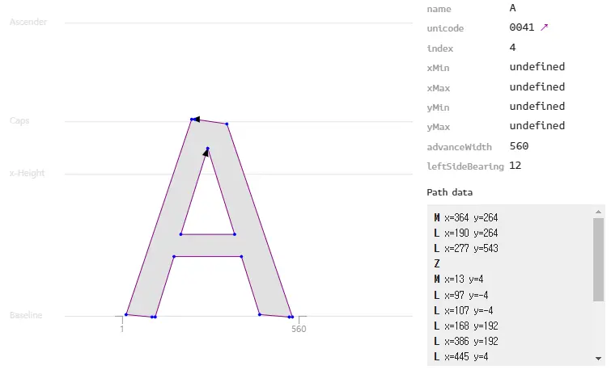
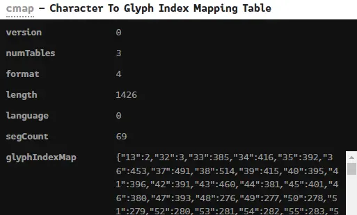
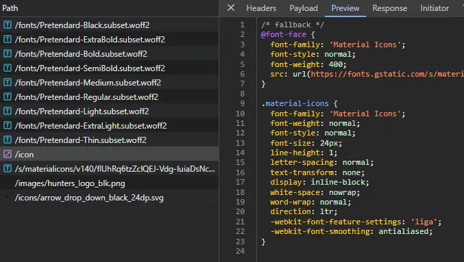
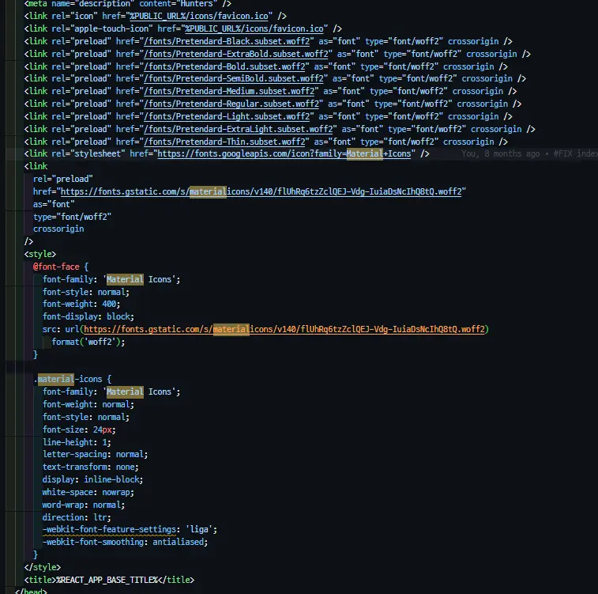

# Typography

- [텍스트 제어 속성](#텍스트-제어-속성)
  - [white-space](#white-space)
  - [word-break](#word-break)
  - [text-overflow](#text-overflow)
- [line-height 단위 차이](#line-height-단위-차이)
- [글꼴 지정(font-family)](#글꼴-지정font-family)
- [웹 폰트 정의(@font-face)](#웹-폰트-정의font-face)
  - [@font-face 주요 속성](#font-face-주요-속성)
  - [폰트 형식(WOFF2 • WOFF)](#폰트-형식woff2--woff)
- [폰트 파일 동작 원리](#폰트-파일-동작-원리)
  - [아이콘 폰트 동작 원리](#아이콘-폰트-동작-원리)
- [폰트 로딩 이슈 및 해결](#폰트-로딩-이슈-및-해결)

## 텍스트 제어 속성

### white-space

공백 문자(`\s`, `\t`) 처리와 자동 줄바꿈 여부를 결정한다.

| 값                | 스페이스 • 탭  | 줄바꿈(`\n`)   | 오버플로우 시 자동 줄바꿈 |
| ----------------- | -------------- | -------------- | ------------------------- |
| `normal` (기본값) | 한 개 공백으로 | 한 개 공백으로 | O                         |
| `nowrap`          | 한 개 공백으로 | 한 개 공백으로 | X                         |
| `pre`             | 그대로 보존    | 그대로 보존    | X                         |
| `pre-wrap`        | 그대로 보존    | 그대로 보존    | O                         |
| `pre-line`        | 한 개 공백으로 | 그대로 보존    | O                         |

### word-break

텍스트가 컨테이너 영역을 벗어날 때 단어를 어떻게 끊을지 결정한다.

- CJK (Chinese • Japanese • Korean): 띄어쓰기 없이 이어진 한중일 문자.
- Non-CJK: 영어, 숫자 등 CJK 이외의 문자.
- 단어 중간에 특수문자가 있으면 예상대로 동작하지 않을 수 있다. 이럴 땐 `white-space` 속성을 함께 사용한다.

| 값                | Non-CJK 강제 줄바꿈 | CJK 강제 줄바꿈 |
| ----------------- | ------------------- | --------------- |
| `normal` (기본값) | X                   | O               |
| `break-all`       | O                   | O               |
| `keep-all`        | X                   | X               |

### text-overflow

텍스트가 오버플로우되는 상황은 부모 박스의 너비를 초과하는 경우에 발생한다. `white-space: nowrap`으로 자동 줄바꿈을 제거하여 오버플로우를 유도하고, `overflow: hidden`으로 가린 뒤 `text-overflow: ellipsis`를 적용한다.

```css
div {
  white-space: nowrap; /* 자동 줄바꿈 제거 */
  overflow: hidden; /* 오버플로우 숨김 */
  text-overflow: ellipsis; /* 말줄임표 적용 */
}
```

## line-height 단위 차이

`line-height`에 단위 없는 숫자와 `em` 단위를 사용하면 상속 시 동작이 달라진다.

- 단위 없는 숫자 (`line-height: 1.5`): 숫자 그대로 상속됨. 자식 요소에서 각자의 `font-size`에 대한 배수로 재계산됨.
- `em` 단위 (`line-height: 1.5em`): 부모의 `font-size`를 기준으로 계산된 고정 픽셀값이 상속됨. 자식 요소의 `font-size`가 달라도 고정값이 적용되어 예상치 못한 결과가 나올 수 있다.

```css
/* 단위 없는 값 — 권장 */
body {
  font-size: 16px;
  line-height: 1.5; /* 자식에서 각자 font-size × 1.5로 계산됨 */
}

h1 {
  font-size: 32px;
  /* line-height: 1.5 상속 → 32px × 1.5 = 48px */
}

/* em 단위 — 주의 */
body {
  font-size: 16px;
  line-height: 1.5em; /* 16px × 1.5 = 24px로 고정되어 상속됨 */
}

h1 {
  font-size: 32px;
  /* line-height: 24px 고정값 상속 → font-size보다 작은 line-height 발생 */
}
```

대부분의 경우 단위 없는 값을 사용하는 것이 폰트 크기 변화에 유연하게 대응할 수 있어 권장된다.

## 글꼴 지정(font-family)

요소에 적용할 글꼴의 우선순위 목록을 정의한다.

- 설정이 없으면 운영체제의 시스템 기본 글꼴이 적용됨.
- 여러 글꼴을 나열하여 앞선 글꼴이 없을 경우 다음 글꼴로 대체(Fallback)됨.
- 글꼴 이름에 공백이 포함되면 반드시 따옴표(`' '`)로 감싸야 함.
- 마지막에 `serif`, `sans-serif` 등 제네릭 패밀리를 두어 최종 fallback으로 사용함.

```css
body {
  font-family: Pretendard, 'Noto Sans KR', sans-serif;
}
```

## 웹 폰트 정의(@font-face)

사용자의 컴퓨터에 설치되지 않은 글꼴을 서버에서 내려받아 사용할 수 있게 정의한다.

```css
@font-face {
  font-family: 'Pretendard';
  font-weight: 600;
  font-display: swap;
  src:
    local('Pretendard SemiBold'),
    url('/fonts/Pretendard-SemiBold.subset.woff2') format('woff2'),
    url('/fonts/Pretendard-SemiBold.subset.woff') format('woff');
}
@font-face {
  font-family: 'Pretendard';
  font-weight: 500;
  font-display: swap;
  src:
    local('Pretendard Medium'),
    url('/fonts/Pretendard-Medium.subset.woff2') format('woff2'),
    url('/fonts/Pretendard-Medium.subset.woff') format('woff');
}

body {
  font-family: Pretendard, 'Noto Sans KR', sans-serif;
}
```

### @font-face 주요 속성

- `font-family`: 이 규칙으로 정의할 글꼴의 이름을 지정함. `font-family` 속성에서 이 이름으로 참조함.
- `src`: 폰트 파일의 경로와 형식을 지정함.
  - `local()`: 사용자 기기에 설치된 폰트를 우선 확인함. 네트워크 요청을 줄이기 위해 `url()` 앞에 선언함.
  - `url()`: 서버에서 다운로드할 폰트 경로를 지정함.
  - `format()`: 브라우저가 지원 여부를 사전에 판단할 수 있도록 파일 형식을 명시함.
- `font-display`: 폰트 로딩 중 텍스트 표시 방식을 결정함.
  - `swap`: 폰트 로드 전에는 시스템 글꼴을 보여주고, 완료 후 웹 폰트로 교체함 (권장).
  - `block`: 폰트 로드 전까지 텍스트를 숨김. 레이아웃 시프트는 없지만 빈 화면이 노출됨.
  - `fallback`: 100ms 동안만 숨기고, 이후 시스템 글꼴로 표시함. 로드가 완료되면 교체함.
- `unicode-range`: 특정 유니코드 범위에만 해당 폰트를 적용하여 불필요한 다운로드를 방지함.

```css
@font-face {
  font-family: 'Pretendard';
  font-weight: 400;
  font-display: swap;
  unicode-range: U+AC00-D7A3; /* 한글 범위만 적용 */
  src: url('/fonts/Pretendard-Regular.woff2') format('woff2');
}
```

### 폰트 형식(WOFF2 • WOFF)

| 형식  | 설명                                                       | 압축 알고리즘 | 브라우저 지원 |
| ----- | ---------------------------------------------------------- | ------------- | ------------- |
| WOFF  | 웹용으로 개발된 압축 폰트 형식. TTF/OTF를 zlib으로 압축함. | zlib          | IE9+          |
| WOFF2 | WOFF보다 약 30% 더 높은 압축률을 제공하는 차세대 형식.     | Brotli        | 모던 브라우저 |

WOFF2를 우선 선언하고 WOFF를 fallback으로 두는 것이 일반적인 패턴이다. 구형 브라우저 지원이 필요 없다면 WOFF2만 사용해도 무방하다.

## 폰트 파일 동작 원리

폰트는 유니코드를 입력받으면, 해당 유니코드에 대응하는 글리프 인덱스를 cmap 테이블에서 조회한다. 이후 조회된 글리프 인덱스를 기반으로 해당 글리프를 렌더링하는 방식으로 동작한다.

```text
A → U+0041 → 65 → glyphIndex: 4
```

`A`는 유니코드 `U+0041`이고, 이는 10진수로 `65`이다. 이 값은 cmap 테이블에서 글리프 인덱스 `4`에 매핑된다.

글리프:



cmap(Character To Glyph Index Mapping Table):



### 아이콘 폰트 동작 원리

아이콘 폰트는 일반적으로 PUA(Private Use Area, `U+E000`–`U+F8FF`)에 위치한 유니코드와 해당 글리프를 매핑하여 저장한다. FontAwesome은 CSS `content`에 PUA 유니코드를 직접 지정하는 방식을 사용한다.

```css
.fas {
  font-family: 'FontAwesome';
}
.fa-home::before {
  content: '\f015'; /* 집 아이콘의 유니코드(U+F015) */
}
```

```html
<i class="fas fa-home"></i>
```

## 폰트 로딩 이슈 및 해결

웹 폰트를 사용하는 경우 `@font-face`가 적용된 CSS 파일을 내려받은 뒤 폰트 파일을 추가로 요청하므로, 초기 렌더링 시 폰트가 아직 로드되지 않은 상태가 발생한다.

- FOUT (Flash of Unstyled Text): 폰트 로드 전 시스템 글꼴이 보이다가 교체되는 현상임. `font-display: swap` 사용 시 발생함.
- FOIT (Flash of Invisible Text): 폰트 로딩이 완료될 때까지 텍스트가 보이지 않는 현상임. `font-display: block` 사용 시 발생함.





해결 방안:

- `font-display: swap`을 사용하여 FOIT 대신 FOUT을 유도함. 텍스트가 항상 표시되므로 사용자 경험에 유리함.
- 중요한 폰트는 `<link rel="preload">`로 미리 불러와 로딩 시점을 앞당김.
- 서브셋(Subset) 폰트를 제작하여 사용하지 않는 글자를 제거하고 파일 용량을 줄임.

```html
<link rel="preload" href="/fonts/Pretendard-Regular.subset.woff2" as="font" type="font/woff2" crossorigin />
```
