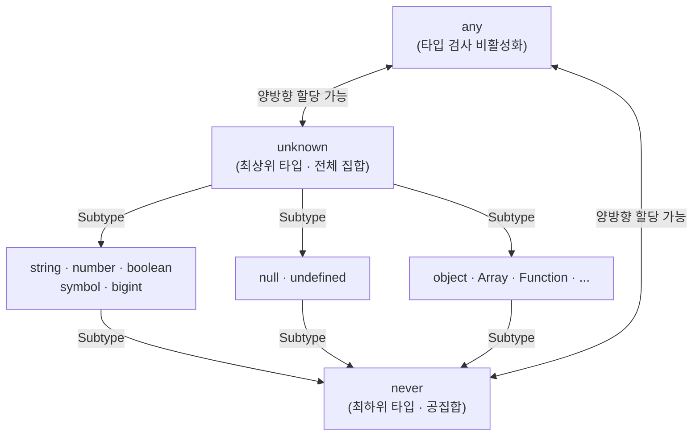

# 타입스크립트(Typescript)

- [타입 시스템과 집합론](#타입-시스템과-집합론)
  - [any vs unknown](#any-vs-unknown)
  - [never 타입](#never-타입)
  - [유니온(|)과 인터섹션(\&)](#유니온과-인터섹션)
- [제네릭(Generics)의 유연성](#제네릭generics의-유연성)
- [타입 가드(Type Guards)와 is 키워드](#타입-가드type-guards와-is-키워드)
- [조건부 타입(Conditional Types)](#조건부-타입conditional-types)
- [타입 단언(as) vs 타입 검증(satisfies)](#타입-단언as-vs-타입-검증satisfies)
- [기타 유틸리티 및 키워드](#기타-유틸리티-및-키워드)
- [인덱스 시그니처(Index Signature)와 맵드 타입(Mapped Type)](#인덱스-시그니처index-signature와-맵드-타입mapped-type)
  - [인덱스 시그니처(Index Signature)](#인덱스-시그니처index-signature)
  - [맵드 타입(Mapped Type)](#맵드-타입mapped-type)
  - [비교](#비교)

## 타입 시스템과 집합론

TypeScript의 타입 시스템은 집합론을 기반으로 설계되었다. 상위 집합(Supertype)에는 하위 집합(Subtype)을 할당할 수 있지만, 반대의 경우는 불가능함.



### any vs unknown

두 타입 모두 모든 값을 허용하는 전체 집합이지만, 타입 안정성 측면에서 결정적인 차이가 있다.

- `any`:
  - 타입 검사를 완전히 비활성화하는 탈출구임.
  - 어떤 타입의 변수에도 할당 가능하며, 속성 접근이나 메서드 호출 시 아무런 제약이 없음.
  - 타입 안정성을 파괴하므로 사용을 지양해야 한다.
- `unknown`:
  - `any`와 마찬가지로 모든 값을 받을 수 있지만, 사용 전 반드시 타입을 좁혀야 함.
  - 타입 가드나 타입 단언 없이 속성에 접근하거나 함수로 호출할 수 없음.
  - `any`보다 안전한 대안으로, 알 수 없는 데이터(예: API 응답)를 다룰 때 권장됨.

```ts
let a: any = 'hello';
a.toFixed(); // 컴파일 에러 없음 — 런타임 에러 발생 가능

let u: unknown = 'hello';
// ❌ incorrect: 타입 좁히기 없이 접근 불가
u.toUpperCase();

// ✅ correct: typeof 타입 가드로 좁힌 후 접근
if (typeof u === 'string') {
  u.toUpperCase();
}
```

### never 타입

- 결코 발생할 수 없는 값을 의미하는 공집합이다.
- 모든 타입의 하위 타입이며, 어떤 값도 `never` 타입에 할당될 수 없음.
- 주로 예외를 던지는 함수의 반환 타입이나, `switch` 문의 `default` 케이스에서 모든 타입을 처리했음을 보장(Exhaustiveness Check)할 때 사용함.

```ts
// 예외를 던지는 함수는 정상적으로 값을 반환하지 않으므로 반환 타입이 never
function throwError(message: string): never {
  throw new Error(message);
}

// Exhaustiveness Check: Shape에 새 케이스가 추가되면 컴파일 에러로 누락을 감지
type Shape = 'circle' | 'square' | 'triangle';

function getArea(shape: Shape): number {
  switch (shape) {
    case 'circle':
      return Math.PI;
    case 'square':
      return 1;
    case 'triangle':
      return 0.5;
    default:
      const _check: never = shape; // 모든 케이스를 처리했으므로 never 할당 가능
      return _check;
  }
}
```

### 유니온(|)과 인터섹션(&)

- 유니온(Union): 여러 타입 중 하나일 수 있음을 나타내는 합집합임. 공통된 프로퍼티에만 접근 가능하며, 개별 프로퍼티 접근을 위해서는 타입 좁히기가 필요함.
- 인터섹션(Intersection): 여러 타입을 모두 만족해야 하는 교집합임. 객체 타입을 결합하여 새로운 타입을 생성할 때 유용하다.

```ts
type Admin = { role: 'admin'; permissions: string[] };
type Member = { name: string; email: string };

// 유니온: Admin 또는 Member
type AdminOrMember = Admin | Member;

function greet(person: AdminOrMember) {
  // ❌ incorrect: 공통 프로퍼티가 아니므로 접근 불가
  // person.name;

  // ✅ correct: in 연산자로 타입을 좁힌 후 접근
  if ('role' in person) {
    console.log(person.permissions);
  } else {
    console.log(person.name);
  }
}

// 인터섹션: Admin과 Member를 모두 만족
type AdminMember = Admin & Member;

const adminMember: AdminMember = {
  role: 'admin',
  permissions: ['read', 'write'],
  name: 'Alice',
  email: 'alice@example.com',
};
```

## 제네릭(Generics)의 유연성

- 제네릭(Generics)은 타입을 파라미터처럼 사용하여 재사용성을 높이는 기법이다.
- 특정 타입에 고정되지 않고, 함수나 클래스 호출 시점에 타입을 결정할 수 있는 유연성을 제공함.
- `extends` 키워드를 사용하여 제네릭에 제약 조건을 추가함으로써 특정 구조를 가진 타입만 허용할 수 있다.

```ts
// T는 반드시 length 속성을 가진 객체여야 함
function logSize<T extends { length: number }>(arg: T): void {
  console.log(arg.length);
}
```

## 타입 가드(Type Guards)와 is 키워드

- 타입 가드(Type Guards)는 런타임에 값의 타입을 확인하여 타입을 좁히는 메커니즘이다.
- `typeof`, `instanceof`, `in` 연산자를 주로 사용함.
- 사용자 정의 타입 가드: `is` 키워드를 사용하여 함수가 특정 타입을 확인했음을 컴파일러에게 명시적으로 알릴 수 있다.

```ts
interface Cat {
  meow(): void;
}
interface Dog {
  bark(): void;
}

// 사용자 정의 타입 가드 함수
function isCat(animal: Cat | Dog): animal is Cat {
  return (animal as Cat).meow !== undefined;
}

function speak(animal: Cat | Dog) {
  if (isCat(animal)) {
    animal.meow(); // 여기서 animal은 Cat으로 추론됨
  } else {
    animal.bark(); // 여기서 animal은 Dog로 추론됨
  }
}
```

## 조건부 타입(Conditional Types)

- 입력 타입에 따라 출력 타입을 결정하는 로직을 타입 시스템에 포함함.
- `T extends U ? X : Y` 형식을 사용하며, 분배적 특성을 활용해 유니온 타입의 각 요소를 순회하며 적용할 수 있다.

```ts
type TypeLabel<T> = T extends string ? 'text' : T extends number ? 'number' : 'other';

type A = TypeLabel<string>; // 'text'
type B = TypeLabel<number>; // 'number'
type C = TypeLabel<boolean>; // 'other'

// 유니온 타입에 분배적으로 적용됨
type D = TypeLabel<string | number>; // 'text' | 'number'
```

## 타입 단언(as) vs 타입 검증(satisfies)

- `as` (Type Assertion): 개발자가 컴파일러에게 해당 타입을 강제로 주입함. 추론된 타입 정보가 무시될 수 있어 런타임 에러 위험이 존재함.
- `satisfies`: 특정 타입을 만족하는지 검증하면서도, 구체적으로 추론된 타입 정보(Literal Type 등)를 그대로 유지함. 타입 안정성을 유지하면서 더 정밀한 타입 추론이 가능하다.

```ts
// as: red의 타입이 string | number[]로 넓혀져 배열 메서드 접근 불가
const paletteAs = {
  red: [255, 0, 0],
  green: '#00ff00',
} as Record<string, string | number[]>;

// ❌ incorrect: red가 string | number[]로 추론되어 .map 사용 불가
paletteAs.red.map((v) => v * 2);

// satisfies: 타입 검증은 하되 구체적인 추론 타입(number[])을 유지
const palette = {
  red: [255, 0, 0],
  green: '#00ff00',
} satisfies Record<string, string | number[]>;

// ✅ correct: red가 number[]로 추론되어 .map 사용 가능
palette.red.map((v) => v * 2);
```

## 기타 유틸리티 및 키워드

- `ReturnType<T>`: 함수의 반환 타입을 추출함.

```ts
function fetchUser() {
  return { id: 1, name: 'Alice' };
}

type UserResult = ReturnType<typeof fetchUser>; // { id: number; name: string }
```

- `declare`: 외부 라이브러리나 전역 변수의 존재를 알리는 선언문임. 실제 구현 없이 타입 정보만 컴파일러에게 제공한다.

```ts
// 빌드 도구가 런타임에 주입하는 전역 변수 선언
declare const __APP_VERSION__: string;
declare function externalLogger(message: string): void;
```

- `infer`: 조건부 타입 내에서 타입을 추론하여 변수처럼 사용할 수 있게 함.

```ts
// 함수의 첫 번째 파라미터 타입을 추출하는 유틸리티 타입
type FirstParam<T> = T extends (first: infer P, ...rest: any[]) => any ? P : never;

function greet(name: string, age: number) {}
type Name = FirstParam<typeof greet>; // string
```

## 인덱스 시그니처(Index Signature)와 맵드 타입(Mapped Type)

### 인덱스 시그니처(Index Signature)

- 객체의 키가 미리 정해지지 않았을 때, 키와 값의 타입을 일괄 정의하는 방법이다.
- 키 타입은 `string`, `number`, `symbol`만 사용 가능함.
- 동적 키를 가진 객체를 다룰 때 유용하다.

```ts
interface Scores {
  [name: string]: number;
}

const scores: Scores = { alice: 90, bob: 85 };
scores['charlie'] = 88; // 가능
```

- 주의: 인덱스 시그니처를 사용하면 명시적으로 선언한 다른 프로퍼티도 같은 값 타입을 따라야 함.

### 맵드 타입(Mapped Type)

- 기존 타입의 키를 순회하여 새로운 타입을 생성하는 방법이다.
- `keyof`와 `in` 키워드를 조합하여 사용함.
- TypeScript 내장 유틸리티 타입(`Readonly<T>`, `Partial<T>`, `Record<K, T>` 등)이 맵드 타입으로 구현되어 있다.

```ts
type User = { id: string; name: string; age: number };

// 모든 프로퍼티를 선택적으로 변환 (Partial<T>와 동일)
type PartialUser = { [K in keyof User]?: User[K] };

// 모든 프로퍼티를 읽기 전용으로 변환 (Readonly<T>와 동일)
type ReadonlyUser = { readonly [K in keyof User]: User[K] };
```

### 비교

| 항목        | 인덱스 시그니처                   | 맵드 타입                          |
| ----------- | --------------------------------- | ---------------------------------- |
| 목적        | 동적 키의 타입 일괄 정의          | 기존 타입을 변형하여 새 타입 생성  |
| 키 타입     | `string`, `number`, `symbol` 고정 | `keyof`로 기존 타입의 키를 추론    |
| 타입 정밀도 | 모든 키에 동일한 타입 적용        | 기존 타입의 각 키별 타입 유지 가능 |
| 예시        | `[key: string]: number`           | `[K in keyof T]: T[K]`             |
