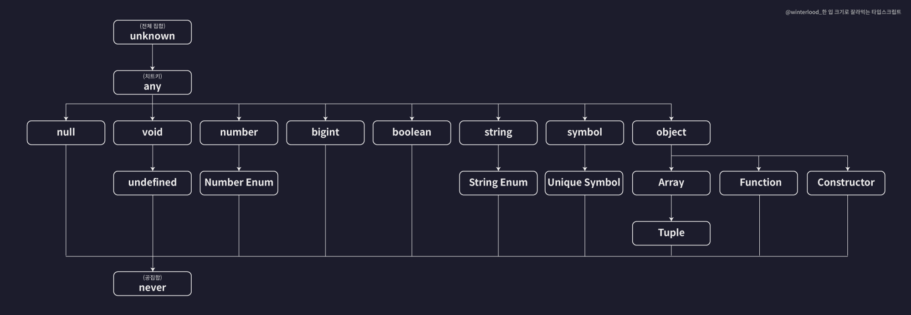

# Typescript Note

- [타입은 집합이다](#타입은-집합이다)
  - [`any`](#any)
  - [`unknown`](#unknown)
  - [`never`](#never)
  - [유니온(`|`) 타입 • 인터섹션(`&`) 타입](#유니온-타입--인터섹션-타입)
- [옵셔널 프로퍼티](#옵셔널-프로퍼티)
- [분배적 조건부 타입](#분배적-조건부-타입)
- [`declare`](#declare)
- [`ReturnType`](#returntype)
- [`null` • `undefined` 한번에 체크하기](#null--undefined-한번에-체크하기)
- [`extends` 키워드](#extends-키워드)
  - [인터페이스 확장](#인터페이스-확장)
  - [제네릭 제약 (Generic Constraints)](#제네릭-제약-generic-constraints)
  - [조건부 타입 (Conditional Types)](#조건부-타입-conditional-types)
  - [infer 키워드와 함께 사용](#infer-키워드와-함께-사용)

## 타입은 집합이다



- 위 계층도는 타입스크립트 컴파일러 옵션 중 `strictNullCheck` 옵션이 `true`인 경우에 해당한다.
- 타입을 집합으로 생각하면 상위 집합에 하위 집합을 할당할 수 있지만, 하위 집합에 상위 집합은 할당 불가능하다.

### `any`

- `any`는 `unknown`을 제외하면 전체 집합이고, 다른 모든 타입의 상위 타입이기 때문에 다른 모든 타입은 `any`로 할당 가능하다.

```ts
  const a: any = 1; // number -> any
  const b: any = 'hello'; // string -> any
  const c: any = true; // boolean -> any
  const d: any = null; // null -> any
  const e: any = undefined; // undefined -> any
  const f: any = []; // Array -> any
  const g: any = {}; // Object -> any
  const h: any = () => {}; // Function -> any
  ...
```

- `any`는 타입 시스템의 제약을 제거하므로, 타입 안정성을 포기해야 한다. 가능한 사용을 피해야한다.

### `unknown`

- `unknown`은 전체 집합이고, 다른 모든 타입의 상위 타입이기 때문에 다른 모든 타입은 `unknown`으로 할당 가능하다.

  ```ts
  const a: unknown = 1; // number -> unknown
  const b: unknown = 'hello'; // string -> unknown
  const c: unknown = true; // boolean -> unknown
  const d: unknown = null; // null -> unknown
  const e: unknown = undefined; // undefined -> unknown
  const f: unknown = []; // Array -> unknown
  const g: unknown = {}; // Object -> unknown
  const h: unknown = () => {}; // Function -> unknown
  ...
  ```

- 예외적으로 `any` 타입으로 다운캐스팅이 가능하다.

  ```ts
  let ANY: any;
  let UNKNOWN: unknown;

  ANY = UNKNOWN; // unknown -> any
  ```

- `unknown` 타입의 경우 타입 가드를 통해 타입을 좁혀주어야 하기 때문에 타입 안정성이 존재한다.

  ```ts
  try {
    // ...
  } catch (error) {
    if (error instanceof TypeError) {
      // ...
    } else if (error instanceof ReferenceError) {
      // ...
    } else {
      // ...
    }
  }
  ```

### `never`

- `never`는 공집합이고, 다른 모든 타입의 하위 타입이기 때문에 다른 모든 타입으로 할당 가능하다.

  ```ts
  function throwError(message: string): never {
    throw new Error(message);
  }

  let neverVar: never = throwError('error');

  const a: number = neverVar; // never -> number
  const b: string = neverVar; // never -> string
  const c: boolean = neverVar; // never -> boolean
  const d: null = neverVar; // never -> null
  const e: undefined = neverVar; // never -> undefined
  const f: [] = neverVar; // never -> Array
  const g: {} = neverVar; // never -> Object
  const h: () => {} = neverVar; // never -> Function
  ...
  ```

- `never` 타입은 결코 발생할 수 없는 값을 나타내며, 주로 예외를 던지거나 무한 루프를 표현할 때 사용된다.

  ```ts
  // 함수가 오류를 발생시킬 때:
  function throwError(message: string): never {
    throw new Error(message);
  }
  ```

  ```ts
  // 함수가 무한 루프를 돌 때:
  function infiniteLoop(): never {
    while (true) {}
  }
  ```

  ```ts
  // 타입에 따라 절대 발생하지 않을 케이스를 처리할 때:
  type SomeType = 'A' | 'B';

  function handleType(x: SomeType): string {
    switch (x) {
      case 'A':
        return 'Type A';
      case 'B':
        return 'Type B';
      default:
        const check: never = x;
        return check;
    }
  }
  ```

- `never` 타입을 이용하여 코드를 작성할 때, 모든 가능한 케이스를 처리하고 있음을 보장할 수 있다. 이로 인해 코드의 안전성과 예측 가능성이 향상된다.

### 유니온(`|`) 타입 • 인터섹션(`&`) 타입

```ts
type Type1 = number | string; // 서로소 합집합
function foo1(bar1: Type1) {
  // bar1 : number | string(타입 좁히기 전 공통메서드 사용 가능)
  if (typeof bar1 === 'number') {
    // bar1: number
  } else if (typeof bar1 === 'string') {
    // bar1: string
  } else {
    const never: never = bar1;
    return never;
  }
}

type Type2 = number & string; // 서로소 교집합(공집합)
function foo2(bar2: Type2) {
  const never: never = bar2;
  return never;
}

type Type3 = 3 | number; // 상위/하위집합 합집합
function foo3(bar3: Type3) {
  if (typeof bar3 === 'number') {
    // bar3: number
  } else {
    const never: never = bar3;
    return never;
  }
}

type Type4 = 3 & number; // 상위/하위집합 교집합
function foo4(bar4: Type4) {
  if (bar4 === 3) {
    // bar4: 3
  } else {
    const never: never = bar4;
    return never;
  }
}

interface A {
  a: number;
  b: number;
  c: number;
}

interface B {
  a: number;
  b: string;
  d: number;
}

type Type5 = A | B; // 합집합
function foo5(bar5: Type5) {
  // bar5.a: number
  // bar5.b: number | string(타입 좁히기 전 공통메서드 사용 가능)
  if ('c' in bar5) {
    // bar5: interface A
  } else if ('d' in bar5) {
    // bar5: interface B
  } else {
    const never: never = bar5;
    return never;
  }
}

type Type6 = A & B; // 교집합
function foo6(bar6: Type6) {
  // bar6.a: number
  // bar6.b: never
  // bar6.c: number
  // bar6.d: number
}

interface C {
  x: number;
}

interface D {
  x: number;
  y: number;
}

type Type7 = C | D; // 상위/하위집합 합집합
function foo7(bar7: Type7) {
  // bar7.x: number
}

type Type8 = C & D; // 상위/하위집합 교집합
function foo8(bar8: Type8) {
  // bar8.x: number
  // bar8.y: number
}
```

## 옵셔널 프로퍼티

타입스크립트에서 옵셔널 프로퍼티(`?`)는 해당 변수가 `undefined`일 수 있다는 것을 유니온 타입으로 정의해준다.

`null` 타입은 적용되지 않으므로 따로 유니온 타입으로 정의해주어야 한다.

```ts
interface Person {
  name: string;
  age?: number; // number | undefined
  hobby?: string | null; // number | null | undefined
}
```

옵셔널 프로퍼티가 정의된 매개변수에는 초기값을 부여할 수 없다. 초기값을 부여하려면 옵셔널 프로퍼티를 제거하고 정의해야 한다.

```ts
function init(a: number , b?: number = 0) {
  ...
} // ❌

function init(a: number, b: number = 0) {
  ...
} // ⭕
```

## 분배적 조건부 타입

조건부 타입은 분배적으로 동작한다. 분배적 조건부 타입은 유니온 타입에서 각 구성 요소에 대해 개별적으로 조건부 타입을 적용한다.

```ts
// Exclude null and undefined from T
type NonNullable<T> = T extends null | undefined ? never : T;

type Example = NonNullable<string | undefined | null>;
// typeof Example === 'string'
```

## `declare`

- `declare`는 타입 정보만 제공하며, 실제 구현은 포함하지 않는다.
- `declare` 없이 타입을 정의하면, TypeScript는 해당 코드가 구현되어 있다고 가정한다.

▾ 사용 예시:

- 외부 자바스크립트 라이브러리의 타입 선언

  ```ts
  declare module 'my-library' {
    export function doSomething(): void;
  }
  ```

- 전역 스코프에 존재하는 변수나 함수의 타입을 선언

  ```ts
  declare const Kakao: Kakao;

  declare const turnstile: Turnstile.Turnstile;
  ```

- 타입 정의 파일(`.d.ts`)에서 사용

|             | `.ts`                             | `.d.ts`                          |
| ----------- | --------------------------------- | -------------------------------- |
| 내용        | 실제 구현 코드와 타입 정보를 포함 | 타입 정보만 포함                 |
| 컴파일 대상 | JavaScript로 컴파일됨             | 컴파일되지 않음 타입 정보만 제공 |

## `ReturnType`

`ReturnType`은 함수 타입으로부터 반환 타입을 추론하는 데 사용된다. 즉, 특정 함수가 반환하는 값의 타입을 추출한다.

```ts
type returnFuncType = ReturnType<typeof func>;
```

▾ 실무 사용 사례:

브라우저의 Web API와 Node.js의 환경에 따라 `setTimeout`이 반환하는 값이 다를 수 있다.

- 브라우저 환경에서는 `setTimeout`이 `number`를 반환한다. (`timer ID`: 특정 타이머를 식별하기 위한 숫자)
- Node.js 환경에서는 `setTimeout`이 `NodeJS.Timeout` 객체를 반환한다.

`ReturnType<typeof setTimeout>`을 사용하면 환경에 따른 반환 타입 차이를 자동으로 처리할 수 있다.

```ts
type TimerType = ReturnType<typeof setTimeout>;

let timer: TimerType;

timer = setTimeout(() => console.log('Hello'), 1000);

clearTimeout(timer);
```

## `null` • `undefined` 한번에 체크하기

```ts
const temp = null;

if (temp == null) {
  console.log(temp); // null
}
```

```ts
const temp = undefined;

if (temp == null) {
  console.log(temp); // undefined
}
```

## `extends` 키워드

TypeScript에서 `extends` 키워드는 상속, 제네릭 제약, 조건부 타입 등 다양한 용도로 사용된다.

### 인터페이스 확장

```ts
interface Shape {
  color: string;
}

interface Square extends Shape {
  sideLength: number;
}

interface Circle extends Shape {
  radius: number;
}

// 다중 확장
interface ColoredSquare extends Shape, Square {
  border: string;
}
```

### 제네릭 제약 (Generic Constraints)

```ts
// T는 반드시 length 프로퍼티를 가져야 함
function logLength<T extends { length: number }>(arg: T): T {
  console.log(arg.length);
  return arg;
}

logLength('hello'); // ✅ string has length
logLength([1, 2, 3]); // ✅ array has length
logLength({ length: 10, value: 3 }); // ✅ object has length
// logLength(123); // ❌ number doesn't have length
```

```ts
// keyof를 사용한 제약
function getProperty<T, K extends keyof T>(obj: T, key: K): T[K] {
  return obj[key];
}

const person = { name: 'John', age: 30, city: 'Seoul' };
const name = getProperty(person, 'name'); // string
const age = getProperty(person, 'age'); // number
// const invalid = getProperty(person, "invalid"); // ❌ 존재하지 않는 키
```

### 조건부 타입 (Conditional Types)

```ts
// T가 string을 확장하면 true, 아니면 false
type IsString<T> = T extends string ? true : false;

type Test1 = IsString<string>; // true
type Test2 = IsString<number>; // false
type Test3 = IsString<'hello'>; // true (string literal은 string을 확장)
```

```ts
// 내장 유틸리티 타입들의 구현 예시
type MyNonNullable<T> = T extends null | undefined ? never : T;
type MyReturnType<T> = T extends (...args: any[]) => infer R ? R : never;
type MyParameters<T> = T extends (...args: infer P) => any ? P : never;

function example(a: string, b: number): boolean {
  return true;
}

type ExampleReturn = MyReturnType<typeof example>; // boolean
type ExampleParams = MyParameters<typeof example>; // [string, number]
```

### infer 키워드와 함께 사용

```ts
// 배열 요소 타입 추출
type ArrayElement<T> = T extends (infer U)[] ? U : never;

type StringArray = ArrayElement<string[]>; // string
type NumberArray = ArrayElement<number[]>; // number
type NotArray = ArrayElement<string>; // never
```

```ts
// Promise 내부 타입 추출
type Awaited<T> = T extends Promise<infer U> ? U : T;

type PromiseString = Awaited<Promise<string>>; // string
type RegularString = Awaited<string>; // string
```
