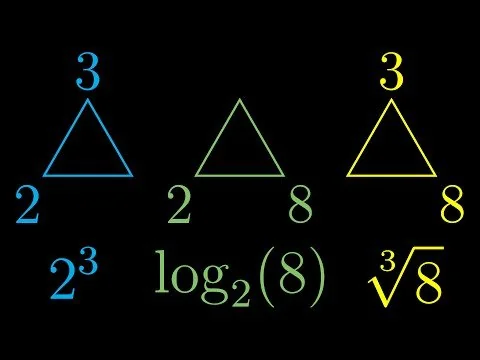

- [마크업 언어](#마크업-언어)
- [표준편차](#표준편차)
- [Min-Max 정규화](#min-max-정규화)
- [Z-score 표준화](#z-score-표준화)
- [요청 • 응답](#요청--응답)
- [파싱(Parsing)](#파싱parsing)
- [방정식](#방정식)
- [지수 • 로그 • 루트](#지수--로그--루트)
- [정적(Static) • 동적(Dynamic)](#정적static--동적dynamic)
- [Deployment • Distribution](#deployment--distribution)
- [정의역(Domain) • 공역(Codomain) • 치역(Range)](#정의역domain--공역codomain--치역range)
- [로그 스케일(Log Scale)](#로그-스케일log-scale)
- [벡터(Vector)](#벡터vector)
- [오프셋(Offset)](#오프셋offset)

## 마크업 언어

문서가 화면에 표시되는 형식을 나타내거나 데이터의 논리적인 구조를 명시하기 위한 규칙들을 정의한 언어의 일종이다. 데이터를 기술한 언어라는 점에서 프로그래밍 언어와는 분명한 차이가 있다.

## 표준편차

표준편차는 데이터의 평균에서 각 데이터가 떨어진 정도를 나타내는 값이다. 표준편차가 작으면 데이터가 평균에 모여있고, 표준편차가 크면 데이터가 평균에서 멀리 떨어져있다.

## Min-Max 정규화

최소-최대 정규화는 데이터를 특정 범위 \([a, b]\)로 변환하는 방법이다. 가장 일반적으로 \([0, 1]\) 범위로 변환된다.

$X{\text{norm}} = \frac{X - X{\text{min}}}{X{\text{max}} - X{\text{min}}} \times (b - a) + a$

- $X$ : 원본 데이터 값
- $X{\text{min}}$ : 데이터셋에서 최소값
- $X{\text{max}}$ : 데이터셋에서 최대값
- $a, b$ : 원하는 변환 범위 (기본적으로 $a=0, b=1$)

## Z-score 표준화

Z-score 표준화는 데이터를 평균이 0, 표준편차가 1인 분포로 변환한다.

$X{\text{norm}} = \frac{X - \mu}{\sigma}$

- $X$ : 원본 데이터 값
- $\mu$ : 데이터셋의 평균
- $\sigma$ : 데이터셋의 표준 편차

## 요청 • 응답

| 요청    | 응답     |
| ------- | -------- |
| Request | Response |
| Send    | Receive  |
| From    | To       |
| 발신    | 착신     |
| 송신    | 수신     |

## 파싱(Parsing)

파싱은 입력 데이터(예: 텍스트, 코드, 문자열 등)를 읽고 이를 더 작은 구성 요소로 나누어 그 의미나 구조를 이해할 수 있도록 만드는 작업을 말한다.

1. 프로그래밍 언어 파싱
   - 소스 코드를 읽어 문법적으로 올바른지 확인하고, 추상 구문 트리(AST, Abstract Syntax Tree) 같은 자료 구조로 변환하는 과정이다. 이는 컴파일러나 인터프리터가 코드를 실행 가능하도록 만드는 첫 단계 중 하나다.
   - 예: `"3 + 5"`라는 문자열을 파싱하면 숫자 `3`, 연산자 `+`, 숫자 `5`로 분리되어 연산 구조를 이해할 수 있게 된다.

2. 데이터 파싱
   - JSON, XML, CSV 같은 형식의 데이터를 읽고, 프로그램에서 사용할 수 있는 객체, 배열, 변수 등으로 변환하는 작업이다.
   - 예: `"{"name": "John", "age": 30}"`라는 JSON 문자열을 파싱하면 `{name: "John", age: 30}`라는 데이터 구조로 변환된다.

## 방정식

- 미지수의 값에 따라 참, 거짓이 결정되는 등식이다.
- 방정식을 참이 되게 하는 미지수의 값을 해 또는 근이라고 한다.

## 지수 • 로그 • 루트

- 지수: 지수 방정식의 결과값을 찾음.
- 로그: 지수 방정식의 지수를 찾음.
- 루트: 지수 방정식의 밑을 해결

## 정적(Static) • 동적(Dynamic)

- 정적(Static): 프로그램이 실행되기 전, 즉 컴파일 단계나 파싱 단계에서 결정되는 것이다.
- 동적(Dynamic): 프로그램이 실행된 후, 즉 런타임 단계에서 결정되는 것이다.

## Deployment • Distribution

- Deployment: 개발된 소프트웨어를 실제 운영 환경에 설치하고 실행 가능한 상태로 만드는 과정이다. 주로 웹 애플리케이션을 서버에 올리거나 모바일 앱을 스토어에 출시하는 것을 의미한다.
- Distribution: 소프트웨어나 콘텐츠를 사용자에게 전달하는 과정이다. 패키지 관리자를 통한 라이브러리 배포, CDN을 통한 파일 배포 등이 해당된다.

## 정의역(Domain) • 공역(Codomain) • 치역(Range)

함수 $f: A \rightarrow B$에서:

- 정의역(Domain): 함수의 입력값이 될 수 있는 모든 값들의 집합 $A$
- 공역(Codomain): 함수의 출력값이 될 수 있는 모든 값들의 집합 $B$
- 치역(Range): 함수가 실제로 출력하는 값들의 집합 (공역의 부분집합)

## 로그 스케일(Log Scale)

데이터의 범위가 매우 클 때, 로그 함수를 적용하여 값들 사이의 차이를 압축해서 보여주는 척도이다. 지수적으로 증가하는 데이터나 매우 큰 범위의 데이터를 시각화할 때 유용하다.

- 선형 스케일: 1, 2, 3, 4, 5
- 로그 스케일: 1, 10, 100, 1000, 10000

## 벡터(Vector)

벡터는 크기(magnitude)와 방향(direction)을 모두 가지는 수학적 객체이다. 물리학에서는 힘, 속도, 가속도 등을 나타내고, 컴퓨터 과학에서는 데이터를 표현하는 배열 형태로 사용된다.

- 2차원 벡터 예시: $\vec{v} = (3, 4)$
- 크기: $|\vec{v}| = \sqrt{3^2 + 4^2} = 5$
- 방향: x축에서 시계 반대방향으로 약 53.13°

## 오프셋(Offset)

오프셋은 기준점에서 떨어진 거리나 상대적인 위치를 나타내는 값이다. 메모리 주소, 배열 인덱스, 시간, 좌표계 등 다양한 분야에서 사용된다.

1. 메모리 오프셋: 메모리의 기준 주소에서 특정 데이터까지의 거리
   - 예: 배열 `arr[0]`의 주소가 1000이면, `arr[3]`의 오프셋은 12 (각 요소가 4바이트인 경우)

2. 시간 오프셋: 기준 시간에서의 차이
   - 예: UTC+9 (한국 표준시는 UTC에서 +9시간 오프셋)

3. 좌표 오프셋: 원점이나 기준점에서의 상대적 위치
   - 예: 화면 좌표 (100, 50)에서 오브젝트를 (10, 20) 오프셋만큼 이동시키면 (110, 70)
