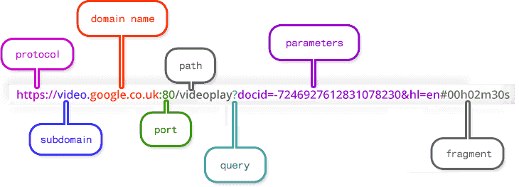

# URL

## URL(Uniform Resource Locator)

URL은 말 그대로 자원(리소스)을 가리키는 지시자이다. 자원의 종류는 아래와 같다.

- 웹 페이지 (HTML 문서)
- 이미지
- 스타일 시트 (CSS)
- 스크립트 (JavaScript)
- 멀티미디어 (동영상, 오디오)
- 문서 (PDF, 문서 파일 등)
- 데이터 (JSON, XML)
- 기타 리소스 (폰트, 아이콘 등)

이 외에도 웹은 다양한 유형의 자원을 포함하고 있으며, URL을 통해 이러한 자원들에 접근할 수 있다. URL은 프로토콜(예: http, https), 호스트, 포트, 경로 및 쿼리 매개변수 등을 포함하여 자원의 위치와 접근 방법을 지정한다.

## createObjectURL(), revokeObjectURL()

바이너리 데이터 -> 자바스크립트에서 다루기 쉽게 BLOB 객체로 변환 -> 해당 BLOB 객체를 가리키는 URL 생성

모두 브라우저 메모리에 저장됨

## encodeURI encodeURIComponent

https://developer.mozilla.org/ko/docs/Web/JavaScript/Reference/Global_Objects/encodeURI
