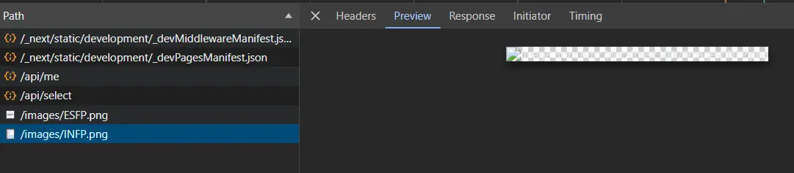
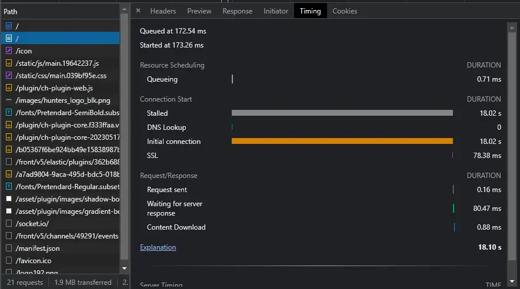

# 실무 이슈

- [렌더링 이슈](#렌더링-이슈)
  - [CSS가 적용되지 않는 경우](#css가-적용되지-않는-경우)
  - [화면이 하얗게 뜨는 경우 (White Screen of Death)](#화면이-하얗게-뜨는-경우-white-screen-of-death)
- [리소스 로드 이슈](#리소스-로드-이슈)
  - [이미지 미리보기가 안 되는 경우](#이미지-미리보기가-안-되는-경우)
- [네트워크 이슈](#네트워크-이슈)
  - [Initial Connection 지연](#initial-connection-지연)
  - [Mixed Content 차단](#mixed-content-차단)
- [SameSite 이슈: 외부 유입 시 인증 쿠키 미전송](#samesite-이슈-외부-유입-시-인증-쿠키-미전송)
  - [문제 상황](#문제-상황)
  - [원인 분석: SameSite 속성에 따른 동작 차이](#원인-분석-samesite-속성에-따른-동작-차이)
  - [해결 방법](#해결-방법)
- [TypeScript 경로 해석 이슈](#typescript-경로-해석-이슈)
  - [JSON 파일이 디렉터리 배럴을 가로막는 경우](#json-파일이-디렉터리-배럴을-가로막는-경우)
- [레이아웃 이슈: 절대 위치 요소가 최상위 스크롤바를 만드는 경우](#레이아웃-이슈-절대-위치-요소가-최상위-스크롤바를-만드는-경우)
  - [증상: 의도치 않은 최상위 스크롤바](#증상-의도치-않은-최상위-스크롤바)
  - [원인 분석: 스크롤 컨테이너를 탈출하는 절대 위치 요소](#원인-분석-스크롤-컨테이너를-탈출하는-절대-위치-요소)
  - [해결 방법: containing block 확보](#해결-방법-containing-block-확보)

## 렌더링 이슈

### CSS가 적용되지 않는 경우

1. 브라우저 호환성: 사용자의 브라우저 버전이 낮을 경우 최신 CSS 속성이 지원되지 않을 수 있다. Can I Use 사이트에서 호환성을 확인하고, 벤더 프리픽스(`-webkit-`, `-moz-` 등)를 추가하거나 폴백 스타일을 제공해야 한다.
2. 우선순위(Specificity) 충돌: 다른 CSS 규칙에 의해 덮어씌워졌을 수 있다. 개발자 도구 Elements 탭의 Styles 패널에서 취소선이 그어진 속성을 확인한다.

### 화면이 하얗게 뜨는 경우 (White Screen of Death)

주로 JavaScript 실행 중 치명적인 에러가 발생하여 렌더링이 중단된 경우다.

1. 문법/참조 에러: `undefined`의 속성을 읽으려 하거나 함수가 아닌 값을 호출했을 때 주로 발생한다.
2. 콘솔 확인: 개발자 도구 Console 탭에서 빨간색 에러 메시지를 확인하여 원인을 파악한다.
3. React Error Boundary: 리액트 환경에서는 Error Boundary를 설정하여 전체 앱이 중단되는 것을 방지하고 에러 UI를 렌더링할 수 있다.

## 리소스 로드 이슈

### 이미지 미리보기가 안 되는 경우



`fetch`로 이미지를 가져온 뒤 개발자 도구 Network 탭의 Preview/Response 탭에서 내용이 표시되지 않는 경우가 있다.

```ts
async function getResource() {
  try {
    const response = await fetch('/images/images/test.png');
    const blob = await response.blob();
    return new File([blob], 'images/test.png');
  } catch (error) {
    console.log(error);
  }
}
```

`response.blob()`, `response.json()` 등의 메서드는 응답 본문(Body) 스트림을 소비한다. 스트림을 이미 읽어버린 경우 브라우저 타이밍에 따라 개발자 도구에서 응답 내용을 더 이상 표시하지 못할 수 있다. 디버깅 시에는 스트림을 읽기 전 시점에서 확인하거나, Network 탭에 기록된 응답 헤더와 상태 코드를 활용한다.

## 네트워크 이슈

### Initial Connection 지연

리액트 프로젝트 배포 후 사이트 첫 접속에서 체감상 30초에 달하는 로드 지연이 발생했다. SPA 특성상 첫 로드가 느린 것으로 판단해 번들 크기(1.2MB)와 폰트 용량을 최적화했으나 개선되지 않았다.



개발자 도구 Network 탭의 Timing 섹션을 확인하니, 진입점인 `index.html`을 불러오는 데 약 20초가 소요됐으며 지연 구간은 Initial connection 단계였다. 이는 프론트엔드 코드가 아닌 인프라 문제였다. 도메인 설정을 점검한 결과, 유효하지 않은 IP 또는 복수의 IP에 잘못 연결되어 타임아웃 후 정상 IP를 탐색하는 과정에서 지연이 발생하고 있었다.

동일한 증상이 재발하면 DNS 설정과 도메인-IP 연결 상태를 우선 점검한다.

### Mixed Content 차단

HTTPS 페이지에서 HTTP 리소스(이미지, 스크립트, API 요청 등)를 로드하면 브라우저가 보안상의 이유로 차단한다. 개발자 도구 Console 탭에 Mixed Content 경고가 표시되며, 해당 리소스의 URL을 모두 HTTPS로 변경하여 해결한다.

## SameSite 이슈: 외부 유입 시 인증 쿠키 미전송

### 문제 상황

SNS, 이메일, 타 블로그 등 외부 사이트에 공유된 링크를 통해 서비스에 접속하면, Next.js Proxy나 Middleware에서 사용자 인증 상태를 식별하지 못하는 현상이 발생했다. 로그인된 상태임에도 비로그인으로 간주되어 권한 기반 분기(Redirect)와 페이지 처리가 정상적으로 동작하지 않았다.

원인은 인증 쿠키의 `SameSite` 속성이 `Strict`로 설정된 것이었다. 외부 사이트로부터의 유입 시 브라우저가 쿠키를 서버로 전송하지 않았기 때문이다.

### 원인 분석: SameSite 속성에 따른 동작 차이

브라우저는 CSRF(Cross-Site Request Forgery) 공격을 방지하기 위해 쿠키 전송 범위를 `SameSite` 속성으로 제한한다.

1. `SameSite=Strict`: 쿠키를 발급한 도메인과 요청 도메인이 정확히 일치할 때만 전송한다. 외부 사이트에서 링크를 클릭하는 크로스 사이트 내비게이션은 GET 요청이더라도 쿠키를 전송하지 않는다.
2. `SameSite=Lax` (현재 브라우저 기본값): 사용자가 외부 링크를 클릭하여 이동하는 최상위 내비게이션(Top-level Navigation)이면서 안전한 HTTP 메서드(GET)인 경우에 한해 쿠키 전송을 허용한다. `<iframe>`, `` 태그를 통한 삽입이나 `POST` 요청은 여전히 차단된다.

### 해결 방법

인증 쿠키의 `SameSite` 속성을 `Strict`에서 `Lax`로 변경했다. 외부 링크를 통한 접속에서도 브라우저가 인증 쿠키를 함께 전송하게 되어, 서버 측에서 정상적으로 인증 상태를 확인하고 페이지 분기를 처리할 수 있게 됐다.

## TypeScript 경로 해석 이슈

### JSON 파일이 디렉터리 배럴을 가로막는 경우

`tsconfig.json`에 `resolveJsonModule: true`가 설정된 상태에서 `"@/*": ["./*"]` 와일드카드 경로 별칭을 사용할 때 발생할 수 있다.

모듈 리졸버는 `@/components`를 해석할 때 다음 순서로 파일을 탐색한다.

```text
1. ./components.ts / .tsx / .js / .jsx  → 없음
2. ./components.json                    → 있으면 여기서 멈춤
3. ./components/index.ts                → 여기까지 도달하지 못함
```

shadcn CLI를 실행하면 프로젝트 루트에 `components.json`(shadcn 설정 파일)이 생성된다. 이 파일이 존재하면 `@/components` import가 설정 객체로 해석되어, 가져오려던 컴포넌트가 모두 `undefined`가 된다. React에서 `undefined`를 JSX 엘리먼트로 사용하면 "Element type is invalid" 에러가 발생하고 해당 라우트 전체가 500을 반환한다.

해결 방법은 `paths`에 더 구체적인 경로를 와일드카드보다 먼저 등록하는 것이다. TypeScript는 `paths` 항목을 위에서 아래 순서로 매칭하므로, 구체적인 경로가 먼저 오면 JSON 파일 탐색 단계 자체를 건너뛴다.

```json
"paths": {
  "@/components": ["./components/index"],
  "@/*": ["./*"]
}
```

## 레이아웃 이슈: 절대 위치 요소가 최상위 스크롤바를 만드는 경우

### 증상: 의도치 않은 최상위 스크롤바

헤더·푸터를 고정하고 가운데 영역만 스크롤되도록 `h-screen` + `overflow-hidden` / `overflow-y-auto` 조합으로 구성한 페이지에서, 내부 스크롤과 별개로 문서 전체(`<html>`)에 최상위 스크롤바가 추가로 생겼다. 레이아웃상 모든 요소가 뷰포트 높이 안에 갇혀 있어야 하는데도 `document.documentElement.scrollHeight`가 `clientHeight`보다 컸고, 결과적으로 스크롤바가 두 개 생기는 형태였다.

### 원인 분석: 스크롤 컨테이너를 탈출하는 절대 위치 요소

폼 안에서 사용한 Select 컴포넌트(Radix 기반)는 form 제출과 접근성을 위해 화면에 보이지 않는 네이티브 `<select>`를 함께 렌더링한다. 이 요소는 visually-hidden 패턴(`width:1px; height:1px; clip:rect(0 0 0 0)`)이면서 `position: absolute`였다.

`position: absolute` 요소는 가장 가까운 positioned 조상(`position`이 `static`이 아닌 요소)을 기준(containing block)으로 배치된다. 그런데 이 `<select>`부터 `<body>`까지의 조상 체인에 positioned 요소가 하나도 없었다. 그 결과 containing block이 `<body>`가 되어, 중간에 있는 스크롤 컨테이너의 `overflow` 클리핑이 적용되지 않고 요소가 그대로 컨테이너를 탈출했다.

폼이 길어 깊은 위치의 `<select>`가 `<body>` 기준 수천 px 아래 좌표에 배치됐고, 보이지 않는 1px짜리 요소가 `<html>`의 `scrollHeight`를 늘려 최상위 스크롤바를 만들었다. 내부 `overflow-y-auto` 컨테이너의 스크롤은 정상 동작했기 때문에 원래 의도한 스크롤 위에 불필요한 문서 스크롤이 겹쳐 보였다.

> `clip`, `overflow:hidden`, `width/height:1px`는 요소의 *렌더링*만 숨길 뿐, 요소가 차지하는 박스 자체는 부모의 레이아웃·스크롤 영역 계산에 그대로 포함된다.

### 해결 방법: containing block 확보

스크롤 컨테이너에 `position: relative`를 부여해, 숨김 `<select>`의 containing block이 `<body>`가 아닌 스크롤 컨테이너가 되도록 했다. 그러면 절대 위치 요소가 스크롤 컨테이너 내부 기준으로 배치되어 `overflow` 클리핑·스크롤에 포함되고, `<html>`로 새어 나가지 않는다.

```diff
- <div className="flex flex-1 justify-center overflow-y-auto ...">
+ <div className="relative flex flex-1 justify-center overflow-y-auto ...">
```

내부 스크롤 동작은 그대로 유지되며 최상위 스크롤바만 사라진다. 절대 위치 자식을 가질 수 있으면서 자체 스크롤을 갖는 컨테이너에는 `position: relative`를 기본으로 두는 것이 안전하다.
