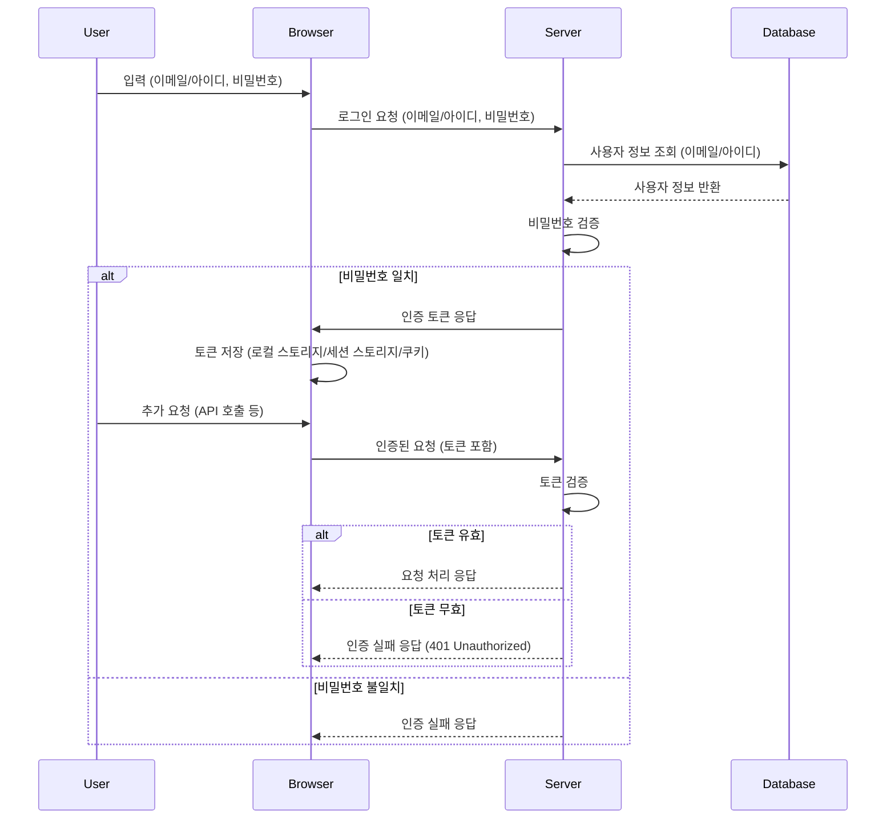
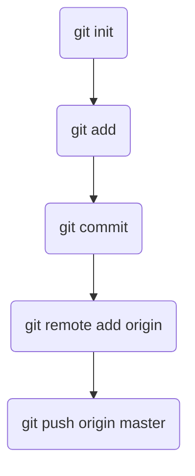
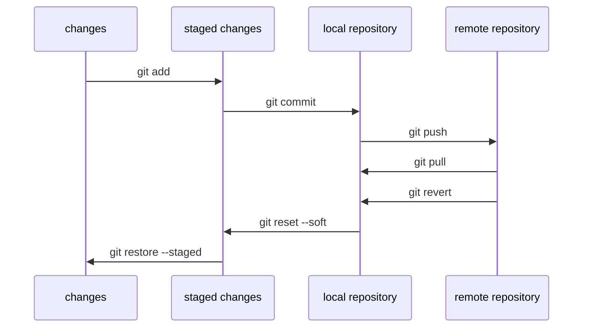
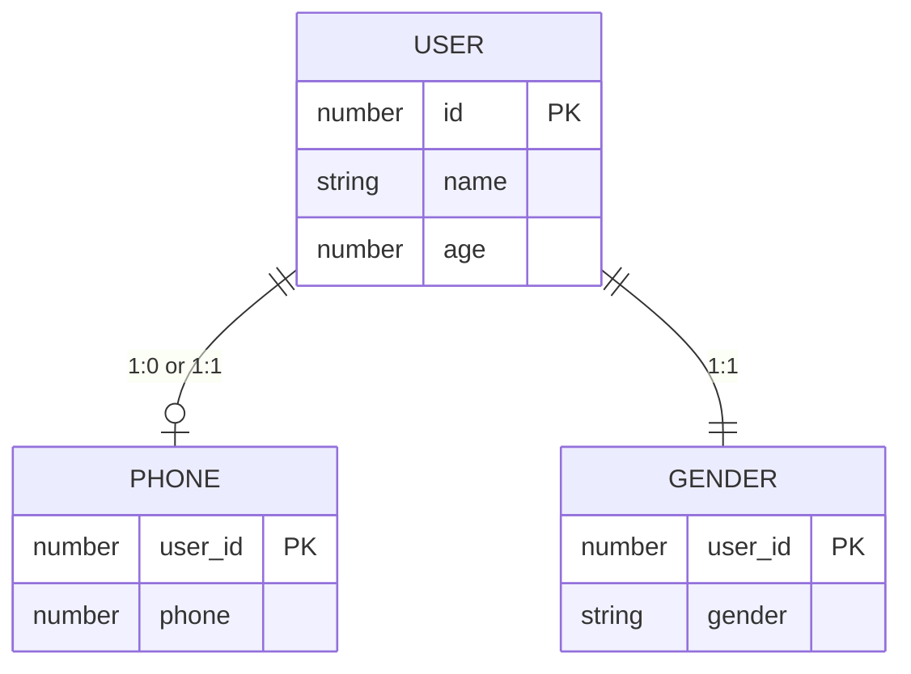
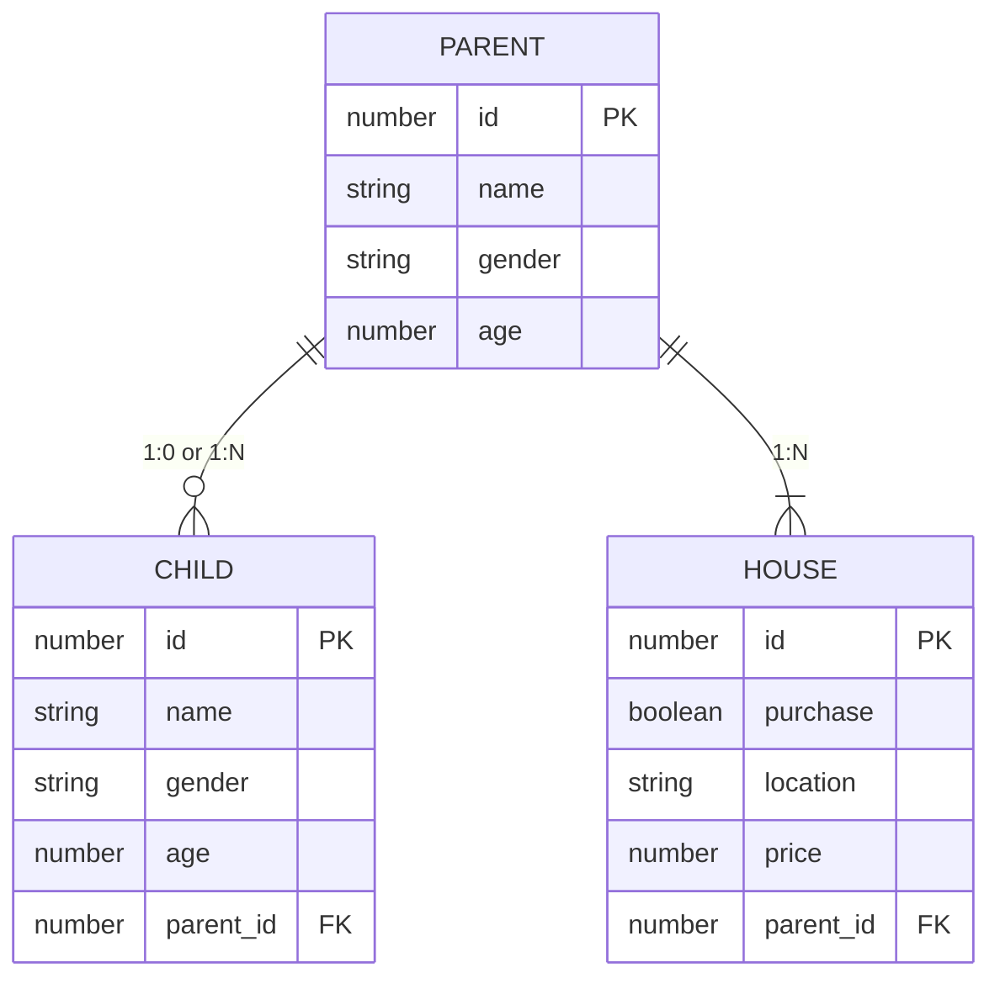
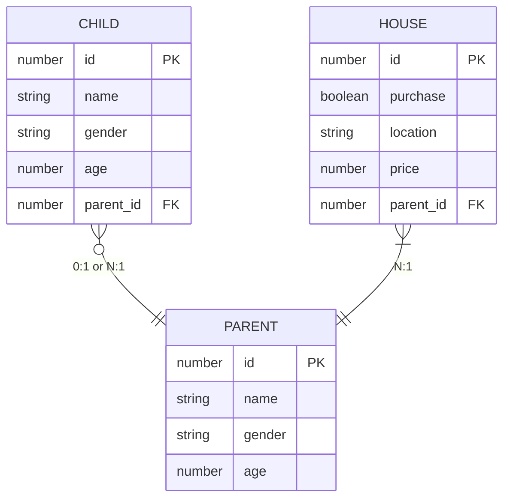
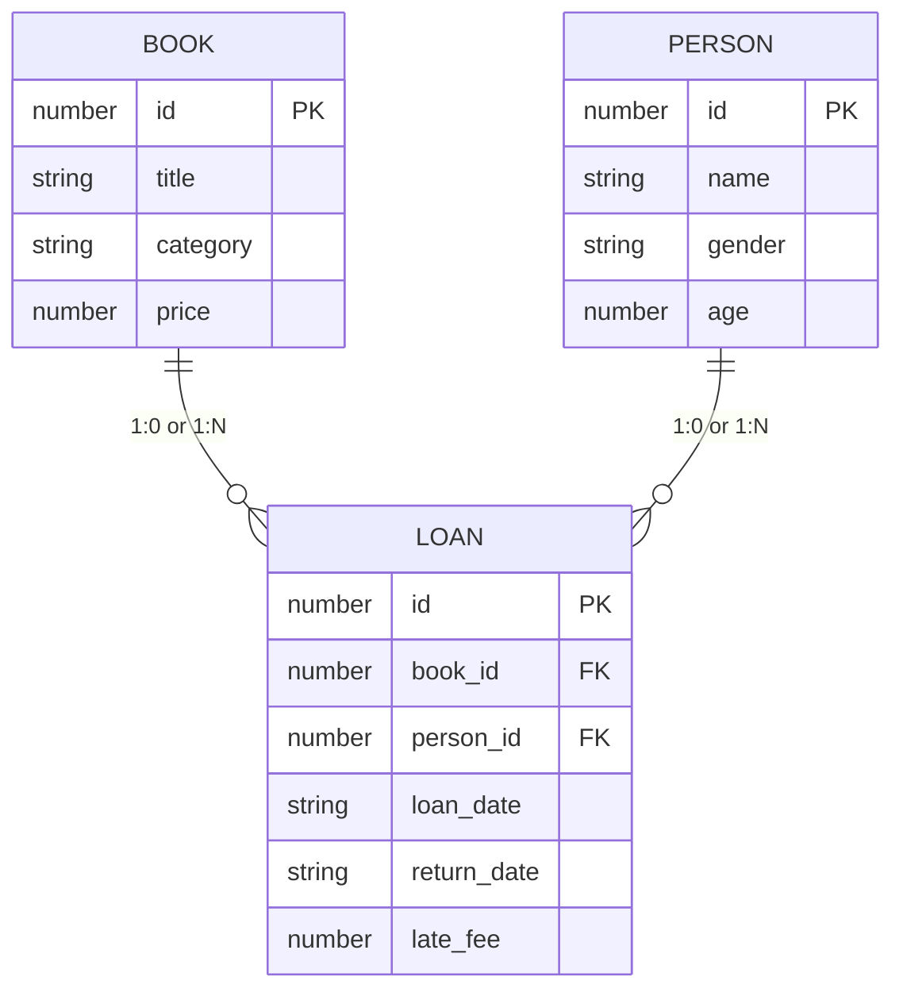

# Mermaid

```mermaid
sequenceDiagram
    participant User
    participant Browser
    participant Server
    participant Database

    User->>Browser: 입력 (이메일/아이디, 비밀번호)
    Browser->>Server: 로그인 요청 (이메일/아이디, 비밀번호)
    Server->>Database: 사용자 정보 조회 (이메일/아이디)
    Database-->>Server: 사용자 정보 반환
    Server->>Server: 비밀번호 검증
    alt 비밀번호 일치
        Server->>Browser: 인증 토큰 응답
        Browser->>Browser: 토큰 저장 (로컬 스토리지/세션 스토리지/쿠키)
        User->>Browser: 추가 요청 (API 호출 등)
        Browser->>Server: 인증된 요청 (토큰 포함)
        Server->>Server: 토큰 검증
        alt 토큰 유효
            Server-->>Browser: 요청 처리 응답
        else 토큰 무효
            Server-->>Browser: 인증 실패 응답 (401 Unauthorized)
        end
    else 비밀번호 불일치
        Server-->>Browser: 인증 실패 응답
    end
```

```mermaid
flowchart TD
    1("git init")
    2("git add")
    3("git commit")
    4("git remote add origin")
    5("git push origin master")
    1-->2-->3-->4-->5
```

```mermaid
sequenceDiagram
    changes->>staged changes: git add
    staged changes->>local repository: git commit
    local repository->>remote repository: git push
    remote repository->>local repository: git pull
    remote repository->>local repository: git revert
    local repository->>staged changes: git reset --soft
    staged changes->>changes: git restore --staged
```

```mermaid
erDiagram
USER {
  number id PK
  string name
  number age
}
PHONE {
  number user_id PK
  number phone
}
GENDER {
  number user_id PK
  string gender
}
USER ||--o| PHONE: "1:0 or 1:1"
USER ||--|| GENDER: "1:1"
```

```mermaid
erDiagram
PARENT {
  number id PK
  string name
  string gender
  number age
}
CHILD {
  number id PK
  string name
  string gender
  number age
  number parent_id FK
}
HOUSE {
  number id PK
  boolean purchase
  string location
  number price
  number parent_id FK
}
PARENT ||--o{ CHILD: "1:0 or 1:N"
PARENT ||--|{ HOUSE: "1:N"
```

```mermaid
erDiagram
PARENT {
  number id PK
  string name
  string gender
  number age
}
CHILD {
  number id PK
  string name
  string gender
  number age
  number parent_id FK
}
HOUSE {
  number id PK
  boolean purchase
  string location
  number price
  number parent_id FK
}
CHILD }o--|| PARENT: "0:1 or N:1"
HOUSE }|--|| PARENT: "N:1"
```

```mermaid
erDiagram
BOOK {
  number id PK
  string title
  string category
  number price
}
PERSON {
  number id PK
  string name
  string gender
  number age
}
LOAN {
  number id PK
  number book_id FK
  number person_id FK
  string loan_date
  string return_date
  number late_fee
}
BOOK ||--o{ LOAN: "1:0 or 1:N"
PERSON ||--o{ LOAN: "1:0 or 1:N"
```
