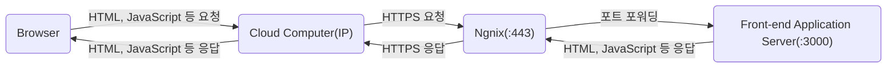
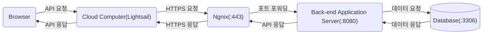

# Web

- [Web](#web)
  - [웹 브라우저란?](#웹-브라우저란)
    - [렌더링 과정](#렌더링-과정)
  - [웹 서버란?](#웹-서버란)
  - [브라우저와 서버의 의사소통](#브라우저와-서버의-의사소통)
  - [브라우저의 주소 표시창에 URL을 입력했을 때 발생하는 동작](#브라우저의-주소-표시창에-url을-입력했을-때-발생하는-동작)
  - [URL(Uniform Resource Locator)](#urluniform-resource-locator)
  - [자바스크립트 등장 이전의 웹 동작 방식](#자바스크립트-등장-이전의-웹-동작-방식)
    - [자바스크립트 등장 이후의 웹 동작 방식](#자바스크립트-등장-이후의-웹-동작-방식)
    - [AJAX 등장 이전의 웹 방식](#ajax-등장-이전의-웹-방식)
    - [AJAX 등장 이후의 웹 방식](#ajax-등장-이후의-웹-방식)
  - [렌더링 방법 비교](#렌더링-방법-비교)
    - [CSR(Client Side Rendering)](#csrclient-side-rendering)
    - [SSR(Server Side Rendering)](#ssrserver-side-rendering)
    - [SSG(Static Site Generator)](#ssgstatic-site-generator)
  - [마크업 언어(Markup Language)](#마크업-언어markup-language)
    - [HTML(Hyper Text Markup Language)](#htmlhyper-text-markup-language)
    - [Markdown](#markdown)
    - [XML(eXtensible Markup Language)](#xmlextensible-markup-language)
    - [JSON(JavaScript Object Notation)](#jsonjavascript-object-notation)
    - [YAML(Yet Another Markup Language)](#yamlyet-another-markup-language)
  - [인코딩](#인코딩)
    - [문자 인코딩](#문자-인코딩)
      - [유니코드](#유니코드)
      - [UTF-8](#utf-8)
    - [문자열 인코딩](#문자열-인코딩)
    - [멀티미디어 인코딩](#멀티미디어-인코딩)
  - [브라우저 캐시](#브라우저-캐시)
    - [memory cache vs disk cache](#memory-cache-vs-disk-cache)
  - [멀티미디어 태그의 src 속성](#멀티미디어-태그의-src-속성)
    - [외부 서버 주소로 파일 요청](#외부-서버-주소로-파일-요청)
    - [현재 웹 페이지와 동일한 서버인 경우 상대 경로](#현재-웹-페이지와-동일한-서버인-경우-상대-경로)
    - [Base64 인코딩](#base64-인코딩)
  - [MIME 타입](#mime-타입)
    - [multipart/form-data](#multipartform-data)
    - [application/json](#applicationjson)
    - [application/octet-stream](#applicationoctet-stream)
    - [application/x-www-form-urlencoded](#applicationx-www-form-urlencoded)
    - [etc](#etc)
  - [HTTP 헤더](#http-헤더)
    - [일반 헤더 (General Headers)](#일반-헤더-general-headers)
    - [요청 헤더 (Request Headers)](#요청-헤더-request-headers)
    - [응답 헤더 (Response Headers)](#응답-헤더-response-headers)
    - [표현 헤더 (Representation Headers)](#표현-헤더-representation-headers)
    - [쿠키 관련 헤더](#쿠키-관련-헤더)
    - [CORS (Cross-Origin Resource Sharing) 관련 헤더](#cors-cross-origin-resource-sharing-관련-헤더)
  - [개발자 도구 디버깅](#개발자-도구-디버깅)
    - [등록 이벤트 확인하기](#등록-이벤트-확인하기)
    - [initial connection](#initial-connection)
    - [blocked:mixed-content](#blockedmixed-content)
    - [content-disposition](#content-disposition)
    - [CSS가 안 먹히는 경우](#css가-안-먹히는-경우)
    - [화면이 하얗게 뜨는 경우](#화면이-하얗게-뜨는-경우)
    - [이미지 로드 시 개발자 도구에서 미리보기가 안 뜨는 이슈](#이미지-로드-시-개발자-도구에서-미리보기가-안-뜨는-이슈)
  - [Web API](#web-api)
    - [Clipboard API](#clipboard-api)
    - [History API](#history-api)
    - [Location API](#location-api)
  - [외부 API 연동](#외부-api-연동)
  - [CMS](#cms)
    - [CMS (Monolithic CMS)](#cms-monolithic-cms)
    - [Headless CMS:](#headless-cms)
  - [css](#css)
  - [모듈 다운](#모듈-다운)
  - [FOUC(flash of unstyled content)](#foucflash-of-unstyled-content)
  - [script](#script)
  - [템플릿 엔진](#템플릿-엔진)

## 웹 브라우저란?

브라우저는 HTTP 프로토콜을 해석할 수 있는 프로그램이며, HTTP 요청으로 응답한 컨텐츠를 브라우저 상에 보여주는 역할을 한다. 컨텐츠는 주로 HTML, CSS, JavaScript, JSON, 이미지, 폰트, 미디어 등 여러가지가 존재하는데, 그 중에서 HTML, CSS, JavaScript는 브라우저 내부에 렌더링 엔진과 자바스크립트 엔진에 의해 파싱 되어 렌더 트리를 생성한 후 화면에 표현한다.

### 렌더링 과정


## 웹 서버란?

웹 서버는 HTTP 프로콜을 해석할 수 있는 프로그램이 돌아가고 있는 컴퓨터를 말한다.

아래는 기본적으로 HTTP/HTTPS 요청을 받는 웹서버를 바탕으로 하고 사용성에 따라 구분해 보았다.

API 서버: DB와 연결되어 사용자의 요청에 따라 GET/POST/PUT/DELETE 동작을 수행하는 서버

SSR 서버: DB와 연결되어 사용자의 요청에 따라 알맞은 데이터를 넣어 렌더링된 HTML 파일을 응답하는 서버

Static 서버: 사용자가 요청한 정적 파일(HTML, JavaScript, CSS, Image, Font 등)을 응답하는 서버

## 브라우저와 서버의 의사소통





## 브라우저의 주소 표시창에 URL을 입력했을 때 발생하는 동작


## URL(Uniform Resource Locator)


URL은 말 그대로 자원(리소스)을 가리키는 지시자이다. 자원의 종류는 아래와 같다.

- 웹 페이지 (HTML 문서)
- 이미지
- 스타일 시트 (CSS)
- 스크립트 (JavaScript)
- 멀티미디어 (동영상, 오디오)
- 문서 (PDF, 문서 파일 등)
- 데이터 (JSON, XML)
- 기타 리소스 (폰트, 아이콘 등)

이 외에도 웹은 다양한 유형의 자원을 포함하고 있으며, URL을 통해 이러한 자원들에 접근할 수 있다. URL은 프로토콜(예: http, https), 호스트, 포트, 경로 및 쿼리 매개변수 등을 포함하여 자원의 위치와 접근 방법을 지정한다.

## 자바스크립트 등장 이전의 웹 동작 방식

자바스크립트가 등장하기 전의 웹은 정적인 내용으로 구성되었다. 웹 페이지의 내용은 서버에서 생성되어 클라이언트에게 전송되고, 클라이언트는 해당 내용을 받아 브라우저에서 렌더링하여 표시했다. 사용자와의 상호작용은 주로 링크를 클릭하거나 폼을 제출하는 등의 방식으로 이루어졌다. 이렇게 정적인 웹 페이지에서는 페이지 갱신이 발생하면 새로운 페이지를 서버에서 요청하고 받아와야 했다. 이로 인해 사용자 경험이 제한되었고, 웹 페이지 갱신이 느렸다.

### 자바스크립트 등장 이후의 웹 동작 방식

자바스크립트의 등장으로 웹 페이지에 동적인 기능을 추가할 수 있게 되었다. 자바스크립트는 클라이언트 측에서 실행되는 스크립트 언어로, 웹 페이지의 내용을 변경하거나 사용자와의 상호작용을 처리할 수 있다. 이로 인해 웹 페이지는 더 동적이고 반응적으로 동작할 수 있게 되었다. 예를 들어, 사용자가 버튼을 클릭하면 자바스크립트를 사용하여 페이지 내용을 변경하거나 서버와 통신하여 데이터를 동적으로 가져올 수 있다.

### AJAX 등장 이전의 웹 방식

AJAX가 등장하기 전의 웹 방식에서는 페이지 갱신이 발생할 때마다 새로운 페이지를 서버에서 요청하고 응답을 받아와 전체 페이지를 다시 렌더링했다. 이로 인해 사용자 경험이 제한되었고, 페이지 갱신 시간이 오래 걸렸다.

### AJAX 등장 이후의 웹 방식

AJAX(Asynchronous JavaScript and XML) 자바스크립트와 XML을 이용한 비동기적 데이터 교환을 의미한다. 그러나 현재에는 XML보다는 사용자 편의성이나 보안 측면에서 유리한 JSON이 보편적으로 사용된다.

AJAX의 등장으로 웹 페이지의 일부분만 갱신하거나 데이터를 비동기적으로 서버와 주고받을 수 있게 되었다. 이는 사용자 경험을 향상시키고 페이지 갱신 시간을 줄이는 데 큰 영향을 미쳤다. AJAX를 통해 데이터를 서버와 주고받을 때 페이지 전체를 새로 렌더링할 필요 없이, 필요한 부분만 업데이트할 수 있다. 이로 인해 웹 애플리케이션은 빠르고 동적인 동작을 보여줄 수 있게 되었다.

요약하면, 자바스크립트의 등장 이전에는 정적인 웹 페이지가 주를 이루었으며, 자바스크립트와 함께 웹 페이지는 동적이고 반응적인 동작을 하게 되었다. 또한, AJAX의 등장으로 웹 페이지의 일부분만 갱신하거나 데이터를 비동기적으로 주고받을 수 있게 되어 사용자 경험과 성능이 크게 향상되었다.

## 렌더링 방법 비교

### CSR(Client Side Rendering)

CSR은 클라이언트(브라우저)에서 렌더링을 한다. 한 번 요청해서 받으면 변하지 않는 정적 자산들인 빈 HTML(도화지)과 자바스크립트(붓)를 Static 서버에 요청해서 받아온 후 작성된 자바스크립트 코드에 따라 브라우저는 화면을 그리고 동적인 데이터가 들어가는 부분은 API 서버에 데이터를 요청해서 데이터를 업데이트한다.

### SSR(Server Side Rendering)

SSR은 SSR 서버에서 렌더링을 한다. SSR 서버는 첫 요청에서 초기값을 넣어 렌더링된 HTML 파일을 응답한다. 이 후 상호작용을 통해 데이터가 변경될 때 서버로 요청이 들어오면 그 시점의 알맞은 데이터를 넣어 렌더링이 완료된 HTML을 보내는 방식이다.

### SSG(Static Site Generator)

미리 작성해놓은 정적인 파일들을 Static 서버에 저장해놓고 클라이언트가 요청하면 해당 파일을 보여주는 방식이며, 동적인 변화가 불가능하다.


## 마크업 언어(Markup Language)

문서가 화면에 표시되는 형식을 나타내거나 데이터의 논리적인 구조를 명시하기 위한 규칙들을 정의한 언어의 일종이다. 데이터를 기술한 언어라는 점에서 프로그래밍 언어와는 분명한 차이가 있다.

### HTML(Hyper Text Markup Language)

HTML은 태그를 사용하여 웹 페이지의 구조와 내용을 정의합니다. 제목, 단락, 링크, 이미지, 양식 등 다양한 요소를 지원합니다. HTML 문서는 웹 브라우저에 의해 시각적으로 표시됩니다.

### Markdown

Markdown은 간단한 구문 (강조를 위한 별표, 제목을 위한 해시태그 등)을 사용하여 일반 텍스트를 구조화된 콘텐츠로 서식 지정합니다. 원시 형식으로 읽기 쉽고, 게시를 위해 HTML이나 다른 형식으로 변환할 수 있습니다. Markdown은 HTML만큼 다양한 기능을 제공하지는 않지만, 기본 콘텐츠를 간단하고 빠르게 생성하는 데 적합합니다.

### XML(eXtensible Markup Language)

기존의 HTML과 달리 웹상에서 구조화된 문서를 전송가능하도록 설계되었다. 이게 무슨 뜻이냐면 예를 들어 HTML에서는 "CPU 2.83GHz"라는 데이터를 표기할 때 어디부터가 데이터 명이고 어디부터가 실제 데이터인지 표시할 수 있는 마땅한 방법이 없다.

이런 문제를 해결하기 위해 XML을 이용하면 어디부터 어디까지가 데이터 이름이고 어디부터 어디까지가 실제 데이터이며 어디부터 어디까지가 데이터 단위인지도 표현이 가능하다. 즉, 데이터에 의미를 부여하는 메타데이터를 기술할 수 있다. XML은 바로 이러한 목적으로 탄생했다. 위의 예를 XML로 바꾸면 데이터 명은 `<dataname>CPU</dataname>`가 되고 데이터 값은 `<datavalue>2.83</datavalue>`이 된다.

이런 XML의 특징은 수많은 종류의 데이터를 유연하고 자유롭게 기술하는 데 적용할 수 있어서 다양한 용도로 응용할 수 있으며, 인터넷으로 연결된 시스템끼리 쉽게 식별 가능한 데이터를 주고받을 수 있게 된다. 게임 모드 등을 시도해 봤다면 설정파일이 XML로 된 것을 본 경험이 있을 것이다.

### JSON(JavaScript Object Notation)

서버와 클라이언트간의 데이터를 교환할 때 사용하는 데이터 포맷이다. 클라이언트가 사용하는 언어에 관계 없이 통일된 데이터를 주고받을 수 있도록, 일정한 패턴을 지닌 문자열을 생성해 내보내면 클라이언트는 그를 해석해 데이터를 자기만의 방식으로 온전히 저장, 표시할 수 있게 된다.

과거 웹 초기 시절부터 사용된 XML은 헤더와 태그 등의 여러 요소로 가독성이 떨어지고, 쓸데없이 용량을 잡아먹는다는 단점을 항상 지적받았다. 이에 대응해 간결하고 통일된 양식으로 각광을 받고 있는 것이 JSON이다.

`{ }`​은 객체를 의미하며, `[ ]`은 배열, 객체 안에 객체를 넣을 수도 있어서 XML처럼 복잡한 구조 또한 표현이 가능하다. 표현할 수 있는 값의 자료형은 `{ }​`로 표기되는 객체, `[ ]`로 표기되는 배열, 문자열, 숫자, 불리언, `null`로 6가지가 전부다. 또한 `null`의 존재에서 알 수 있듯, JSON은 JavaScript 이외의 언어에서 사용될 상황을 다분히 고려하고 있다.

### YAML(Yet Another Markup Language)

기존에 주로 사용되던 포맷인 JSON의 불편함을 해소하기 위해 만들어진 superset(상위 호환)이다.

## 인코딩

<!-- todo: 내용 보완 필요 -->

### 문자 인코딩

사용자가 키보드 입력 시 키보드는 컴퓨터에게 유니코드를 전달하고 컴퓨터는 해당 유니코드를 UTF-8 방식으로 인코딩하여 저장하는데 이 때 UTF-8이 문자 인코딩이다. 해당 데이터는 브라우저나 메모장, 텍스트 에디터 프로그램에 내장된 UTF-8 디코딩 기능을 통해 사용자에게 해당 데이터를 출력한다

#### 유니코드

유니코드는 모든 글자가 코드와 1:1매핑되어 있는 코드표이다.

컴퓨터가 세상에 나왔을 때는 영어와 몇가지 특수문자만 사용했고 이를 저장하기 위해서 1 byte면 충분했다. 시간이 흘러 다른 국가 사람들이 컴퓨터를 이용하다보니 자국어도 컴퓨터로 표시하고 싶어졌다. 그래서 1 byte 안에 임의대로 알파벳 대신 자기나라 글자를 할당해서 그럭저럭 쓸 수는 있었다. 그러나 네트워크가 발전하고 다른 사람 홈페이지를 들어갔더니 글자가 와장창 깨지고 만다. 그리하여 국제적으로 전세계 언어를 모두 표시할 수 있는 표준코드를 만들기로 했다. 그게 바로 유니코드다.


#### UTF-8

UTF-8은 유니코드를 인코딩하는 방식이다. 전세계에서 사용하는 약속이다.

유니코드를 통해 코드표가 정의되었다. 남은 것은 그 코드가 컴퓨터에 어떻게 저장되어야 하는 것이다. 다른 말로 인코딩이라고 하는데, 컴퓨터가 이해할 수 있는 이진 데이터로 바꿔주는 것이다. UTF-8은 가변 인코딩방식이다. 쉬운 말로 하면 글자마다 byte 길이가 다르다는 것이다. 'a'는 1 byte이고 '가'는 3 byte이다. 가변을 구분하기 위해 첫 바이트에 표식을 넣었는데 2 byte는 110으로 시작하고 3바이트는 1110으로 시작한다. 나머지 바이트는 10으로 시작한다.


### 문자열 인코딩

문자열 인코딩은 문자열을 별도의 방식으로 치환하는 인코딩이다. 엄밀히 말하면 위의 문자 인코딩과는 다른 개념이며 문장의 코드화에 가깝다.

문자 입력/전송시, 읽지 않는 문자나 기존 예약된 문자가 따로 있어 사용할 수 없는 문자가 있을 때, 이를 회피하기 위해서 돌려 인코딩을 하는 경우가 많다. 또한 표현하는 한도를 넘은 문자열을 집어넣고자 할 때 따로 약속된 코드로 인코딩을 하기도 한다. 심지어는 문자가 아닌 정보를 문자처럼 기록하고자 할 때 별도의 인코딩을 하기도 한다.

보통 URL이나, HTML같은 웹 관련 텍스트에서 종종 마주할 수 있다.

### 멀티미디어 인코딩

문자 인코딩이 부호화와 관련이 깊다면, 멀티미디어 인코딩은 압축 및 알고리즘과 관련이 깊다. 주로 재생기기, 프로그램 등과 호환되는 코덱으로 변환, 동영상/소리의 용량을 줄이는 데에 필요하다

## 브라우저 캐시

캐시란, 데이터를 미리 복사해 놓는 임시 장소를 가리킨다. 캐시를 이용하지 않았을 때의 데이터 접근 시간이 오래 걸리는 경우나 값을 다시 연산하는 시간을 단축하기 위해 사용된다. 데이터가 본래 저장되어 있던 장소보다 접근 시간이 더 빠른 별도의 장소에 데이터를 미리 복사해 놓으면 계산이나 접근 시간 없이 더 빠른 속도로 데이터에 접근할 수 있다.

브라우저는 웹 페이지에서 사용되는 이미지, 스크립트, 스타일시트, 폰트 및 기타 웹 자원을 캐시에 저장한다. 캐시 덕에 동일한 자원을 나중에 다시 다운로드하지 않고 재사용할 수 있으며 렌더링 속도를 높이고 대역폭 사용을 줄일 수 있다. 캐시된 데이터는 보통 웹 서버에서 지정한 만료 기간 또는 캐시 제어 헤더를 기반으로 관리되며 만료 기간이 지나면 브라우저는 데이터를 새로 다운로드한다.

### memory cache vs disk cache


위의 개발자 도구에서 확인할 수 있듯이, 브라우저에서는 자원을 캐싱할 때 저장되는 위치에 따라 memory cache와 disk cache로 나뉜다. memory cache는 컴퓨터의 RAM(메모리)에 저장되고, disk cache는 컴퓨터의 하드디스크의 저장된다. 윈도우 운영체제에서 크롬을 사용한다면 아래 경로를 통해 저장된 캐시를 확인할 수 있다.

C:\Users\<사용자 이름>\AppData\Local\Google\Chrome\User Data\Default\Cache

memory cache는 브라우저 종료 시 데이터가 휘발되며, 주로 크기가 작거나 빠른 엑세스가 필요한 자원들이 저장된다. 빠른 엑세스는 디스크보다 메모리가 접근 위치가 가깝기 때문에 상대적으로 빠르게 접근이 가능하다. disk cache는 브라우저가 종료되어도 휘발되지 않으며, 주로 크기가 크고 복잡한 자원들이 저장된다.

memory cache, disk cache, 캐시 안된 자원의 Time 열을 확인하면 속도의 차이를 확인할 수 있다.

## 멀티미디어 태그의 src 속성

HTML 태그 중 ``, `<video />`, `<audio />`와 같은 멀티미디어 태그들은 `src` 속성을 입력해야 한다.

- HTML 파싱: 브라우저는 HTML 문서를 파싱하고, 멀티미디어 태그를 만나면 멀티미디어를 로드해야 함을 인식한다. 멀티미디어 태그의 src 속성에 지정된 URL로 리소스를 찾는다.

- 리소스 요청: 브라우저는 멀티미디어 태그의 src 속성에 지정된 URL로 HTTP GET 요청을 생성하여 리소스를 서버에 요청한다.

- 서버 응답: 서버는 리소스 요청을 받고, 해당 리소스를 찾아 브라우저에 응답한다. 서버 응답은 HTTP 상태 코드와 리소스 데이터로 구성된다.

- 리소스 다운로드: 브라우저는 서버로부터 받은 리소스를 다운로드하고 메모리에 저장한다. 이 과정에서 리소스의 크기와 형식에 따라 시간이 소요될 수 있다.

- 멀티미디어 렌더링: 멀티미디어 다운로드가 완료되면 브라우저는 리소스를 렌더링하여 화면에 표시한다.

- 캐싱: 리소스가 캐시 가능한 경우, 브라우저는 리소스를 로컬 캐시에 저장하여 나중에 동일한 리소스에 대한 요청 시 네트워크 요청을 피할 수 있다. 리소스의 캐시 유효 기간은 서버의 응답 헤더에서 제공된다.

- 오류 처리: 만약 리소스를 찾을 수 없거나 다운로드 중에 오류가 발생하면 브라우저는 대체 텍스트(alt 속성의 값)나 기본 오류 리소스를 표시할 수 있다.

### 외부 서버 주소로 파일 요청

가장 흔한 경우는 외부 정적 자산 서버에서 호스팅되는 외부 이미지 파일의 URL을 `src` 속성에 지정하는 것이다.

```html

```

### 현재 웹 페이지와 동일한 서버인 경우 상대 경로

파일이 현재 웹 페이지와 동일한 서버에 있는 경우, 상대 경로를 사용하여 `src` 속성에 지정할 수 있다.

```html

```

### Base64 인코딩

파일을 Base64로 인코딩하여 `src` 속성에 지정할 수 있다. 큰 이미지의 경우 데이터 URL은 페이지 크기를 크게 늘릴 수 있다.

```html

```

## MIME 타입

MIME(Multipurpose Internet Mail Extensions) 타입은 파일의 형식이나 유형을 식별하기 위한 표준화된 문자열이다. MIME 타입은 주로 웹에서 사용되며, 웹 브라우저와 서버가 파일의 내용을 올바르게 처리하도록 도와준다. MIME 타입은 파일의 확장자나 내용의 특성에 따라 결정되며, 파일의 실제 형식을 정확하게 식별할 수 있도록 도와준다.

### multipart/form-data

여러 데이터 유형(텍스트, 이미지, 파일 등)을 동시에 HTTP 요청의 body 값으로 전송할 수 있으며 주로 파일 업로드와 폼 데이터를 같이 전송할 때 사용된다. 각 파트에 Content-Type 및 Content-Disposition 헤더가 부여된다.

자바스크립트에서 바이너리 데이터를 다룰 때 blob 객체로 다뤄지는데 multipart/form-data를 사용하면 해당 객체를 자동으로 바이너리 데이터로 변환하고 서버로 전송한다.

HTML 폼 방식, fetch API, axios 방식으로 요청 가능하다.


### application/json

HTTP 요청의 body 값으로 JSON 데이터를 보낼 때 사용한다.

fetch API, axios 방식으로 요청 가능하다.


바이너리 데이터를 Base64 형식으로 인코딩해서 보내는 경우는 아래와 같다.


### application/octet-stream

HTTP 요청의 body 값으로 아무런 특별한 분류나 변환 없이 원시 바이트 데이터로 이루어진 스트림을 전송할 때 사용한다. 어떤 종류의 파일인지 알 수 있는 바이너리 데이터는 다른 MIME 타입을 사용해서 명시해준다.

자바스크립트에서 바이너리 데이터를 다룰 때 blob 객체로 다뤄지는데 application/octet-stream을 사용하면 해당 객체를 바이너리 데이터로 변환 후에 서버로 전송해야 한다.

fetch API, axios 방식으로 요청 가능하다.


### application/x-www-form-urlencoded

HTML 폼 방식으로 HTTP 요청을 할 때 기본값으로 설정되며, HTTP 요청의 body 값으로 데이터를 URL 인코딩하여 보낼 때 사용한다.


HTML 폼 방식, fetch API, axios 방식으로 요청 가능하다.

### etc

- application/JavaScript
- application/xml
- application/zip
- application/pdf
- application/sql
- application/graphql
- application/ld+json
- application/msword (.doc)
- application/vnd.openxmlformats-officedocument.wordprocessingml.document(.docx)
- application/vnd.ms-excel (.xls)
- application/vnd.openxmlformats-officedocument.spreadsheetml.sheet (.xlsx)
- application/vnd.ms-powerpoint (.ppt)
- application/vnd.openxmlformats-officedocument.presentationml.presentation (.pptx)
- application/vnd.oasis.opendocument.text (.odt)
- audio/mpeg
- audio/vorbis
- text/css
- text/html
- text/csv
- text/plain
- assets/image/png
- image/jpeg
- image/gif

## HTTP 헤더

HTTP 헤더는 요청과 응답 모두에 사용되며, 다양한 메타데이터와 제어 정보를 전송하는 데 사용된다. 실무에서 자주 사용되는 HTTP 헤더 속성은 다음과 같다

### 일반 헤더 (General Headers)

Cache-Control: 캐싱 동작을 지정합니다.
Connection: 네트워크 연결 관리를 위한 지시어를 제공합니다.
Date: 메시지가 생성된 날짜와 시간을 나타냅니다.

### 요청 헤더 (Request Headers)

Accept: 클라이언트가 이해할 수 있는 미디어 타입을 나타냅니다.
Authorization: 사용자 인증 정보를 포함합니다.
Host: 요청의 대상 서버와 포트 번호를 나타냅니다.
User-Agent: 클라이언트 응용 프로그램의 정보를 제공합니다.
Referer: 현재 요청 URL을 호출한 이전 웹 페이지의 URL을 나타냅니다.

### 응답 헤더 (Response Headers)

Location: 새로운 URL로 리다이렉션하는 데 사용됩니다.
Server: 웹 서버의 소프트웨어 정보를 나타냅니다.
WWW-Authenticate: 클라이언트에게 인증 방법을 알려주는 데 사용됩니다.

### 표현 헤더 (Representation Headers)

Content-Type: 본문의 미디어 타입을 나타냅니다.
Content-Length: 응답 본문의 길이를 바이트 단위로 나타냅니다.
Content-Encoding: 본문 데이터의 인코딩 방식을 나타냅니다.
Content-Disposition: 본문을 표시할 것인지, 파일로 다운로드할 것인지를 나타내는 지시어를 포함합니다.

### 쿠키 관련 헤더

Set-Cookie: 서버에서 클라이언트로 쿠키를 전송하는 데 사용됩니다.
Cookie: 클라이언트에서 서버로 쿠키를 전송하는 데 사용됩니다.

### CORS (Cross-Origin Resource Sharing) 관련 헤더

Access-Control-Allow-Origin: 리소스에 액세스할 수 있는 외부 도메인을 지정합니다.
Access-Control-Allow-Methods: 허용되는 HTTP 메서드를 지정합니다.
Access-Control-Allow-Headers: 허용되는 헤더를 지정합니다.

## 개발자 도구 디버깅

### 등록 이벤트 확인하기

```js
getEventListeners($0);
getEventListeners(window);
getEventListeners(document);
```

또는 개발자 도구


### initial connection

리액트 프로젝트를 배포 후에 사이트에 접속해보니 사이트가 매우 느리게 로드되었다. 거의 체감상 30초 정도 걸린 것 같다.

처음에는 SPA니까 첫 로드가 오래 걸린다 생각했지만, 그러기엔 번들 파일의 크기가 1.2MB정도였다. 개발 중에 급하게 폰트를 적용했었는데 해당 폰트가 경량화 폰트가 아니라서 폰트 용량 문제라고 생각했으나, 경량화 폰트를 적용해도 해당 이슈는 사라지지 않았다.

그래서 개발자 도구를 좀 더 디테일하게 살펴보니 진입점 파일인 index.html을 불러오는데 약 20초 정도가 걸렸다. 원인은 아래 사진과 같이 initial connection 이슈였다. 이걸 보니 단순히 프론트 쪽에 코드를 수정해서 될 일이 아니라 네트워크 쪽 이슈 같았다. 백엔드 개발자가 도메인 연결 쪽을 검토해줬는데 연결한 도메인이 다른 IP에도 연결되어 있어서 해당 IP를 잘 찾지못해서 일어난 이슈였다.


해당 이슈가 다시 발생한다면 도메인 연결을 검토해보자.

### blocked:mixed-content

https 사이트에서 http 통신을 할 경우 발생한다.

### content-disposition

content-dispositon의 경우 서버에서 값을 노출시켜주지 않으면 axios에서 보여지지 않으므로 설정을 따로 해야한다.

Access-Control-Expose-Headers: Content-Disposition
Content-Type: application/octet-stream
Content-Disposition: attachment; filename="example.dat"

### CSS가 안 먹히는 경우

사용자의 브라우저 버전이 낮을 경우 해당 요소에 적용된 스타일이 지원이 안되는 경우가 있다. 브라우저 업데이트를 요구한다.

### 화면이 하얗게 뜨는 경우

자바스크립트에서 메서드 참조를 못하거나 값을 참조하지 못했을 때 발생할 확률이 크다

### 이미지 로드 시 개발자 도구에서 미리보기가 안 뜨는 이슈


```js
async function getResource() {
  try {
    const response = await fetch('/images/assets/test.png');
    const blob = await response.blob();
    return new File([blob], 'assets/test.png');
  } catch (error) {
    console.log(error);
  }
}
```

위 코드에서 보듯이 `fetch`로 가져온 자원은 개발자 도구 Network 탭에서 미리보기 가능한 상태이지만 `blob()` 메서드를 적용하면서 해당 `response`의 타입이 변경되었으니 미리보기가 불가능해진다.

## Web API

<!-- todo: 내용 보완 필요 -->

### Clipboard API

로컬호스트 및 HTTPS 통신에서만 동작함

### History API

window.location.href = '/'
history.pushState
history.replaceState

### Location API

## 외부 API 연동

보통 외부 서비스에서 만든 API를 사용하기 위해서는 서비스 제공자가 제공해주는 API 키를 요청에 함께 보내야한다.

그래야 신뢰성 있는 사용자인지 파악이 가능하기 때문이다.

보통 오픈된 API의 경우에는 따로 API 키가 필요하지 않다.

무튼 외부에 무언가와 소통할 때는 거기서 주는 어떠한 신뢰를 증명하는 것을 받고 그걸 같이 보여주는 식이다.

## CMS

CMS(콘텐츠 관리 시스템)와 Headless CMS는 콘텐츠 관리에 사용되는 두 가지 다른 접근 방식을 나타냅니다. 각각의 특징과 장단점을 살펴보겠습니다.

### CMS (Monolithic CMS)

1. **통합된 시스템:**

   - CMS는 콘텐츠 관리, 프론트엔드 디자인, 백엔드 로직이 통합된 하나의 시스템입니다.
   - 사용자는 하나의 통합된 환경에서 모든 것을 관리할 수 있습니다.

2. **프론트엔드 제약사항:**

   - 주로 특정 템플릿 엔진 또는 디자인 패턴에 의존하므로 프론트엔드에 제약이 생길 수 있습니다.

3. **모노리스 구조:**

   - 대부분의 CMS는 모노리스 구조를 가지고 있어, 대규모 애플리케이션에서 모듈성이 부족할 수 있습니다.

4. **프로토콜 제한:**
   - 특정 프로토콜이나 기술에 의존하므로, 다양한 플랫폼에 대한 콘텐츠 제공이 어려울 수 있습니다.

### Headless CMS:

1. **프론트엔드와 백엔드의 분리:**

   - Headless CMS에서는 콘텐츠 관리와 프론트엔드를 완전히 분리하여 독립적으로 운영할 수 있습니다.

2. **다양한 플랫폼 지원:**

   - 콘텐츠는 API를 통해 제공되므로 다양한 플랫폼 및 디바이스에 유연하게 적용 가능합니다.

3. **프론트엔드 선택 자유:**

   - Frontend는 어떠한 기술 스택이나 프레임워크를 사용해도 되기 때문에 개발자는 선호하는 방식으로 프론트엔드를 개발할 수 있습니다.

4. **유연한 데이터 구조:**

   - Headless CMS에서는 콘텐츠 모델을 자유롭게 구성할 수 있어 필요에 따라 데이터를 관리할 수 있습니다.

5. **성능 및 속도:**

   - 필요한 데이터만을 요청하기 때문에 성능 및 속도 측면에서 우수한 결과를 낼 수 있습니다.

6. **개발자 친화적:**
   - Headless CMS는 개발자들이 선호하는 도구와 기술을 사용할 수 있도록 하여 개발자 친화적입니다.

Headless CMS와 Monolithic CMS는 각각의 상황에 맞게 선택되어야 합니다. 프로젝트의 규모, 필요한 유연성, 개발자의 선호도 등을 고려하여 적절한 시스템을 선택하는 것이 중요합니다.

## css

link tag
css 파일 내부 import
js 파일 내부 import

## 모듈 다운

cdn
npm
상대경로 절대경로를 통한 정적 자산ㄴ

## FOUC(flash of unstyled content)

## script

둘다 비동기적으로 스크립트를 불러오는 것이나 작동방식의 약간으 ㅣ차이가 존재

<script defer>
<script async>

## 템플릿 엔진

클라이언트와 서버 간의 렌더링 방식은 다양할 수 있습니다. 전통적으로, 웹 애플리케이션의 경우, 클라이언트 측에서는 브라우저 내에서 JavaScript와 HTML을 사용하여 렌더링을 처리하는 경우가 많습니다. 이는 일반적으로 React, Vue.js, Angular와 같은 프론트엔드 프레임워크 또는 라이브러리를 사용하여 구현됩니다.

서버 측에서는 일반적으로 서버 측 언어 또는 프레임워크를 사용하여 HTML을 동적으로 생성하는 방식으로 렌더링됩니다. 이는 주로 템플릿 엔진 (예: Jinja2, Django 템플릿, Handlebars 등)을 사용하여 구현됩니다. 이 경우 서버는 클라이언트에게 렌더링된 HTML을 제공하고, 클라이언트는 이를 받아서 브라우저에서 표시합니다.

그러나 최근에는 클라이언트 측에서 모든 렌더링을 담당하는 "싱글 페이지 애플리케이션" (SPA)이 더욱 일반적으로 사용되고 있습니다. 이 경우 서버는 주로 데이터를 제공하는 API 엔드포인트를 제공하고, 클라이언트 측 JavaScript가 이 데이터를 사용하여 동적으로 콘텐츠를 생성하고 렌더링합니다. 이러한 방식은 React, Vue.js, Angular와 같은 프론트엔드 프레임워크 또는 라이브러리와 함께 사용됩니다.

따라서 클라이언트와 서버 간의 렌더링 방식은 프로젝트의 요구 사항과 개발자의 선호도에 따라 달라질 수 있습니다.

handlebars, pug = node
jsp = java

렌더링 엔진
= webkit, blink, gecko
